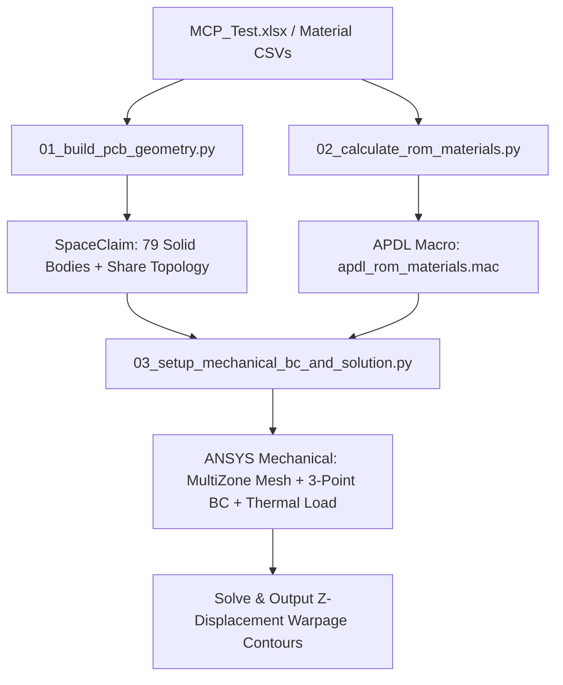

# PCB Multi-Layer Thermal Warpage Analysis Skill

This skill documents the complete, robust workflow for performing automated PCB thermal warpage ($Z$-axis displacement) analysis across multi-layer PCB stackups using ANSYS SpaceClaim, Mechanical ACT API, and APDL composite material macros.

---

## Workflow Overview

---

## Key Domain Rules & Pitfalls

### 1. SpaceClaim Geometry & Share Topology Rules
- **Layer Stacking**: Extrude rectangular blocks ($L \times W \times t_i$) from Top ($L01$, highest $Z$) to Bottom ($L79$, $Z=0$). Keep all bodies **uncombined** so each layer can receive distinct APDL material properties.
- **GUI Pane Protection**: Rapid gRPC extrusions cause SpaceClaim GUI Property Pane refresh exceptions (`Object reference state not set to an instance of an object`). Always add `time.sleep(0.05)` (50ms UI buffer) after each body extrusion.
- **Share Topology Setting**: Add bodies into a sub-component (`Component`) and set `comp.set_shared_topology(SharedTopologyType.SHARETYPE_SHARE)`. Calling `set_shared_topology` directly on the root `Design` raises a `ValueError`.

### 2. Rule of Mixtures (ROM) Material Modeling & APDL Rules
- **Rule of Mixtures Equation**:
  $$E_{\text{eff}}(T) = f_{\text{Cu}} E_{\text{Cu}}(T) + (1-f_{\text{Cu}}) E_{\text{sub}}(T)$$
  $$\text{CTE}_{\text{eff}}(T) = f_{\text{Cu}} \text{CTE}_{\text{Cu}}(T) + (1-f_{\text{Cu}}) \text{CTE}_{\text{sub}}(T)$$
  $$\nu_{\text{eff}} = f_{\text{Cu}} \nu_{\text{Cu}} + (1-f_{\text{Cu}}) \nu_{\text{sub}}$$
- **APDL Syntax Rule 1 (PRXY Order)**: In APDL, `MP, PRXY, i, nu` MUST be declared **BEFORE** `MPTEMP` and `MPDATA, EX` / `MPDATA, ALPX`. Declaring `MP, PRXY` after `MPDATA` causes MAPDL to delete the constant Poisson's ratio (`Poisson's ratio NU set for material i deleted`).
- **APDL Syntax Rule 2 (Mode Clean Exit)**: APDL Command Snippets starting with `/PREP7` MUST end with `FINISH` and `/SOLU`. Omitting `FINISH` leaves MAPDL in `/PREP7` mode when `SOLVE` is called, triggering `SOLVE is not a recognized PREP7 command`.

### 3. Mechanical Boundary Conditions & Statically Determinate Support
- **Initial / Reference Temperature**: Set `analysis.EnvironmentTemperature = Quantity(30, "C")` and `analysis.AnalysisSettings.ReferenceTemperature = Quantity(30, "C")` to prevent Mechanical from defaulting to 22 °C.
- **3-2-1 Statically Determinate Support**: Apply displacement constraints on Layer 79 bottom corner vertices ($Z=0$):
  - **P1** (Corner 1): $UX=0, UY=0, UZ=0$ (3 DOFs)
  - **P2** (Corner 2): $UX=\text{Free}, UY=0, UZ=0$ (2 DOFs)
  - **P3** (Corner 3): $UX=\text{Free}, UY=\text{Free}, UZ=0$ (1 DOF)
  - Eliminates all 6 rigid body motion degrees of freedom without inducing artificial thermal constraint stress.
- **Unconstrained Model & Pivot Error Prevention**: If bodies are unbonded, MAPDL fails with `small equation solver pivot term` / `rigid body motion`. Enforce Share Topology in SpaceClaim or auto-generate `Bonded` Contact Regions between adjacent layer faces.

---

## Executable Scripts Reference

All Python orchestration scripts are stored in:
`F:\Ming_python\ansys-unified-mcp\scripts\pcb_warpage_analysis\`

1. **`01_build_pcb_geometry.py`**: Builds PCB 79 layers in SpaceClaim with Share Topology enabled and UI refresh protection.
2. **`02_calculate_rom_materials.py`**: Computes 23-point ROM composite properties and outputs valid `apdl_rom_materials.mac`.
3. **`03_setup_mechanical_bc_and_solution.py`**: Mechanical ACT script for MultiZone meshing, APDL snippet import, 30°C initial temp, 220°C thermal condition, 3-2-1 support, and Z-displacement results.
4. **`run_full_warpage_workflow.py`**: Master workflow runner that executes the end-to-end automation.
