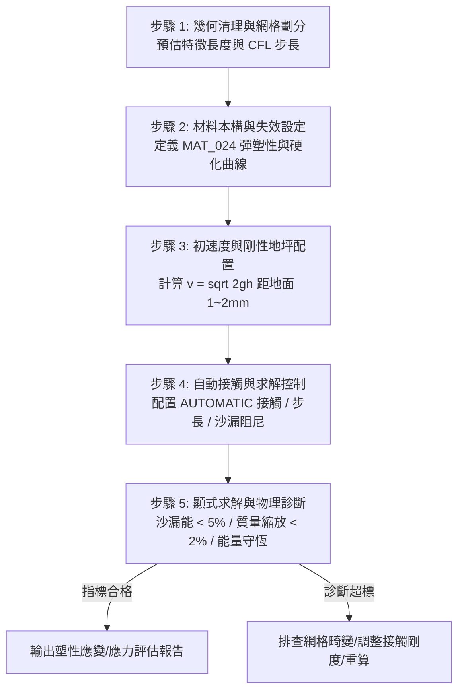

# LS-DYNA 顯式動力學與落摔分析工程主控手冊

本手冊為 ANSYS LS-DYNA 顯式動力學與落摔試驗（Drop Test）標準主控規範，依據林明志標準建立「工程 SOP + 子手冊路由 + 判斷力準則 + 自動化腳本」架構。

---

## 一、落摔衝擊分析標準 SOP 流程

1. **步驟 1（幾何與網格）**：清理細小特徵，實體單元優先採用六面體網格；依材料波速預估臨界時間步長 $\Delta t = L_{\text{char}} / c$。
2. **步驟 2（材料與截面）**：金屬塑性件使用 `*MAT_024`，輸入真實應力-塑性應變曲線；殼單元厚度積分點設定 $NIP \ge 5$。
3. **步驟 3（初速度與邊界）**：落摔體置於剛性地坪上方 $1.0 \sim 2.0\text{ mm}$ 處，以 `*INITIAL_VELOCITY_GENERATION` 賦予撞擊初速度 $v_z = -\sqrt{2gh}$。
4. **步驟 4（接觸與控制）**：配置 `*CONTACT_AUTOMATIC_SURFACE_TO_SURFACE`，設定 `TSSFAC = 0.9`，啟用能量開關 `HGEN=2, RWEN=2, SLNTEN=2`。
5. **步驟 5（求解與診斷）**：監控 `glstat` 歷程曲線，執行沙漏能、動能/內能轉化與質量縮放客觀核驗。

---

## 二、專精參考手冊路由表 (Router)

| 領域分類 | 專精子手冊路徑 | 核心內容與工程焦點 |
| :--- | :--- | :--- |
| **單元截面** | `reference/parts_and_sections.md` | `*PART`、`*SECTION_SOLID` (ELFORM=1/2)、`*SECTION_SHELL` (NIP=5)、沙漏阻尼 `*HOURGLASS` (IHQ=4)。 |
| **材料模型** | `reference/material_cards.md` | `*MAT_024` 彈塑性卡片詳細欄位、LCSS 應變硬化曲線、應變率效應、`*MAT_020` 剛體定義。 |
| **接觸演算法** | `reference/contacts.md` | `*CONTACT_AUTOMATIC_SURFACE_TO_SURFACE`、`SOFT=0/1/2` 剛度算法選型、摩擦係數與穿透處理。 |
| **初始與邊界** | `reference/initial_boundary.md` | 撞擊初速度計算公式、`*INITIAL_VELOCITY_GENERATION`、`*RIGIDWALL_PLANAR` 剛性地坪與約束設定。 |
| **能量診斷** | `reference/energy_diagnostics.md` | **【判斷力庫】** 沙漏能佔比門檻、動能轉內能平滑度、接觸滑移能負值排查。 |
| **質量縮放** | `reference/mass_scaling_rules.md` | **【判斷力庫】** CFL 時間步長、`DT2MS` 負值規則、質量增加率三級控制 (<2% / <5%) 與質心檢驗。 |
| **自動化腳本** | `scripts/run_drop_test_demo.py` | 完整落摔關鍵字卡生成腳本，內建 glstat 能量平衡與質量縮放自動評估函數。 |

---

## 三、工程紅線禁忌清單 (Don'ts)

- **沙漏能佔比超標禁放行**：全域沙漏能佔總能量比率 $E_{\text{hg}} / E_{\text{total}} > 5\%$ 嚴禁放行結果（推薦控制在 $< 2\%$），否則響應失真。
- **質量縮放嚴格監控**：系統新增質量百分比 $\Delta M / M_0 > 2\%$ 必須立即發出工程警示；$\Delta M / M_0 > 5\%$ 判定分析無效，嚴禁作為交付數據。
- **異質接觸無剛度匹配禁求解**：高剛度金屬與軟質發泡/塑膠接觸時，嚴禁使用預設 `SOFT=0`（必引發嚴重節點穿透），必須切換為 `SOFT=1` 或 `SOFT=2`。
- **嚴禁不設步長安全係數直接計算**：`*CONTROL_TIMESTEP` 中嚴禁省略 `TSSFAC`，衝擊問題建議設為 `0.85 ~ 0.90`，防止高頻接觸導致步長發散。
- **嚴禁使用高空零初速自由落體**：落摔模擬嚴禁將物體從真實高度（如 1.5 米）自由釋放，必須下移至距地面 $1 \sim 2\text{ mm}$ 並直接賦予初始速度。
- **薄板彈塑性嚴禁積分點過少**：薄殼單元承受塑性彎曲時，`NIP` 嚴禁使用預設 2 點，必須設定 $NIP \ge 5$ 以捕捉厚度應力梯度。
