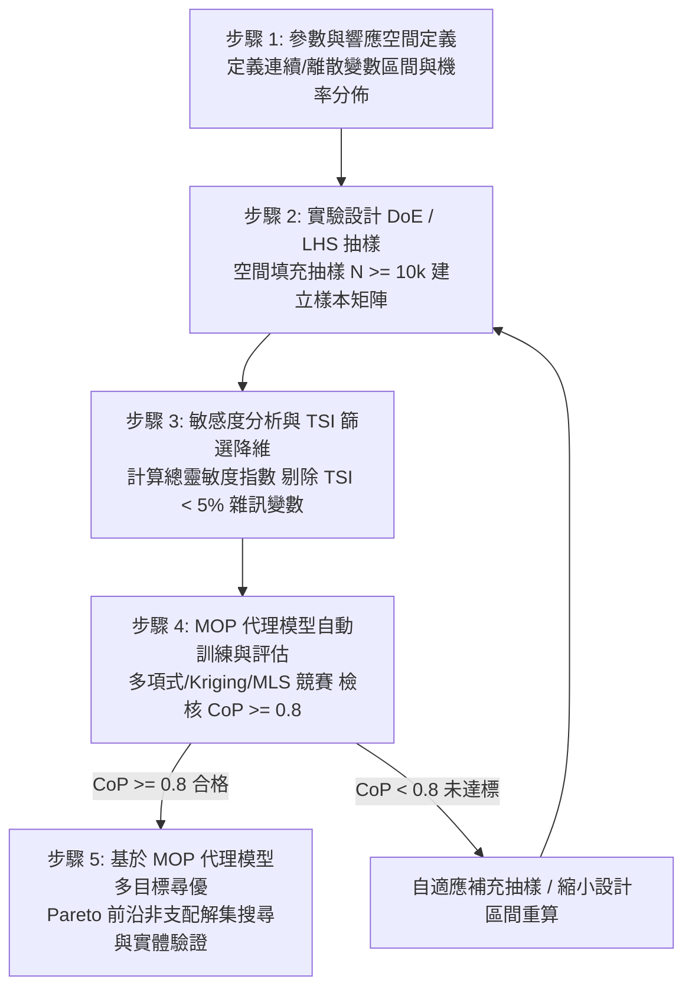

# ANSYS optiSLang 代理模型與最佳化工程主控手冊

本手冊為 ANSYS optiSLang 參數敏感度分析、MOP 最佳預測元模型與多目標尋優之標準主控規範，依據林明志標準建立「工程 SOP + 子手冊路由 + 判斷力準則 + 自動化腳本」架構。

---

## 一、參數化研究到最佳化的標準 SOP 流程

1. **步驟 1（參數與響應空間）**：梳理 CAD/CAE 輸入參數，明確定義連續或離散範圍及隨機機率分佈（Uniform / Normal）。
2. **步驟 2（DoE 與 LHS 抽樣）**：採用拉丁超立方抽樣（LHS）確保多維空間填充性，樣本數基準為 $N \ge 10 \cdot k$（$k$ 為參數維度）。
3. **步驟 3（敏感度與降維）**：調用 `SensitivityActor` 進行方差分解，計算總靈敏度指數（TSI）；將 $\text{TSI} < 0.05$ 之不顯著變數凍結為常數，達成主動降維。
4. **步驟 4（MOP 競賽與評估）**：自動在多項式、移動最小二乘（MLS）與克里金（Kriging）間競賽，嚴格檢核預測係數 $\text{CoP} \ge 0.80$。
5. **步驟 5（Pareto 尋優與覆核）**：將高品質 MOP 導出為 ProxySolver，驅動演化演算法（EA）或梯度法（NLPQLP）獲取 Pareto 前沿解，並對最優折衷解進行 CAE 實體二次覆核。

---

## 二、專精參考手冊路由表 (Router)

| 領域分類 | 專精子手冊路徑 | 核心內容與工程焦點 |
| :--- | :--- | :--- |
| **實驗設計** | `reference/doe_sampling.md` | 拉丁超立方抽樣 (LHS) 原理、空間填充準則、樣本容量估算 ($N \ge 10k$)、機率分佈配置。 |
| **敏感度矩陣** | `reference/sensitivity_matrix.md` | 總靈敏度指數 (TSI) Sobol 方差分解、Pearson/Spearman 相關矩陣、變數篩選與降維準則 ($\text{TSI} < 0.05$)。 |
| **MOP 元模型** | `reference/mop_metamodel.md` | MOP 最佳模型競賽架構（多項式/MLS/Kriging/MLP）、最佳子空間搜索、ProxySolver 導出與毫秒級推論。 |
| **最佳化演算法** | `reference/optimization_algorithms.md` | 局部梯度法 (`NLPQLPActor`) vs 全域啟發式 (`NOAActor` / `EAActor`)、多目標 Pareto 前沿解集提取。 |
| **判斷力庫** | `reference/optislang_judgment.md` | **【判斷力庫】** 預測係數 CoP 四級門檻 ($\ge 0.8$)、共線性排查 ($\text{VIF} > 5$)、過擬合 ($R^2$ 虛高但 CoP 低落) 診斷。 |
| **自動化腳本** | `scripts/setup_mop_workflow_demo.py` | 完整 optiSLang 原生 Python 流程建立腳本，內建 CoP 評估、TSI 降維過濾與過擬合警示模組。 |

---

## 三、工程紅線禁忌清單 (Don'ts)

- **CoP 未達標嚴禁直接尋優**：預測係數 $\text{CoP} < 0.80$ 時嚴禁直接拿 MOP 進行全域最佳化尋優！此時代理模型泛化能力不足，盲目尋優必掉入虛假最優陷阱。
- **高維未降維嚴禁全局尋優**：設計變數數量 $> 10$ 個時，嚴禁在未經 TSI 篩選降維前直接啟動全域搜尋，否則將觸發維度災難導致收斂停滯。
- **嚴禁外插超出 DoE 抽樣邊界**：代理模型僅在抽樣點凸包（Convex Hull）內插具備高精度；嚴禁外插超出初始抽樣上下限邊界，否則預測誤差發散。
- **嚴禁只看決定係數 $R^2$ 忽視 CoP**：傳統 $R^2$ 隨模型項數增加必然單調上升（極易受過擬合欺騙）；必須以交叉驗證的 CoP 作為真實模型泛化能力的唯一判定依據。
- **共線性未排查嚴禁擬合高階模型**：輸入參數間若存在嚴重共線性（相關係數 $> 0.85$ 或 $\text{VIF} > 5$），嚴禁強行擬合高階多項式，避免矩陣病態求逆失真。
