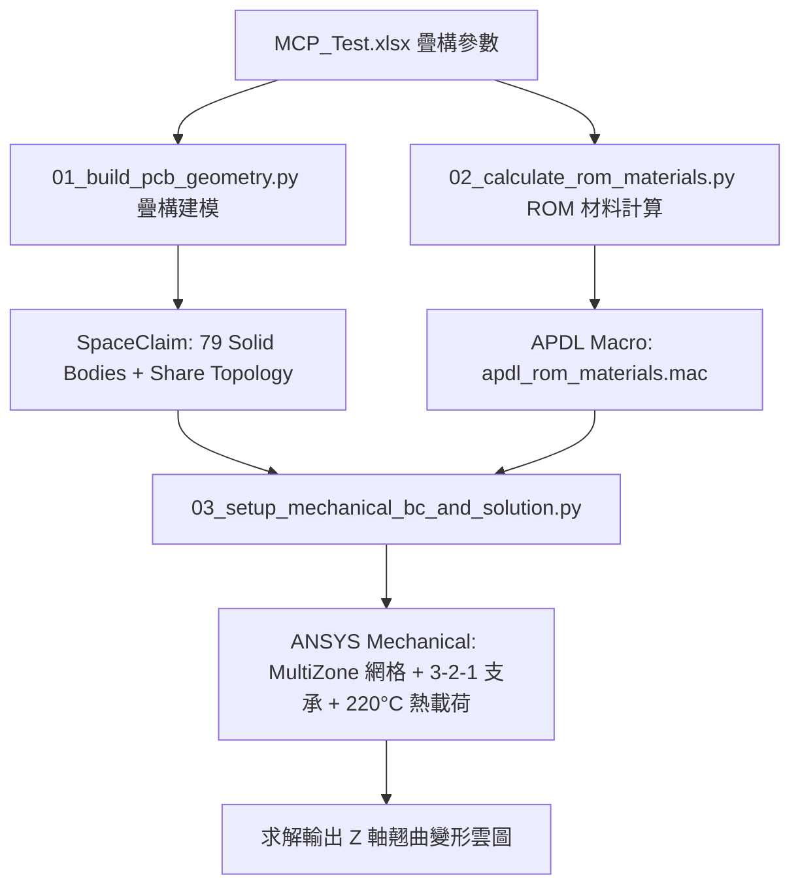

# PCB Multi-Layer Thermal Warpage Analysis Skill

本技能專門處理 PCB 多層板熱翹曲（Z 軸變形）自動化分析工作流（ANSYS SpaceClaim 疊構建模 + ROM 複合材料巨集 + Mechanical 3-2-1 靜定支承熱應力求解）。

---

## 工作流架構

## 核心腳本目錄
`F:\Ming_python\ansys-unified-mcp\scripts\pcb_warpage_analysis\`
1. `01_build_pcb_geometry.py`
2. `02_calculate_rom_materials.py`
3. `03_setup_mechanical_bc_and_solution.py`
4. `run_full_warpage_workflow.py`
