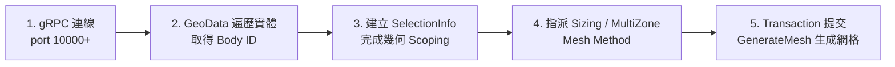

# PyMechanical 遠端操作與網格自動化主控手冊

本技能彙整透過 PyMechanical gRPC 連線 Mechanical 視窗，並執行幾何 Scoping 與網格控制（AutoMesh）之標準 SOP。

---

## 一、核心操作流程

1. **連線建立**：以 `pymech.connect_to_mechanical(port=10000)` 連線目標視窗。
2. **實體 Scoping**：使用 `SelectionManager.CreateSelectionInfo` 指定 Body ID，嚴防 Scoping 遺失。
3. **網格指派**：配置尺寸與劃分方法，使用 `Transaction(True)` 批次提交後執行 `GenerateMesh()`。

---

## 二、模組路由表 (Module Router)

深入操作手冊請參閱 `reference/`：

| 操作主題 | 專精文件 | 核心內容 |
| :--- | :--- | :--- |
| **gRPC 連線與腳本環境** | [`reference/grpc_connection.md`](reference/grpc_connection.md) | 連線配置、多視窗處理、`run_python_script` 特性 |
| **幾何 Scoping 與網格控制** | [`reference/scoping_and_mesh.md`](reference/scoping_and_mesh.md) | `SelectionInfo`、`GeoData` 提取、Sizing、MultiZone |

---

## 三、排障速查 (Troubleshooting)

| 異常現象 | 根本原因 | 標準處置法 |
| :--- | :--- | :--- |
| Sizing 出現 ❓ 黃色問號 | `Location` 未設定或 Scoping 為空 | 確保 `sel.Ids = [body_id]` 陣列包含有效 ID |
| `Quantity` 未定義 | 缺少命名空間匯入 | `from Ansys.Core.Units import Quantity` |
| gRPC 連線被拒絕 | Port 錯誤或 Mechanical 未開啟 | 檢查 Mechanical 視窗啟動狀態與指定 port |
