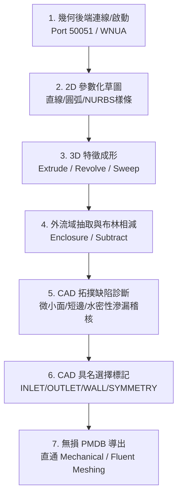

# ANSYS 現代化幾何建模與無損流轉主控手冊 (PyAnsys Geometry)

本技能依據林明志標準構建，提供基於 `ansys.geometry.core` (PyAnsys Geometry) 的現代化幾何前處理自動化指導，貫穿 2D 草圖、3D 成形、外流域抽取、CAD 診斷及無損 PMDB 導出之完整 SOP。

---

## 一、幾何前處理到無損導出標準 SOP

### 標準工程執行步驟
1. **連線初始化**：Windows 環境強制指定 `transport_mode="wnua"` 連線既有幾何引擎（SpaceClaim 或 Discovery）或自動拉起新進程。
2. **2D 參數化草圖**：依附基準面（XY/XZ/YZ），使用直線、圓弧或點陣列 NURBS 樣條繪製閉合輪廓，坐標單位嚴格為公尺 (m)。
3. **3D 特徵成形**：依結構特徵調用拉伸 (`extrude_sketch`) 或旋轉 (`revolve_sketch`)，驗證生成實體體積正定。
4. **外流域抽取與布林運算**：依據空氣動力學黃金比例外擴長方體（上游 2~3L、下游 6~8L、阻塞率 < 3%），調用 `subtract` 扣除固體。
5. **CAD 缺陷稽核**：調用診斷演算法排查狹長微小面、極短邊、自相交與滲漏間隙，執行去特徵 (Defeaturing) 簡化。
6. **CAD 具名選擇標記**：依空間極值坐標或法向自動建立面與體 Named Selection，嚴禁留白。
7. **無損導出**：通過檢核清單後，導出 `.pmdb` 原生二進制檔案，完好保留拓撲與具名邊界。

---

## 二、專精參考手冊與腳本導引表 (Router)

| 工程領域 / 任務情境 | 專精手冊 / 實作腳本 | 核心重點與關鍵規範 |
|---|---|---|
| **2D 參數化草圖與曲線** | [`reference/sketching.md`](reference/sketching.md) | 基準面定義、NURBS 點陣列樣條插值、草圖閉合容差。 |
| **3D 實體成形特徵** | [`reference/3d_features.md`](reference/3d_features.md) | 拉伸、旋轉、掃掠路徑曲率安全原則、混成拓撲同構。 |
| **外流域抽取與布林運算** | [`reference/booleans_enclosures.md`](reference/booleans_enclosures.md) | CFD 邊界擴展規範 (2~3L, 6~8L)、單相流 vs CHT 模式。 |
| **具名選擇自動標記** | [`reference/named_selections.md`](reference/named_selections.md) | 外包圍盒空間極值過濾、面法向判別、命名規範與完備性。 |
| **CAD 缺陷診斷判斷力庫** | [`reference/cad_diagnostics.md`](reference/cad_diagnostics.md) | 微小面 (Sliver)、短邊、自交、流體滲漏判定標準與修復。 |
| **無損 PMDB 導出規範** | [`reference/pmdb_export_rules.md`](reference/pmdb_export_rules.md) | PMDB 格式優勢、Shared Topology 設置、下游網格接軌。 |
| **外流域抽取示範腳本** | [`scripts/create_enclosure_demo.py`](scripts/create_enclosure_demo.py) | 參數化翼型拉伸、外流域抽取、布林相減與自動導出。 |
| **CAD 缺陷掃描腳本** | [`scripts/check_cad_defects.py`](scripts/check_cad_defects.py) | 幾何實體水密性稽核、微小面/短邊過濾與 JSON 診斷報告。 |

---

## 三、工程嚴禁事項清單 (Don'ts)

- ❌ **布林運算後未核驗 Named Selection 完整性嚴禁導出**：布林相減會重新分割鄰接表面，必須重新稽核所有邊界（INLET, OUTLET, WALL）是否涵蓋 100% 幾何外表面，嚴禁存在未命名的野生幾何面。
- ❌ **流體域滲漏未查嚴禁導出 PMDB**：流體域必須滿足水密封閉性且體積嚴格正定 ($V > 0$)。若存在裝配間隙導致流體外溢或體積歸零，嚴禁送入下游網格。
- ❌ **未簡化微小圓角嚴禁直接送入網格**：小於基準網格尺寸 1/10 的非受力加工倒角、裝配螺紋與商標刻字，必須在幾何階段去特徵簡化，嚴禁原樣送入劃分網格。
- ❌ **嚴禁在網格生成後依賴幾何 Face ID 指派邊界**：網格剖分會導致幾何面 ID 重構隨機洗牌，所有邊界條件必須在 CAD 階段綁定 Named Selection。
- ❌ **Windows 環境連線嚴禁使用 insecure 傳輸模式**：必須顯式指定 `transport_mode="wnua"`，避免通訊死鎖。

---

## 四、客觀驗證完成條件 (Verification Conditions)

1. **CAD 水密性與體積驗證**：所有實體體積計算成功且 $V > 0$，無零厚度面與非流形邊界。
2. **CAD 缺陷零檢出判定**：執行 `check_cad_defects.py` 稽核，狹長微小面 (Sliver Faces, 長寬比 $> 50$) 與極短邊 ($L < 10^{-4}\text{ m}$) 檢出數必須為 0，整體狀態回傳 `PASS_READY_FOR_EXPORT`。
3. **具名選擇覆蓋率**：外邊界 6 大宏觀面完全指派至標準 Named Selection，且流體/固體零件皆已設定 Body Named Selection。
4. **檔案輸出真實存在**：目標目錄成功生成 `.pmdb` 檔案且檔案大小 $> 0\text{ bytes}$。
