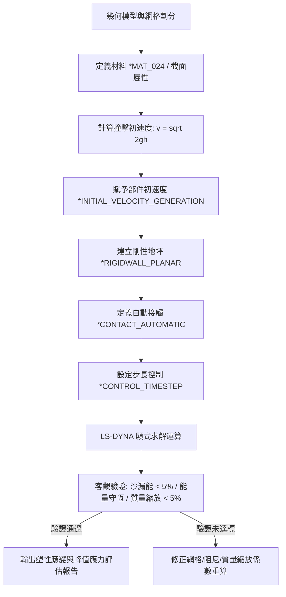

# LS-DYNA 顯式動力學與落摔分析技能 (ANSYS LS-DYNA Explicit Dynamics Skill)

> [!NOTE]
> **架構收斂與指引說明**：
> 本技能已完整整併至林明志標準架構主技能 **[`ansys-lsdyna`](../ansys-lsdyna/SKILL.md)**。
> 顯式動力學與落摔衝擊專精指引請參閱：
> - 主控手冊：[`ansys-lsdyna/SKILL.md`](../ansys-lsdyna/SKILL.md)
> - 材料本構與失效子手冊：[`ansys-lsdyna/reference/material_cards.md`](../ansys-lsdyna/reference/material_cards.md)
> - 經典落摔自動化腳本：[`ansys-lsdyna/scripts/run_drop_test_demo.py`](../ansys-lsdyna/scripts/run_drop_test_demo.py)
> 本檔案保留作為過渡期歷史參照相容。

---

## 一、顯式動力學核心架構與 CFL 時間步長準則

顯式時間積分（Explicit Time Integration）基於中心差分法（Central Difference Method），在求解動力學方程式時無須對整體非線性剛度矩陣進行求逆與牛頓迭代，極度適合高速瞬態、大變形、嚴重材料非線性與接觸碰撞問題。

### 1. 臨界時間步長與 CFL 條件
求解過程必須滿足 Courant-Friedrichs-Lewy (CFL) 數值穩定性準則：
$$\Delta t \le \Delta t_{\text{crit}} = \frac{L_{\text{char}}}{c}$$
其中：
- $L_{\text{char}}$：單元特徵長度（實體單元取最小邊長或內切球直徑，殼單元取面積與最大對角線比值）。
- $c$：材料彈性波速（應力波傳播速度），在均質材料中為 $c = \sqrt{\frac{E}{\rho}}$。

### 2. 時間步長控制與質量縮放 (Mass Scaling)
在 `*CONTROL_TIMESTEP` 卡片中：
- **TSSFAC**：時間步長安全縮放係數，常態衝擊建議取 `0.90`，強烈接觸碰撞建議取 `0.67 ~ 0.85`。
- **DT2MS**：質量縮放臨界時間步長。若設為負值（如 `-1.0e-7`），LS-DYNA 僅會針對時間步長小於該值的高頻小尺寸網格添加虛擬慣性質量，將該單元的時間步長強行提升至 $|DT2MS|$。

---

## 二、PyDYNA 物件導向關鍵字卡片組裝

在自動化構建 LS-DYNA 輸入檔時，核心組裝流程遵循層次化卡片規範：

### 1. 求解與能量控制卡片
- `*CONTROL_TERMINATION`：指定分析終止時間 `ENDTIM`。
- `*CONTROL_TIMESTEP`：指定 `TSSFAC` 與 `DT2MS`。
- `*CONTROL_ENERGY`：設定 `HGEN=2`（啟用沙漏能計算並納入能量平衡矩陣）、`RWEN=2`（記錄剛性牆能量）、`SLNTEN=2`（記錄滑移接觸摩擦能）。
- `*CONTROL_HOURGLASS`：設定抗沙漏黏性/剛度阻尼形式（常用 `IHQ=4` Flanagan-Belytschko 剛度阻尼，`QH=0.10`）。

### 2. 材料卡片：*MAT_024 (*MAT_PIECEWISE_LINEAR_PLASTICITY)
金屬材料落摔中最廣泛採用的彈塑性本構模型：
- `RO`：材料密度（ton/mm³ 或 kg/m³）。
- `E`：彈性楊氏模數。
- `PR`：帕松比。
- `SIGY`：初始降伏應力。
- `ETAN`：雙線性塑性硬化切線模數（若需多線性真實應力-塑性應變曲線，可藉由 `LCSS` 定義應力應變曲線）。
- `FAIL`：塑性應變失效斷裂閥值（達到時單元刪除）。

### 3. 接觸卡片：*CONTACT_AUTOMATIC_SURFACE_TO_SURFACE
- Penalty 接觸演算法：`FS` 為靜摩擦係數，`FD` 為動摩擦係數。
- `SOFT` 接觸剛度策略：
  - `SOFT=0`：預設標準 Penalty 接觸（適合材料剛度接近情況）。
  - `SOFT=1`：節點質量法剛度（適合金屬與發泡材料等異質材料接觸，防止穿透）。
  - `SOFT=2`：線段-線段（Segment-based）接觸（最佳適用於複雜接觸面與網格特徵多變場景）。

### 4. 輸出歷程卡片
- `*DATABASE_BINARY_D3PLOT`：3D 雲圖結果輸出（應力、應變、位移動畫）。
- `*DATABASE_GLSTAT`：整體統計資料庫（全域動能、內能、沙漏能、總能量、滑移能）。
- `*DATABASE_MATSUM`：各材料部件之能量與質量歷程。
- `*DATABASE_SLEOUT`：各接觸介面接觸力與摩擦滑移能。

---

## 三、落摔衝擊 (Drop Test) 標準工作流程



1. **初速度定義**：
   - 避免將落摔體置於空中自由落下（耗費無效計算時間），應將物件移動至距地坪 `1.0 ~ 2.0 mm` 處。
   - 計算撞擊初速度：$v_z = -\sqrt{2 \cdot g \cdot h}$。
   - 透過 `*INITIAL_VELOCITY_GENERATION` 將初速度施加於落摔總成節點集。
2. **剛性撞擊地坪**：
   - 使用 `*RIGIDWALL_PLANAR` 定義平面撞擊牆，設定法向量 $(0, 0, 1)$ 與摩擦係數，節省地面網格計算資源。
3. **防止初速度穿透**：
   - 物件與剛性牆初始間隙必須大於接觸厚度容差，確保初始時刻無穿透接觸力產生。

---

## 四、客觀驗證完成條件 (Verification Conditions)

顯式動力學分析完成後，必須進行三項客觀物理量定量檢驗，不可憑主觀感覺判斷：

| 檢驗項目 | 客觀指標 | 合格判定標準 | 不合格處置對策 |
| :--- | :--- | :--- | :--- |
| **沙漏能檢核 (Hourglass)** | $E_{\text{hourglass}} / E_{\text{total}}$ | **< 5%** (嚴格要求 < 2%) | 調整 `*CONTROL_HOURGLASS` 係數 `QH=0.10`；改用全積分單元或細化網格 |
| **能量守恆檢核 (Energy Balance)** | 總能漂移率 $\frac{\|E_{\text{final}} - E_{\text{init}}\|}{E_{\text{init}}}$ | **$\le 10\%$** 且動能平滑轉換為內能 | 檢視接觸介面滑動能量是否出現負能；確認是否有節點飛散或穿透發散 |
| **質量縮放檢核 (Mass Scaling)** | 系統新增質量百分比 $\Delta M / M_0$ | **< 5%** (且質心無漂移) | 減小 `DT2MS` 絕對值；修正局部微小畸變網格長度 |

---

## 五、完整 Python 程式碼範例

以下腳本展示如何使用 Python 物件導向架構生成標準 LS-DYNA 落摔卡片，並包含自動評估 `glstat` 能量守恆之客觀驗證函數：

```python
# -*- coding: utf-8 -*-
"""
模組名稱：lsdyna_drop_test_generator.py
功能說明：使用 PyDYNA 物件導向介面自動化組裝落摔衝擊 (Drop Test) 關鍵字卡片
依據標準：顯式動力學 CFL 準則與能量守恆驗證規範
"""

import math
from typing import Dict, Any, List, Optional


class ExplicitDropTestBuilder:
    """
    LS-DYNA 落摔衝擊模擬關鍵字卡片物件導向組裝器
    """

    def __init__(self, simulation_title: str = "Drop_Test_Simulation"):
        self.title = simulation_title
        self.lines: List[str] = []
        self._setup_header()

    def _setup_header(self) -> None:
        """初始化卡片檔頭與單位系統標註 (單位：ton, mm, s, N, MPa)"""
        self.lines.extend([
            "$# ====================================================================",
            "$# LS-DYNA 顯式動力學分析關鍵字卡片 (PyDYNA 自動生成)",
            "$# 單位系統：ton, mm, s, N, MPa",
            "$# ====================================================================",
            "*KEYWORD",
            "*TITLE",
            self.title,
            "$"
        ])

    def configure_solver_controls(
        self,
        end_time: float = 0.005,
        tssfac: float = 0.90,
        dt2ms: float = -1.0e-7,
        ihq: int = 4,
        qh: float = 0.10
    ) -> "ExplicitDropTestBuilder":
        """
        設定顯式求解控制、時間步長與沙漏阻尼控制
        :param end_time: 終止時間 (秒)
        :param tssfac: 時間步長安全縮放係數 (建議 0.85 ~ 0.90)
        :param dt2ms: 質量縮放臨界時間步長 (< 0 代表啟用局部質量縮放)
        :param ihq: 沙漏控制類型 (4 為 Flanagan-Belytschko 剛度阻尼形式)
        :param qh: 沙漏黏滯阻尼係數 (建議 0.10)
        """
        self.lines.extend([
            "$ ----------------------------------------------------------------------",
            "$ 1. 求解控制卡片：*CONTROL_TERMINATION, *CONTROL_TIMESTEP, *CONTROL_ENERGY",
            "$ ----------------------------------------------------------------------",
            "*CONTROL_TERMINATION",
            "$#  endtim    endcyc     dtmin    endeng    rpend",
            f"{end_time:10.4e}         0       0.0       0.0       0.0",
            "*CONTROL_TIMESTEP",
            "$#  dtinit    tssfac      isdo    tslimt     dt2ms      lctm     erode     ms1st",
            f"       0.0{tssfac:10.2f}         0       0.0{dt2ms:10.2e}         0         0         0",
            "*CONTROL_ENERGY",
            "$#    hgen      rwen    slnten     rylen",
            "         2         2         2         2",
            "*CONTROL_HOURGLASS",
            "$#     ihq        qh",
            f"{ihq:10d}{qh:10.2f}",
            "$"
        ])
        return self

    def configure_database_output(
        self,
        d3plot_interval: float = 1.0e-4,
        history_interval: float = 1.0e-5
    ) -> "ExplicitDropTestBuilder":
        """
        設定輸出歷史資料庫與三維動畫雲圖輸出頻率
        :param d3plot_interval: d3plot 雲圖時間間隔 (秒)
        :param history_interval: 歷程曲線 (glstat, matsum, sleout) 時間間隔 (秒)
        """
        self.lines.extend([
            "$ ----------------------------------------------------------------------",
            "$ 2. 資料庫輸出卡片：*DATABASE_BINARY_D3PLOT 與能量監控",
            "$ ----------------------------------------------------------------------",
            "*DATABASE_BINARY_D3PLOT",
            "$#      dt      lcdt      beam     npltc    psetid",
            f"{d3plot_interval:10.4e}         0         0         0         0",
            "*DATABASE_GLSTAT",
            f"{history_interval:10.4e}",
            "*DATABASE_MATSUM",
            f"{history_interval:10.4e}",
            "*DATABASE_SLEOUT",
            f"{history_interval:10.4e}",
            "$"
        ])
        return self

    def add_mat_024(
        self,
        mat_id: int,
        density: float,
        youngs_modulus: float,
        poisson_ratio: float,
        yield_stress: float,
        tangent_modulus: float
    ) -> "ExplicitDropTestBuilder":
        """
        添加 *MAT_024 (*MAT_PIECEWISE_LINEAR_PLASTICITY) 彈塑性材料卡片
        :param mat_id: 材料編號
        :param density: 密度 (ton/mm^3)
        :param youngs_modulus: 楊氏模數 (MPa)
        :param poisson_ratio: 帕松比
        :param yield_stress: 初等降伏強度 (MPa)
        :param tangent_modulus: 切線模數 (MPa)
        """
        self.lines.extend([
            "$ ----------------------------------------------------------------------",
            f"$ 3. 彈塑性材料卡片：*MAT_024 (MID = {mat_id})",
            "$ ----------------------------------------------------------------------",
            "*MAT_PIECEWISE_LINEAR_PLASTICITY",
            "$#     mid        ro         e        pr      sigy      etan      fail      tdel",
            f"{mat_id:10d}{density:10.3e}{youngs_modulus:10.3e}{poisson_ratio:10.3f}{yield_stress:10.2f}{tangent_modulus:10.2f}       0.0       0.0",
            "$"
        ])
        return self

    def add_drop_velocity(
        self,
        part_set_id: int,
        drop_height_mm: float,
        gravity_mm_s2: float = 9810.0
    ) -> "ExplicitDropTestBuilder":
        """
        根據落摔高度計算撞擊初速度並定義 *INITIAL_VELOCITY_GENERATION
        速度公式：vz = -sqrt(2 * g * h)
        """
        vz = -math.sqrt(2.0 * gravity_mm_s2 * drop_height_mm)
        self.lines.extend([
            "$ ----------------------------------------------------------------------",
            f"$ 4. 初速度卡片：*INITIAL_VELOCITY_GENERATION (落摔高度 = {drop_height_mm} mm)",
            "$ ----------------------------------------------------------------------",
            "*INITIAL_VELOCITY_GENERATION",
            "$#     sid      styp        vx        vy        vz       gxc       gyc       gzc",
            f"{part_set_id:10d}         2       0.0       0.0{vz:10.2f}       0.0       0.0       0.0",
            "$"
        ])
        return self

    def add_rigid_impact_surface(
        self,
        z_level: float = 0.0,
        friction: float = 0.30
    ) -> "ExplicitDropTestBuilder":
        """
        定義平面的剛性地坪撞擊卡片 (*RIGIDWALL_PLANAR)
        """
        self.lines.extend([
            "$ ----------------------------------------------------------------------",
            f"$ 5. 剛性地坪卡片：*RIGIDWALL_PLANAR (Z = {z_level} mm)",
            "$ ----------------------------------------------------------------------",
            "*RIGIDWALL_PLANAR",
            "$#    nsid      nsid       box      fric",
            f"         0         0         0{friction:10.2f}",
            "$#      xt        yt        zt        xh        yh        zh      fric",
            f"       0.0       0.0{z_level:10.2f}       0.0       0.0       1.0{friction:10.2f}",
            "$"
        ])
        return self

    def add_contact_automatic(
        self,
        slave_part_id: int,
        master_part_id: int,
        fs: float = 0.30,
        fd: float = 0.25,
        soft_mode: int = 1
    ) -> "ExplicitDropTestBuilder":
        """
        設定自動面面接觸 (*CONTACT_AUTOMATIC_SURFACE_TO_SURFACE)
        :param soft_mode: 軟接觸選項 (1 為根據節點質量計算，推薦用於異質材料或網格尺寸差異大場景)
        """
        self.lines.extend([
            "$ ----------------------------------------------------------------------",
            "$ 6. 接觸卡片：*CONTACT_AUTOMATIC_SURFACE_TO_SURFACE",
            "$ ----------------------------------------------------------------------",
            "*CONTACT_AUTOMATIC_SURFACE_TO_SURFACE",
            "$#    ssid      msid     sstyp     mstyp    sboxid    mboxid       spr       mpr",
            f"{slave_part_id:10d}{master_part_id:10d}         3         3         0         0         0         0",
            "$#      fs        fd        dc        vc       vdc    penchk        bt        dt",
            f"{fs:10.2f}{fd:10.2f}       0.0       0.0      20.0         0       0.0       0.0",
            "$#     sfs       sfm       sst       mst      sfst      sfmt       fsf       vsf",
            "       1.0       1.0       0.0       0.0       1.0       1.0       1.0       1.0",
            "$#    soft    sofscl    lcidab    maxpar     sbopt     depth     bsort    frcfrc",
            f"{soft_mode:10d}       0.1         0       0.0         0         2         0         0",
            "$"
        ])
        return self

    def export_to_string(self) -> str:
        """匯出完整卡片字串，以 *END 結尾"""
        content = list(self.lines)
        content.extend(["*END", ""])
        return "\n".join(content)


def verify_explicit_simulation_quality(
    kinetic_energies: List[float],
    internal_energies: List[float],
    hourglass_energies: List[float],
    total_energies: List[float],
    mass_scaling_added_pct: Optional[List[float]] = None
) -> Dict[str, Any]:
    """
    客觀驗證顯式動力學求解結果品質指標
    完成判準：
    1. 沙漏能佔比：Hourglass Energy / Total Energy < 5% (嚴格工程標準 < 2%)
    2. 能量守恆：Total Energy 終值相較初值變動比率 <= 10%
    3. 質量縮放：因質量縮放導致的新增質量比例 < 5%
    """
    if not total_energies or not hourglass_energies:
        return {
            "verified": False,
            "error": "無有效能量歷程數據"
        }

    max_total_energy = max(total_energies) if max(total_energies) > 0 else 1.0e-12
    max_hourglass_energy = max(hourglass_energies)
    hourglass_ratio_pct = (max_hourglass_energy / max_total_energy) * 100.0

    initial_total_energy = total_energies[0] if total_energies[0] > 0 else 1.0e-12
    final_total_energy = total_energies[-1]
    energy_drift_pct = (abs(final_total_energy - initial_total_energy) / initial_total_energy) * 100.0

    max_mass_scaling_pct = max(mass_scaling_added_pct) if mass_scaling_added_pct else 0.0

    is_hourglass_ok = hourglass_ratio_pct < 5.0
    is_energy_conserved = energy_drift_pct <= 10.0
    is_mass_scaling_ok = max_mass_scaling_pct < 5.0

    all_verified = is_hourglass_ok and is_energy_conserved and is_mass_scaling_ok

    return {
        "verified": all_verified,
        "metrics": {
            "hourglass_energy_ratio_pct": round(hourglass_ratio_pct, 3),
            "hourglass_threshold_pct": 5.0,
            "hourglass_passed": is_hourglass_ok,
            "total_energy_drift_pct": round(energy_drift_pct, 3),
            "energy_drift_threshold_pct": 10.0,
            "energy_conservation_passed": is_energy_conserved,
            "max_added_mass_pct": round(max_mass_scaling_pct, 3),
            "mass_scaling_threshold_pct": 5.0,
            "mass_scaling_passed": is_mass_scaling_ok
        }
    }
```
