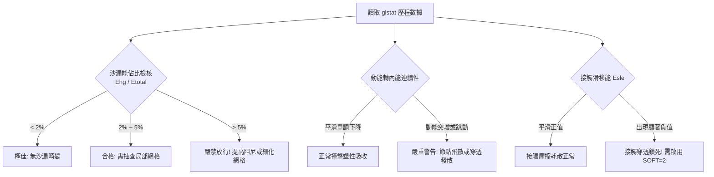

# LS-DYNA 能量診斷判斷力庫 (`energy_diagnostics.md`)

在顯式動力學中，求解器不會像隱式靜力學那樣因不收斂而自動報錯停止。一個發散、沙漏嚴重失真或穿透爆炸的顯式計算可能順利跑完。因此，**工程師必須基於 `glstat` 能量平衡進行嚴格的客觀物理量診斷**。

---

## 一、全域能量平衡方程式

LS-DYNA 系統總能量遵守熱力學與動力學守恆：
$$E_{\text{total}} = E_{\text{kin}} + E_{\text{int}} + E_{\text{hg}} + E_{\text{contact}} - W_{\text{ext}}$$
其中：
- $E_{\text{kin}}$：系統全域動能 (Kinetic Energy)。
- $E_{\text{int}}$：材料彈塑性應變內能 (Internal Energy)。
- $E_{\text{hg}}$：沙漏能 (Hourglass Energy，純屬數值阻尼消耗)。
- $E_{\text{contact}}$：界面接觸滑移能 (Sliding Interface Energy)。
- $W_{\text{ext}}$：外部載荷功 (External Work)。

---

## 二、三大客觀診斷指標與判別門檻

### 1. 沙漏能佔比指標 ($E_{\text{hg}} / E_{\text{total}}$)
- **極佳門檻 ($< 2\%$)**：數值噪聲極低，變形完全由材料物理本構主導。
- **合格門檻 ($< 5\%$)**：工程可接受放行邊界。
- **不合格紅線 ($> 5\%$)**：**嚴禁放行結果**！表示零能模式嚴重污染變形場，應力與應變數據毫無參考價值。
  - **處置對策**：
    1. 將 `*CONTROL_HOURGLASS` 改為 `IHQ=4` 或 `IHQ=5`（剛度形式），`QH` 調增至 `0.10 ~ 0.15`。
    2. 局部大畸變區域改採全積分單元 (`ELFORM=2` 或 `-1`)。
    3. 細化局部網格。

### 2. 動能與內能轉化比對
- **健康曲線特徵**：在碰撞開始瞬間，動能 $E_{\text{kin}}$ 急劇平滑下降，內能 $E_{\text{int}}$ 伴隨等量平滑上升；碰撞結束後動能維持極低反彈水平，內能趨於穩定殘餘塑性應變能。
- **異常警訊**：
  - 若在接觸中途動能無故驟升，必為節點穿透受彈簧反彈力「彈飛」或網格畸變爆炸。
  - 總能量 $E_{\text{total}}$ 漂移率超過 $\pm 10\%$ 判定數值失衡。

### 3. 接觸滑移能 (Sliding Energy) 診斷
- 在 `*DATABASE_GLSTAT` 與 `*DATABASE_SLEOUT` 中檢視接觸能。
- **健康特徵**：滑移能應為非負平滑上升曲線（代表摩擦滑動耗散正功）。
- **致命病態：負滑移能 (Negative Contact Energy)**：
  - 若滑移能出現持續擴大的負值，代表發生嚴重的「節點穿透後被拘禁於面後方」的卡死現象。
  - **處置對策**：將接觸卡片切換為 `SOFT=2`（Segment-based 線段接觸），並檢查初始幾何是否有干涉。
