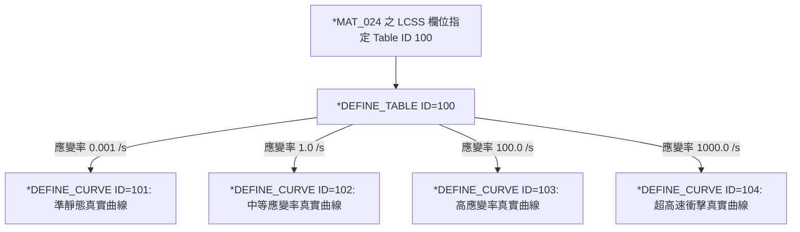

# LS-DYNA 材料卡片定義手冊 (`material_cards.md`)

在落摔與高速衝擊分析中，材料往往經歷彈性、塑性降伏、大應變硬化甚至斷裂失效。本手冊詳細說明工程最常用的彈塑性本構模型 `*MAT_024`、剛體模型 `*MAT_020` 與單位制標準。

---

## 一、單位系統一致性 (Consistent Units)

LS-DYNA 不具備內建單位換算機制，所有輸入數值必須保持完全自洽。工程落摔推薦使用 **ton - mm - s - N - MPa** 單位制：

| 物理量 | 推薦單位制 (mm 系統) | 標準 SI 制 (m 系統) | 換算關係 |
| :--- | :--- | :--- | :--- |
| **長度 (Length)** | $\text{mm}$ | $\text{m}$ | $1\text{ m} = 1000\text{ mm}$ |
| **時間 (Time)** | $\text{s}$ | $\text{s}$ | $1\text{ s} = 1\text{ s}$ |
| **質量 (Mass)** | $\text{ton} = 10^3\text{ kg}$ | $\text{kg}$ | 鋼密度 $7.85\times 10^{-9}\text{ ton/mm}^3$ |
| **力 (Force)** | $\text{N} = \text{ton}\cdot\text{mm}/\text{s}^2$ | $\text{N} = \text{kg}\cdot\text{m}/\text{s}^2$ | $1\text{ N} = 1\text{ N}$ |
| **應力 / 模數 (Stress)** | $\text{MPa} = \text{N/mm}^2$ | $\text{Pa} = \text{N/m}^2$ | 鋼楊氏模數 $2.1\times 10^5\text{ MPa}$ |
| **重力加速度 (Gravity)** | $9806.65\text{ mm/s}^2$ | $9.80665\text{ m/s}^2$ | $g = 9806.65\text{ mm/s}^2$ |

---

## 二、金屬彈塑性卡片：*MAT_024 (*MAT_PIECEWISE_LINEAR_PLASTICITY)

工程界應用最廣泛的金屬彈塑性材料模型，支援雙線性等向硬化、任意多線性應變硬化曲線以及應變率相依性。

### 關鍵字卡片格式：
```text
*MAT_PIECEWISE_LINEAR_PLASTICITY
$#     mid        ro         e        pr      sigy      etan      fail      tdel
         1  7.85e-09  2.10e+05     0.300   350.000   1500.00     0.250     0.000
$#       c         p      lcss      lcsr        vp
     40.00      5.00         0         0      0.00
```

### 關鍵欄位解析：
- **`mid`**：材料唯一識別號。
- **`ro`**：材料密度（ton/mm³，如結構鋼為 `7.85e-9`，鋁合金為 `2.70e-9`）。
- **`e`**：彈性楊氏模數（MPa，如結構鋼為 `2.10e5`）。
- **`pr`**：帕松比（無因次，鋼約 `0.30`）。
- **`sigy`**：初始降伏應力（MPa，如 Q345/Q355 填入 `350.0`）。
- **`etan`**：雙線性切線硬化模數（MPa）。若使用 `lcss` 多線性曲線，此處可填 0。
- **`fail`**：有效塑性應變失效閥值（無因次）。當單元之積分點等效塑性應變超過此值時，單元自動刪除（Erosion）。若不考慮斷裂刪除則設為 0。
- **`lcss`**：定義「有效塑性應變 - 真實應力」曲線的 `*DEFINE_CURVE` 表號。當定義 `lcss` 時，`etan` 自動被覆蓋。

### 應變率效應 (Strain Rate Sensitivity)：
高速落摔碰撞具備顯著動態應變率硬化效應，可採用 **Cowper-Symonds 模型**：
$$\sigma_y = \sigma_0 \left[ 1 + \left( \frac{\dot{\varepsilon}}{C} \right)^{1/P} \right]$$
- **`c`**：應變率參數 $C$（如溫和鋼常用 $C = 40.0\text{ s}^{-1}$）。
- **`p`**：應變率指數 $P$（如溫和鋼常用 $P = 5.0$）。

---

## 三、剛體材料卡片：*MAT_020 (*MAT_RIGID)

剛體材料單元不進行應力應變積分，整體零件作為剛體運動，計算耗時近乎為零，非常適合剛性地坪、治具或配重塊。

```text
*MAT_RIGID
$#     mid        ro         e        pr         n    couple         m    alias
         2  7.85e-09  2.10e+05     0.300       0.0       0.0       0.0
$#     cmo      con1      con2
       1.0         7         7
```

### 關鍵約束欄位：
- **`cmo` (約束模式)**：
  - `0.0`：不施加全域自由度約束。
  - `1.0`：由 `con1` 與 `con2` 明確指定剛體自由度固定。
- **`con1`**：平移自由度約束代碼（`7` 代表限制 X, Y, Z 三向平移）。
- **`con2`**：旋轉自由度約束代碼（`7` 代表限制 X, Y, Z 三向旋轉）。

---

## 四、動態多應變率硬化表：*DEFINE_TABLE 與 *DEFINE_CURVE

在高速衝擊、穿甲與猛烈碰撞中（如彈丸撞擊金屬靶板 `ball_plate`），材料應變率可能瞬間跨越多個數量級（$10^{-3} \sim 10^3\text{ s}^{-1}$）。此時 Cowper-Symonds 冪律公式難以擬合全應變區間，推薦採用 `*DEFINE_TABLE` 關聯多條動態試驗真實應力-塑性應變曲線。



### 關鍵字卡片格式：
```text
*DEFINE_TABLE
$#    tbid      sdir
       100         0
$#   value       lcid
     0.001        101
      1.00        102
    100.00        103
   1000.00        104
*DEFINE_CURVE
$#    lcid      sidr       sfa       sfo      offa      offo    dattyp     lcint
       101         0       1.0       1.0       0.0       0.0         0         0
$#                a1                  o1
                0.00              350.00
                0.05              420.00
                0.15              510.00
                0.30              580.00
```

---

## 五、單元失效刪除卡片：*MAT_ADD_EROSION

當材料經歷極限拉伸、剪切撕裂或穿甲穿透時，嚴重畸變的微小單元會使顯式積分 CFL 臨界時間步長驟降至趨近於零，引發計算停滯。使用 `*MAT_ADD_EROSION` 定義客觀斷裂準則，單元達到破壞閥值時自動自網格中刪除（Erode）：

```text
*MAT_ADD_EROSION
$#     mid      excl    mxpres      mnsp    numfip       tcs      tdel     damp
         1       0.0       0.0       0.0       0.0       0.0       0.0       0.0
$#   volum     epsth     eps01      epsv     epst1      eps1      eps2      eps3
       0.0       0.0       0.0       0.0       0.0       0.0       0.0       0.0
$#    eps4      eps5      eps6      eps7      eps8      eps9     psoid      dflag
       0.0       0.0       0.0       0.0       0.0       0.0         0         0
$#    lcid      mnst     pconv      mxfp      epsrc     damtyp
         0       0.0       0.0      0.45       0.0         0
```

### 核心失效控制參數：
- **`mxfp` (Maximum Failure Plastic Strain)**：最大等效塑性應變失效閥值（如鋼靶板通常設定為 $0.35 \sim 0.50$）。
- **`mxpres` (Maximum Tensile Pressure)**：最大容許拉伸靜水壓力（防止單元承受不合理負壓空化）。
- **`mnsp` (Minimum Principal Strain)**：最小主應變極限（用於壓碎破壞）。

---

## 六、經典工程對照：ball_plate 彈丸撞擊金屬靶板參數

| 部件角色 | 零件類型 | 推薦材料卡片 | 核心參數推薦 (ton-mm-s 系統) |
| :--- | :--- | :--- | :--- |
| **彈丸 (Ball / Projectile)** | 剛性實體單元 (SOLID) | `*MAT_020 (*MAT_RIGID)` | $\rho = 7.85\times 10^{-9}$, $E = 2.1\times 10^5$, $\nu = 0.30$, `CMO=0` (保留 6 自由度) |
| **金屬靶板 (Plate)** | 彈塑性實體/殼單元 | `*MAT_024` + `*MAT_ADD_EROSION` | $\sigma_y = 355\text{ MPa}$, 多應變率 `*DEFINE_TABLE`, 失效塑性應變 $\varepsilon_p = 0.40$ |
| **支撐夾具 (Fixture)** | 固定剛體面 | `*MAT_020 (*MAT_RIGID)` | `CMO=1`, `CON1=7`, `CON2=7` (完全剛性全約束) |
