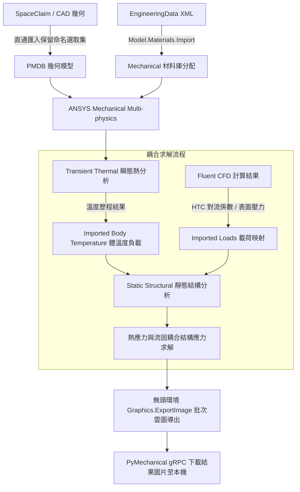

# ANSYS Mechanical 多物理場耦合與自動化分析技能

> [!NOTE]
> **架構收斂與指引說明**：
> 本技能已完整整併至林明志標準架構主技能 **[`ansys-mechanical`](../ansys-mechanical/SKILL.md)**。
> 多物理場序列耦合與 CFD 負載映射專精指引請參閱：
> - 主控手冊：[`ansys-mechanical/SKILL.md`](../ansys-mechanical/SKILL.md)
> - 多物理場專精子手冊：[`ansys-mechanical/reference/multiphysics_mapping.md`](../ansys-mechanical/reference/multiphysics_mapping.md)
> - 經典案例腳本：[`ansys-mechanical/scripts/run_taylor_bar_demo.py`](../ansys-mechanical/scripts/run_taylor_bar_demo.py)
> 本檔案保留作為過渡期歷史參照相容。

---

## 一、核心工作流程架構



---

## 二、幾何與材料自動化配置

### 1. PMDB 格式幾何直通匯入與 Named Selection 自動對應

PMDB（Part Modeling Database）是 ANSYS SpaceClaim 與 Mechanical 間具備最高效率的直通幾何格式。它能完整保留實體拓撲共享資訊、接觸對面群組以及 Named Selection（命名選取集），免除通用格式（如 STEP/IGES）轉換時命名遺失與面索引錯亂的問題。

```python
# ==============================================================================
# 腳本名稱: 01_import_pmdb_and_verify_ns.py
# 功能描述: 匯入 PMDB 幾何檔案並自動關聯驗證 Named Selection
# 執行環境: ANSYS Mechanical ACT / PyMechanical
# ==============================================================================

import os

def import_pmdb_geometry(pmdb_file_path):
    """匯入 PMDB 格式幾何檔案並自動解析 Named Selection。
    
    參數:
        pmdb_file_path (str): PMDB 檔案的絕對路徑。
    """
    if not os.path.exists(pmdb_file_path):
        raise FileNotFoundError(f"找不到指定的 PMDB 幾何檔案: {pmdb_file_path}")

    # 取得或建立幾何匯入群組 (Geometry Import Group)
    geometry_import_group = Model.GeometryImportGroup
    geometry_import = geometry_import_group.AddGeometryImport()

    # 設定 PMDB 匯入偏好設定
    import_format = Ansys.Mechanical.DataModel.Enums.GeometryImportPreference.Format.PMDB
    import_preferences = Ansys.ACT.Mechanical.Utilities.GeometryImportPreferences()
    
    # 關鍵設定：強制保留 CAD 面與體的 Named Selection
    import_preferences.ProcessNamedSelections = True
    import_preferences.NamedSelectionPrefix = ""  # 匯入全部前綴
    import_preferences.ProcessCoordinateSystems = True
    import_preferences.ProcessMaterialProperties = True

    # 執行幾何匯入作業
    geometry_import.Import(pmdb_file_path, import_format, import_preferences)
    print(f"成功直通匯入 PMDB 幾何: {pmdb_file_path}")

    # 遍歷並驗證所有自動載入的 Named Selection
    named_selections = Model.NamedSelections.Children
    print(f"共偵測到 {len(named_selections)} 個命名選取集:")
    ns_map = {}
    for ns in named_selections:
        ns_map[ns.Name] = ns
        print(f"  - 名稱: {ns.Name:<25} | 包含實體數: {ns.TotalEntitiesCount}")

    return ns_map

# 呼叫範例:
# ns_dict = import_pmdb_geometry(r"C:\Simulations\Project_Assembly.pmdb")
```

---

### 2. EngineeringData XML 材料庫自動導入與主體指定

透過 EngineeringData XML（MatML 格式），可將隨溫度變化的非線性材料屬性（熱傳導率 $k(T)$、比熱 $C_p(T)$、熱膨脹係數 $\alpha(T)$、割線模數 $E(T)$）一次性無縫匯入 Mechanical。

```python
# ==============================================================================
# 腳本名稱: 02_import_materials_and_assign.py
# 功能描述: 匯入 EngineeringData XML 材料庫並依實體名稱自動分配材料
# 執行環境: ANSYS Mechanical ACT / PyMechanical
# ==============================================================================

import os

def load_materials_and_assign(material_xml_path, assignment_rules):
    """匯入 XML 材料庫並依據規則將材料指定給對應的幾何主體。
    
    參數:
        material_xml_path (str): EngineeringData MatML XML 檔案路徑。
        assignment_rules (dict): 幾何體名稱特徵關鍵字與材料名稱的對照字典。
    """
    if not os.path.exists(material_xml_path):
        raise FileNotFoundError(f"找不到材料 XML 檔案: {material_xml_path}")

    # 1. 導入 EngineeringData XML 材料庫
    Model.Materials.Import(material_xml_path)
    print(f"成功匯入材料庫: {material_xml_path}")

    # 2. 列出當前模型載入的所有材料
    loaded_materials = [mat.Name for mat in Model.Materials.Children]
    print(f"當前工程材料清單: {loaded_materials}")

    # 3. 取得所有幾何主體 (Body) 並依規則匹配材料
    all_bodies = Model.Geometry.GetChildren(
        Ansys.Mechanical.DataModel.Enums.DataModelObjectCategory.Body, True
    )

    assigned_count = 0
    for body in all_bodies:
        body_name = body.Name
        target_material = None

        # 遍歷指派規則比對名稱關鍵字
        for keyword, mat_name in assignment_rules.items():
            if keyword.lower() in body_name.lower():
                target_material = mat_name
                break

        if target_material:
            if target_material in loaded_materials:
                body.Material = target_material
                assigned_count += 1
                print(f"主體 '{body_name}' 已成功指派材料: '{target_material}'")
            else:
                print(f"警告: 規則指定之材料 '{target_material}' 未存在於材料庫中！")
        else:
            print(f"提示: 主體 '{body_name}' 未匹配到指定規則，維持預設材料。")

    print(f"材料指派完成，共成功更新 {assigned_count} 個主體。")

# 呼叫範例:
# rules = {
#     "Copper": "Copper Alloy",
#     "FR4": "FR-4_GlassEpoxy",
#     "Silicon": "Silicon_Die",
#     "Solder": "SAC305_LeadFree"
# }
# load_materials_and_assign(r"C:\Simulations\CustomMaterials.xml", rules)
```

---

## 三、熱-結構序列耦合 (Transient Thermal to Static Structural)

熱-結構序列耦合的工作原理是先求解瞬態熱分析系統獲得溫度場 $T(x,y,z,t)$，隨後在結構分析中建立「匯入體溫度（Imported Body Temperature）」，將熱分析特定時間步的溫度插值映射至結構網格節點，並以無應力參考溫度 $T_{\text{ref}}$ 計算熱應變：
$$\epsilon_{\text{thermal}} = \alpha(T) \cdot (T - T_{\text{ref}})$$

```python
# ==============================================================================
# 腳本名稱: 03_sequential_thermal_structural_coupling.py
# 功能描述: 建立熱-結構序列耦合，將瞬態熱分析溫度場映射為結構熱應力負載
# 執行環境: ANSYS Mechanical ACT / PyMechanical
# ==============================================================================

def setup_thermal_stress_coupling(thermal_analysis_index=0, structural_analysis_index=1, target_time_sec=10.0):
    """在靜態結構分析中引入瞬態熱分析特定時刻的溫度場進行熱應力計算。
    
    參數:
        thermal_analysis_index (int): 來源熱分析在 Model.Analyses 中的索引。
        structural_analysis_index (int): 目標結構分析在 Model.Analyses 中的索引。
        target_time_sec (float): 要提取溫度的熱分析時間點（單位：秒）。
    """
    thermal_analysis = Model.Analyses[thermal_analysis_index]
    structural_analysis = Model.Analyses[structural_analysis_index]

    print(f"來源熱分析系統: {thermal_analysis.Name}")
    print(f"目標結構分析系統: {structural_analysis.Name}")

    # 1. 在結構分析環境中新增匯入負載群組 (Imported Load Group)
    imported_load_group = structural_analysis.AddImportedLoadGroup()
    imported_load_group.Name = "熱應力耦合溫度場"

    # 2. 新增匯入體溫度負載 (Imported Body Temperature)
    imported_temp = imported_load_group.AddImportedBodyTemperature()
    imported_temp.Name = f"熱分析溫度場_t={target_time_sec}s"

    # 3. 指定作用範圍（設為模型所有本體）
    all_bodies = Model.Geometry.GetChildren(
        Ansys.Mechanical.DataModel.Enums.DataModelObjectCategory.Body, True
    )
    imported_temp.Location = all_bodies

    # 4. 綁定熱分析環境與對應的時間步
    # 連接熱分析作為數據來源
    imported_temp.Source = thermal_analysis
    imported_temp.SourceTime = Quantity(f"{target_time_sec} [s]")

    # 5. 執行溫度場插值與映射計算
    print("正在執行溫度場有限元節點插值映射...")
    imported_temp.ImportLoad()
    print("溫度場映射完成！已成功轉移至結構分析邊界條件。")

    # 6. 加入等效應力 (Von-Mises) 與熱應變評估結果物件
    structural_solution = structural_analysis.Solution
    
    equivalent_stress = structural_solution.AddEquivalentStress()
    equivalent_stress.Name = "熱應力_VonMises"
    
    thermal_strain = structural_solution.AddThermalStrain()
    thermal_strain.Name = "等效熱應變"

    total_deformation = structural_solution.AddTotalDeformation()
    total_deformation.Name = "總變形量"

    print("結構求解評估項目設定完畢，可執行求解。")

# 呼叫範例:
# setup_thermal_stress_coupling(0, 1, 15.0)
```

---

## 四、CFD 負載映射 (Imported Loads from Fluent)

在電子散熱或流固耦合（FSI）工程中，外部流體由 Fluent 計算完成後，需將表面對流換熱係數（HTC）、流體局部溫度以及流體表面壓力分佈導入 Mechanical 固體邊界。

```python
# ==============================================================================
# 腳本名稱: 04_cfd_imported_loads_mapping.py
# 功能描述: 匯入 Fluent 計算之對流換熱係數 (HTC)、表面溫度與流體壓力場
# 執行環境: ANSYS Mechanical ACT / PyMechanical
# ==============================================================================

def map_fluent_cfd_loads(analysis, cfd_file_path, wetted_face_ns_name):
    """將 Fluent 輸出的 CFD 數據檔案映射至指定結構/熱分析邊界面。
    
    參數:
        analysis: 目標分析環境物件 (Thermal 或 Structural)。
        cfd_file_path (str): Fluent 導出的場數據檔案路徑 (.cdat, .ens, 或 .csv)。
        wetted_face_ns_name (str): 固體表面與流體接觸的 Named Selection 名稱。
    """
    # 尋找目標表面選取集
    wetted_ns = None
    for ns in Model.NamedSelections.Children:
        if ns.Name == wetted_face_ns_name:
            wetted_ns = ns
            break

    if not wetted_ns:
        raise ValueError(f"找不到指定的流固接觸面 Named Selection: '{wetted_face_ns_name}'")

    # 1. 建立匯入負載群組
    imported_load_group = analysis.AddImportedLoadGroup()
    imported_load_group.Name = "CFD_Fluent_表面負載"

    # 2. 新增匯入對流負載 (Imported Convection: HTC + Bulk Temperature)
    imported_convection = imported_load_group.AddImportedConvection()
    imported_convection.Name = "CFD_對流換熱係數與環境溫度"
    imported_convection.Location = wetted_ns

    # 設定外部資料檔案路徑
    imported_convection.DataFile = cfd_file_path
    # 插值加權演算法設定：K-近鄰平均或三角網格投影插值
    imported_convection.Algorithm = Ansys.Mechanical.DataModel.Enums.MappingAlgorithm.Triangulation
    
    print("正在執行 CFD 對流換熱係數 (HTC) 數據表面映射...")
    imported_convection.ImportLoad()
    print("HTC 與環境溫度映射完成！")

    # 3. 若為結構分析，額外新增匯入表面壓力負載 (Imported Pressure)
    if analysis.AnalysisType == Ansys.Mechanical.DataModel.Enums.AnalysisType.Structural:
        imported_pressure = imported_load_group.AddImportedPressure()
        imported_pressure.Name = "CFD_流體表面壓力"
        imported_pressure.Location = wetted_ns
        imported_pressure.DataFile = cfd_file_path
        imported_pressure.Algorithm = Ansys.Mechanical.DataModel.Enums.MappingAlgorithm.Triangulation
        
        print("正在執行 CFD 流體表面壓力數據映射...")
        imported_pressure.ImportLoad()
        print("流體壓力映射完成！")

# 呼叫範例:
# map_fluent_cfd_loads(Model.Analyses[0], r"C:\Simulations\Fluent_Out_Data.cdat", "WETTED_WALL_NS")
```

---

## 五、無頭環境批次截圖雲圖導出 (Headless Image Export)

在 HPC 或 Windows Server 無頭環境（Headless Mode）中執行模擬時，無法直接開啟視窗截圖。ANSYS Mechanical 提供 `Graphics.ExportImage` API，搭配白底色彩設定與高解析度視圖渲染，可批次輸出雲圖，並透過 PyMechanical gRPC 將圖檔下載至本地工作目錄。

```python
# ==============================================================================
# 腳本名稱: 05_headless_export_images.py
# 功能描述: 在無頭環境下批次設定視圖、渲染結果雲圖並輸出高畫質圖檔
# 執行環境: ANSYS Mechanical ACT / PyMechanical
# ==============================================================================

import os

def export_all_result_contours(output_dir, width=1920, height=1080):
    """遍歷所有求解結果物件，自動調整視圖角度並輸出白底高解析度 PNG 雲圖。
    
    參數:
        output_dir (str): 圖片儲存的目標資料夾路徑。
        width (int): 輸出圖片寬度像素。
        height (int): 輸出圖片高度像素。
    """
    if not os.path.exists(output_dir):
        os.makedirs(output_dir)

    # 1. 建立並設定圖片輸出參數
    export_settings = Ansys.Mechanical.Graphics.GraphicsImageExportSettings()
    export_settings.Resolution = GraphicsResolutionType.NormalResolution
    export_settings.Background = GraphicsBackgroundType.White  # 強制白底以利技術報告排版
    export_settings.Width = width
    export_settings.Height = height

    exported_files = []

    # 2. 遍歷所有分析系統中的求解結果
    for analysis in Model.Analyses:
        solution = analysis.Solution
        print(f"正在處理分析系統: {analysis.Name}")

        for child in solution.Children:
            # 檢查物件是否具備結果評估與圖形呈現介面
            if hasattr(child, "Activate") and hasattr(child, "PlotData"):
                try:
                    # 啟動並在圖形視窗聚焦該結果雲圖
                    child.Activate()

                    # 設定等角視圖 (Isometric View)
                    Graphics.Camera.SetSpecificViewOrientation(
                        ViewOrientationType.Iso
                    )
                    # 自動縮放適應螢幕
                    Graphics.Camera.SetFit()

                    # 格式化輸出檔案名稱
                    safe_name = child.Name.replace(" ", "_").replace("=", "_").replace("/", "_")
                    filename = f"{analysis.Name}_{safe_name}.png"
                    full_output_path = os.path.join(output_dir, filename)

                    # 執行無頭截圖導出
                    Graphics.ExportImage(
                        full_output_path,
                        GraphicsImageExportFormat.PNG,
                        export_settings
                    )
                    print(f"  [成功輸出] {filename} -> {full_output_path}")
                    exported_files.append(full_output_path)

                except Exception as e:
                    print(f"  [輸出失敗] {child.Name}: {str(e)}")

    print(f"所有結果雲圖輸出完畢，共計導出 {len(exported_files)} 張圖檔。")
    return exported_files

# 呼叫範例:
# export_all_result_contours(r"C:\Simulations\Exported_Contours", 1920, 1080)
```

### PyMechanical 本地下載實體程式碼範例

若 Mechanical 運行於遠端 Linux 運算節點或本機無頭背景容器中，可使用 PyMechanical 的 `download_file` API 將圖片取回：

```python
# ==============================================================================
# 腳本名稱: 06_download_images_via_pymechanical.py
# 功能描述: 透過 PyMechanical gRPC 將遠端無頭執行的雲圖檔案下載至本機
# 執行環境: 本機 Python 終端 (需安裝 ansys-mechanical-core)
# ==============================================================================

import os
from ansys.mechanical.core import launch_mechanical

def run_headless_workflow_and_download(remote_script_path, local_save_dir):
    """拉起無頭 Mechanical 服務器、發送執行腳本並下載導出的圖片。"""
    if not os.path.exists(local_save_dir):
        os.makedirs(local_save_dir)

    # 1. 啟動本機或遠端無頭 Mechanical 實例
    print("正在拉起無頭 Mechanical 運算行程...")
    mechanical = launch_mechanical(batch=True, loglevel="INFO")

    try:
        # 2. 發送並執行雲圖匯出腳本
        print("執行遠端雲圖自動批次導出腳本...")
        with open(remote_script_path, "r", encoding="utf-8") as f:
            script_content = f.read()
        
        mechanical.run_python_script(script_content)

        # 3. 透過 gRPC 下載遠端生成的圖檔清單
        # 假設遠端輸出目錄為 /tmp/mechanical_outputs
        remote_output_dir = "/tmp/mechanical_outputs"
        remote_file = f"{remote_output_dir}/summary_report.png"
        local_file = os.path.join(local_save_dir, "summary_report.png")
        
        mechanical.download_file(remote_file, local_file)
        print(f"成功下載雲圖至本機: {local_file}")

    finally:
        # 4. 安全釋放退出 Mechanical 實例
        mechanical.exit()
        print("Mechanical 運算行程已完全釋放關閉。")

# 呼叫範例:
# run_headless_workflow_and_download("export_script.py", r"D:\Project_Results\Images")
```

---

## 六、完整端到端 Python 自動化範例腳本

以下為整合 PMDB 匯入、材料庫分配、熱-結構序列耦合、CFD 負載映射與無頭截圖之完整端到端 Python 腳本：

```python
# ==============================================================================
# 腳本名稱: complete_mechanical_multiphysics_workflow.py
# 功能描述: 整合 PMDB 幾何直通、材料 XML 導入、熱-結構序列耦合與無頭雲圖輸出的完整腳本
# 執行環境: ANSYS Mechanical ACT / PyMechanical
# ==============================================================================

import os

def execute_full_multiphysics_pipeline(config):
    """執行全流程多物理場自動化分析流程。
    
    參數:
        config (dict): 包含模型路徑、材料路徑與輸出參數的設定字典。
    """
    print("=== [步驟 1/5] PMDB 幾何直通匯入 ===")
    pmdb_path = config.get("pmdb_path")
    if not os.path.exists(pmdb_path):
        raise FileNotFoundError(f"找不到 PMDB 模型: {pmdb_path}")

    geom_import_group = Model.GeometryImportGroup
    geom_import = geom_import_group.AddGeometryImport()
    import_format = Ansys.Mechanical.DataModel.Enums.GeometryImportPreference.Format.PMDB
    import_pref = Ansys.ACT.Mechanical.Utilities.GeometryImportPreferences()
    import_pref.ProcessNamedSelections = True
    geom_import.Import(pmdb_path, import_format, import_pref)
    print("PMDB 幾何匯入完成。")

    print("=== [步驟 2/5] EngineeringData XML 材料庫載入 ===")
    mat_xml_path = config.get("mat_xml_path")
    if os.path.exists(mat_xml_path):
        Model.Materials.Import(mat_xml_path)
        print("材料庫 XML 導入完成。")
        
        # 依關鍵字匹配材料
        rules = config.get("material_rules", {})
        for body in Model.Geometry.GetChildren(Ansys.Mechanical.DataModel.Enums.DataModelObjectCategory.Body, True):
            for kw, mat_name in rules.items():
                if kw.lower() in body.Name.lower():
                    body.Material = mat_name
                    print(f"主體 '{body.Name}' -> 材料 '{mat_name}'")
                    break

    print("=== [步驟 3/5] 熱-結構序列單向耦合設定 ===")
    if len(Model.Analyses) >= 2:
        thermal_analysis = Model.Analyses[0]
        structural_analysis = Model.Analyses[1]

        # 結構系統中建立體溫度負載
        imported_load_group = structural_analysis.AddImportedLoadGroup()
        imported_temp = imported_load_group.AddImportedBodyTemperature()
        imported_temp.Name = "熱應力耦合溫度"
        imported_temp.Location = Model.Geometry.GetChildren(
            Ansys.Mechanical.DataModel.Enums.DataModelObjectCategory.Body, True
        )
        imported_temp.Source = thermal_analysis
        imported_temp.SourceTime = Quantity(f"{config.get('eval_time', 10.0)} [s]")
        imported_temp.ImportLoad()
        print("熱應力載荷映射成功。")

    print("=== [步驟 4/5] 求解分析系統 ===")
    for analysis in Model.Analyses:
        print(f"正在求解系統: {analysis.Name}...")
        analysis.Solve(True)
        print(f"系統 {analysis.Name} 求解完畢。")

    print("=== [步驟 5/5] 無頭高解析度雲圖批次導出 ===")
    output_dir = config.get("output_image_dir", "C:/Temp/OutputImages")
    if not os.path.exists(output_dir):
        os.makedirs(output_dir)

    export_settings = Ansys.Mechanical.Graphics.GraphicsImageExportSettings()
    export_settings.Resolution = GraphicsResolutionType.NormalResolution
    export_settings.Background = GraphicsBackgroundType.White
    export_settings.Width = config.get("image_width", 1920)
    export_settings.Height = config.get("image_height", 1080)

    for analysis in Model.Analyses:
        for result in analysis.Solution.Children:
            if hasattr(result, "Activate"):
                result.Activate()
                Graphics.Camera.SetSpecificViewOrientation(ViewOrientationType.Iso)
                Graphics.Camera.SetFit()
                clean_name = result.Name.replace(" ", "_").replace("/", "_")
                img_path = os.path.join(output_dir, f"{analysis.Name}_{clean_name}.png")
                Graphics.ExportImage(img_path, GraphicsImageExportFormat.PNG, export_settings)
                print(f"已導出雲圖: {img_path}")

    print("=== 多物理場自動化工作流程全部圓滿完成 ===")

# 設定參數結構範例:
# pipeline_config = {
#     "pmdb_path": r"C:\Simulations\BGA_Package.pmdb",
#     "mat_xml_path": r"C:\Simulations\ElectronicMaterials.xml",
#     "material_rules": {"Substrate": "FR-4", "Die": "Silicon", "Ball": "SAC305"},
#     "eval_time": 10.0,
#     "output_image_dir": r"C:\Simulations\Contours",
#     "image_width": 1920,
#     "image_height": 1080
# }
