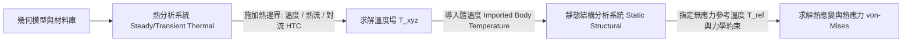
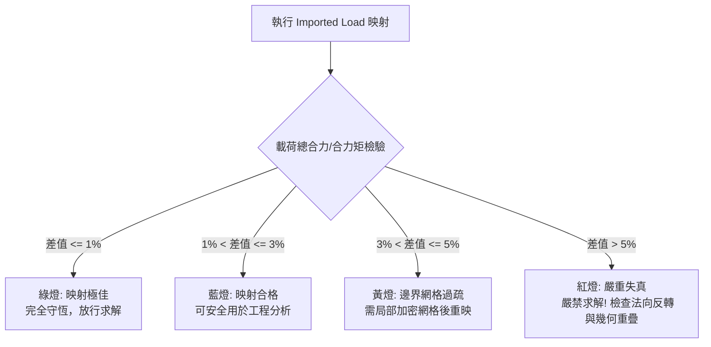

# Mechanical 多物理場耦合與負載映射手冊 (`multiphysics_mapping.md`)

多物理場耦合分析（Multiphysics Coupling）是工程結構在高溫、高壓與複雜流場環境下的核心校核手段。本手冊規範 ANSYS Mechanical 熱-結構序列耦合、Fluent CFD 表面數據映射機制，以及基於聖維南原理的過渡平滑與插值檢驗準則。

---

## 一、熱-結構序列耦合原理與 ACT 管線

熱-結構序列耦合（Sequential Weak Coupling）通常先於熱分析求解整體溫度分佈，再將該溫度場作為外加體載荷（Body Temperature）導入靜態或瞬態力學系統，計算熱應變與熱應力。



### ACT 自動化腳本設定核心：
```python
# 1. 在結構分析環境中建立導入溫度物件
import_temp = Analysis.ThermalCondition.AddImportedBodyTemperature()
import_temp.Source = "Thermal Analysis"

# 2. 作用主體範圍設定
body_sel = ExtAPI.SelectionManager.CreateSelectionInfo(SelectionTypeEnum.GeometryEntities)
body_sel.Entities = [Model.Geometry.Children[0].Children[0]]
import_temp.Location = body_sel

# 3. 指定無應力基準溫度 (Environment Temperature，如 22 °C)
Model.EnvironmentTemperature = Quantity("22 [C]")

# 4. 讀取並插值熱分析求解結果
import_temp.ImportLoad()
```

---

## 二、Fluent CFD 表面負載映射機制 (CFD Surface Mapping)

當流體流速較高或流場壓力梯度顯著時，流體對固體表面的作用力與傳熱需透過表面數據映射（Surface Data Mapping）傳遞至有限元網格。

### 1. 映射數據類型
- **靜態壓力 (Static Pressure)**：將 Fluent 壁面壓力場插值為 Mechanical 表面分佈壓力（Imported Pressure）。
- **對流換熱係數 (HTC, Heat Transfer Coefficient)**：將流體近壁面傳熱特徵映射為結構表面對流換熱邊界。
- **近壁面流體溫度 (Adjacent Fluid Temperature)**：搭配 HTC 作為對流邊界的參考周圍流體溫度。

### 2. 空間場插值演算法
```mermaid
flowchart TD
    CFD_Mesh[Fluent CFD 表面三角形/多面體網格節點] --> Interpolator{空間形函數插值引擎}
    Interpolator -->|粗網格至細網格| FEA_Face[Mechanical 結構表面四邊形/三角形單元高斯點]
    Interpolator -->|演算法 1: 距離反比加權 (IDW)| Opt1[適用於平坦規則邊界]
    Interpolator -->|演算法 2: 局部多項式 Kriging| Opt2[適用於曲率變化大、非對齊網格]
```

---

## 三、聖維南原理與邊界過渡平滑規範

根據聖維南原理（Saint-Venant's Principle），當外力或溫度梯度作用於結構局部區域時，遠離該載荷作用面（距離大於特徵尺寸 $d$）的應力分佈僅取決於合力與合力矩，而與具體分佈形式無關。但在局部載荷邊界交界處，若網格不匹配或插值噪聲過大，會產生嚴重的「數值假應力」。

### 1. 邊界平滑過渡設定原則：
- **切面過渡緩衝區**：在載荷施加面周圍保留至少 $2 \sim 3$ 個單元寬度的過渡平滑過渡帶，避免梯級突變。
- **聖維南影響半徑評估**：
  $$L_{\text{decay}} \approx 1.5 \times \sqrt{A_{\text{contact}}}$$
  在此衰減半徑範圍內，嚴禁直接依據單點節點極值判定結構降伏，必須取路徑積分或剖面均值。
- **特徵邊緣去奇異性**：載荷作用邊緣若與固體銳角幾何重合，必須在幾何階段建立倒角（Fillet $\ge 0.5\text{ mm}$），消除幾何不連續引發的應力奇異點。

---

## 四、映射品質量化檢驗與診斷準則

數據映射完成後，必須進行客觀量化覆核，確認能量與載荷總量在插值過程中嚴格守恆：



### 診斷檢驗清單：
| 檢驗項目 | 合格標準 | 不合格排查對策 |
| :--- | :--- | :--- |
| **總法向力積分 (Force Integral)** | $\left\|\frac{F_{\text{FEA}} - F_{\text{CFD}}}{F_{\text{CFD}}}\right\| \le 2.0\%$ | 檢查 CFD 與 FEA 表面幾何外形公差是否過大，或法向方向是否相反。 |
| **非映射節點比例 (Unmapped Nodes)** | 嚴格為 $0.0\%$ | 擴大空間投影搜尋容差（Search Tolerance 或 Pinball 半徑）。 |
| **未平均應力斷差 (Un-averaged Gap)** | $\le 10.0\%$ | 載荷梯度過大處網格解析度不足，需施加局部網格加密（Face Sizing）。 |
