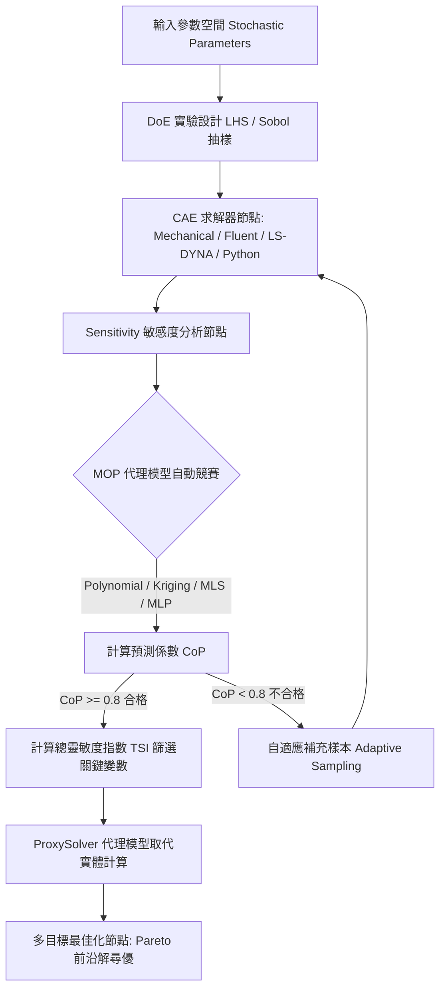

# ANSYS optiSLang 代理模型與最佳化技能 (Metamodeling & Optimization Skill)

本技能提供使用 ANSYS optiSLang 進行參數敏感度分析、最佳預測代理模型（MOP, Metamodel of Optimal Prognosis）建構、關鍵變數篩選與多目標 Pareto 最佳化尋優之標準工程規範與自動化腳本指南。

---

## 一、optiSLang 節點式模組架構

optiSLang 採用強大的基於流圖（Scenery / Flow Graph）之節點式拓撲架構，實現跨求解器聯合運算與多階段分析：



### 核心節點職責說明：
1. **Sensitivity 節點**：負責實驗設計（DoE）、抽樣管理、全域敏感度分析與元模型構建。
2. **MOP (Metamodel of Optimal Prognosis) 節點**：自動在多項式（Polynomial）、克里金（Kriging）、移動最小二乘（MLS）與人工神經網路（MLP）之間進行模型空間競賽，自動尋找最優預測元模型。
3. **ProxySolver 節點**：將驗證通過之高品質 MOP 導出為獨立極速代理求解器，將單次求解耗時從數小時縮短至毫秒級。
4. **Robustness 節點**：分析公差與不確定性（常態分佈、散佈帶），評估產品故障機率與六標準差（6-Sigma）可靠度。
5. **Optimization 節點**：基於 MOP 或直接驅動求解器執行多目標演化演算法（如 NSGA-II），搜尋 Pareto 非支配解集。

---

## 二、隨機參數與實驗設計 (DoE)

### 1. 隨機參數定義 (StochasticParameter)
工程分析中的設計變數需定義其物理邊界與機率分佈特性：
- **均勻分佈 (Uniform Distribution)**：適用於概念探索階段，已知設計上下限但無先驗機率偏好。
  $$X \sim U(a, b)$$
- **常態分佈 (Normal / Gaussian Distribution)**：適用於公差分析與穩健性評估，給定平均值 $\mu$ 與標準差 $\sigma$。
  $$X \sim \mathcal{N}(\mu, \sigma^2)$$

### 2. 拉丁超立方抽樣 (Latin Hypercube Sampling, LHS)
相較於傳統蒙地卡羅（Monte Carlo）隨機抽樣，LHS 具備高度的「空間填充性」（Space-Filling Property）：
- 將各維度機率分佈區間等分為 $N$ 個機率相等的子區間。
- 確保每個子區間在各變數維度上僅被抽樣一次，避免樣本聚集與空間空白。
- 樣本數經驗準則：對於 $k$ 個輸入變數，初始 DoE 建議樣本數 $N \ge 10 \cdot k$。

---

## 三、MOP 最佳預測元模型品質客觀評估

評估代理模型不可僅依賴決定係數 $R^2$（因 $R^2$ 會隨參數增加而虛假上升，導致嚴重過擬合 Overfitting）。optiSLang 獨創的**預測係數 CoP (Coefficient of Prognosis)** 是衡量代理模型泛化能力的唯一客觀金標準。

### 1. 預測係數 CoP 計算原理
CoP 基於多重交叉驗證（Cross-Validation）：
$$\text{CoP} = 1 - \frac{\text{SS}_{E,\text{pred}}}{\text{SS}_T}$$
其中：
- $\text{SS}_{E,\text{pred}} = \sum_{i=1}^N (y_i - \hat{y}_{-i})^2$：剔除第 $i$ 個樣本後，由其餘樣本擬合模型對 $y_i$ 進行預測所產生之預測誤差平方和。
- $\text{SS}_T = \sum_{i=1}^N (y_i - \bar{y})^2$：總變異平方和。

### 2. CoP 品質客觀門檻矩陣

| CoP 區間 | 模型品質判定 | 工程適用性與後續處置建議 |
| :--- | :--- | :--- |
| **$\text{CoP} \ge 0.95$** | **極佳 (Excellent)** | 預測精度極高，可直接完全取代 CAE 實體運算進行百萬次蒙地卡羅模擬或全域最佳化。 |
| **$0.80 \le \text{CoP} < 0.95$** | **良好 (Good)** | 達到工程驗證合格門檻，適合用於趨勢判斷、敏感度過濾與代理模型尋優。 |
| **$0.60 \le \text{CoP} < 0.80$** | **中等 (Fair)** | 存在局部非線性失真，建議使用自適應採樣（Adaptive Sampling）在響應劇烈區域補充樣本點。 |
| **$\text{CoP} < 0.60$** | **不合格 (Poor)** | 嚴禁直接用於最佳化。須檢查網格噪聲、分段不連續性，或將設計空間縮小進行子區域擬合。 |

---

## 四、總靈敏度指數 (TSI) 與 Pareto 多目標尋優

### 1. 總靈敏度指數 (Total Sensitivity Index, TSI)
- optiSLang 透過方差分解（Sobol 指數法）計算各輸入參數對輸出響應的方差貢獻比率。
- **降維過濾準則**：若某參數之 $\text{TSI} < 0.05$（貢獻度小於 5%），可判定為非關鍵雜訊變數，在後續最佳化階段將其凍結為常數，大幅降低尋優維度。

### 2. Pareto 多目標最佳化
當工程存在相互衝突之多目標（例如：極小化結構重量 vs 極小化最大應力）：
- **非支配排序 (Non-dominated Sorting)**：若解 A 在所有目標上均不劣於解 B，且至少在一個目標上優於解 B，則稱 A 支配 B。
- **Pareto 前沿 (Pareto Frontier)**：所有無法被其他解支配的最優折衷解集合。工程師可沿 Pareto 曲線根據權重進行量化取捨。

---

## 五、完整 Python 程式碼範例

以下腳本展示使用 Python 建立 optiSLang 參數空間、配置 LHS 抽樣、生成 MOP 自動設定腳本，以及對 CoP 與 TSI 指標進行客觀評估的驗證演算法：

```python
# -*- coding: utf-8 -*-
"""
模組名稱：optislang_mop_optimization.py
功能說明：使用 PyOptiSLang 自動化建立參數敏感度分析、MOP 最佳預測代理模型與多目標尋優
依據標準：預測係數 CoP >= 0.8 驗證門檻與總靈敏度指數 (TSI) 篩選
"""

from typing import Dict, Any, List


class OptislangWorkflowManager:
    """
    ANSYS optiSLang 代理模型工作流程管理封裝
    """

    def __init__(self, host: str = "127.0.0.1", port: int = 49152):
        self.host = host
        self.port = port
        self.parameters: List[Dict[str, Any]] = []
        self.responses: List[Dict[str, Any]] = []

    def register_continuous_parameter(
        self,
        name: str,
        lower_bound: float,
        upper_bound: float,
        distribution_type: str = "Uniform",
        reference_val: float = 0.0
    ) -> "OptislangWorkflowManager":
        """
        註冊連續隨機參數 (StochasticParameter)
        :param distribution_type: 分佈型別，可為 'Uniform' 或 'Normal'
        """
        self.parameters.append({
            "name": name,
            "lower_bound": lower_bound,
            "upper_bound": upper_bound,
            "distribution": distribution_type,
            "reference_val": reference_val
        })
        return self

    def register_output_response(
        self,
        name: str,
        criterion: str = "min",
        cop_threshold: float = 0.80
    ) -> "OptislangWorkflowManager":
        """
        註冊目標響應與代理模型驗證品質門檻
        :param criterion: 最佳化目標，'min' 或 'max'
        :param cop_threshold: 預測係數 CoP 最低接受門檻 (預設 0.80)
        """
        self.responses.append({
            "name": name,
            "criterion": criterion,
            "cop_threshold": cop_threshold
        })
        return self

    def generate_optislang_setup_script(
        self,
        num_samples: int = 100,
        sampling_method: str = "LHS"
    ) -> str:
        """
        產生 optiSLang 原生 Python 腳本，用於在 optiSLang Server 中建構 Sensitivity 與 MOP 節點
        """
        lines: List[str] = [
            "# -*- coding: utf-8 -*-",
            "# optiSLang 自動化建置腳本",
            "import pyoptislang",
            "",
            "# 1. 建立 Sensitivity 分析系統節點",
            "root_system = project.get_root_system()",
            "sensitivity_node = root_system.create_node(",
            "    type='Sensitivity',",
            "    name='Parametric_Sensitivity_MOP'",
            ")",
            "",
            "# 2. 配置實驗設計 (DoE) 抽樣設定",
            f"sensitivity_node.set_property('SamplingMethod', '{sampling_method}')",
            f"sensitivity_node.set_property('NumberOfSamples', {num_samples})",
            "",
            "# 3. 註冊輸入參數與機率分佈"
        ]

        for p in self.parameters:
            lines.extend([
                f"# 參數：{p['name']}",
                f"param = sensitivity_node.create_parameter('{p['name']}')",
                f"param.set_distribution_type('{p['distribution']}')",
                f"param.set_range({p['lower_bound']}, {p['upper_bound']})"
            ])

        lines.extend([
            "",
            "# 4. 啟用 MOP (Metamodel of Optimal Prognosis) 最佳模型自動篩選",
            "mop_settings = sensitivity_node.get_mop_settings()",
            "mop_settings.enable_polynomial_models = True",
            "mop_settings.enable_kriging_models = True",
            "mop_settings.enable_moving_least_squares = True",
            "mop_settings.enable_neural_networks = True",
            "",
            "# 5. 啟動敏感度分析運算",
            "# sensitivity_node.start_execution()"
        ])

        return "\n".join(lines)


def evaluate_mop_quality_and_tsi(
    cop_values: Dict[str, float],
    tsi_values: Dict[str, Dict[str, float]],
    cop_threshold: float = 0.80,
    tsi_significance_threshold: float = 0.05
) -> Dict[str, Any]:
    """
    客觀評估 MOP 預測品質與篩選關鍵參數
    :param cop_values: 各響應之預測係數 CoP (Coefficient of Prognosis)
    :param tsi_values: 各響應對各輸入變數之總靈敏度指數 (Total Sensitivity Index)
    :param cop_threshold: 可接受之最低 CoP 門檻 (預設 0.80)
    :param tsi_significance_threshold: 顯著性參數門檻 (預設 TSI > 0.05)
    :return: 驗證結論與建議之關鍵降維參數清單
    """
    evaluation_report: Dict[str, Any] = {
        "all_cop_acceptable": True,
        "response_details": {},
        "significant_parameters": set()
    }

    for resp_name, cop in cop_values.items():
        is_acceptable = cop >= cop_threshold
        if not is_acceptable:
            evaluation_report["all_cop_acceptable"] = False

        # 判定模型品質等級
        if cop >= 0.95:
            quality_level = "極佳 (Excellent) - 可高度取代實體仿真"
        elif cop >= 0.80:
            quality_level = "良好 (Good) - 具備高可靠度，適合全域最佳化"
        elif cop >= 0.60:
            quality_level = "中等 (Fair) - 建議增加樣本數或調整設計空間"
        else:
            quality_level = "不合格 (Poor) - 強烈建議細分空間或檢核物理非線性/雜訊"

        # 篩選該響應之關鍵重要變數
        param_tsi = tsi_values.get(resp_name, {})
        sig_params = [
            param for param, tsi in param_tsi.items()
            if tsi >= tsi_significance_threshold
        ]
        evaluation_report["significant_parameters"].update(sig_params)

        evaluation_report["response_details"][resp_name] = {
            "cop": round(cop, 4),
            "cop_acceptable": is_acceptable,
            "quality_level": quality_level,
            "key_drivers": sig_params
        }

    evaluation_report["significant_parameters"] = sorted(
        list(evaluation_report["significant_parameters"])
    )
    return evaluation_report
```
