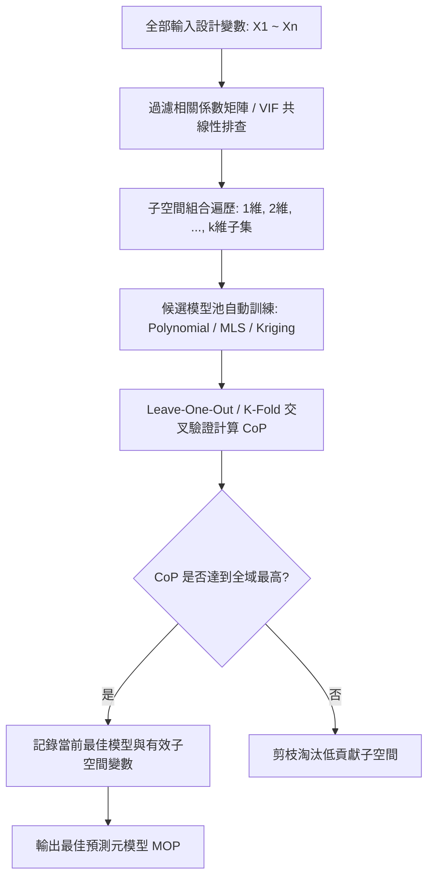

# optiSLang MOP 最佳預測元模型手冊 (`mop_metamodel.md`)

傳統 CAE 最佳化常受制於單一代理模型（如僅使用二次多項式或普通 Kriging）的侷限性。optiSLang 的核心創新在於 **MOP (Metamodel of Optimal Prognosis, 最佳預測元模型)** 架構，它透過模型空間自動競賽與最佳子空間搜索，尋找客觀預測精度最高的代理模型。

---

## 一、MOP 候選模型空間 (Candidate Model Pool)

MOP 自動評估並比較下列多元模型架構，並在交叉驗證預測係數 CoP 下自動挑選最優模型：

| 模型架構 | 數學基礎與特性 | 優勢場景 | 限制與注意事項 |
| :--- | :--- | :--- | :--- |
| **多項式回歸 (Polynomial)** | 線性、純二次、全二次帶交叉項 ($y = \beta_0 + \sum \beta_i x_i + \sum \beta_{ij} x_i x_j$) | 物理趨勢平滑，計算開銷小，外插數值衰減受控 | 難以捕捉高頻震盪或階躍非連續響應 |
| **移動最小二乘 (MLS)** | 空間局部距離加權矩陣多項式近似 ($\min \sum w(x - x_i)(y_i - \hat{y}(x_i))^2$) | 對空間非均勻樣本點適應力高，能平滑局部數值噪聲 | 權重核半徑需細緻調諧，邊界點權重易失真 |
| **克里金高斯過程 (Kriging)** | 全域多項式趨勢項結合局部空間相關高斯隨機過程協方差 ($\hat{y} = f(x) + Z(x)$) | 嚴格插值通過抽樣點，提供不確定性與預測方差估計 | 樣本數大於 500 時協方差矩陣求逆計算量顯著增加 |
| **多層感知機 (MLP)** | 多層前饋人工神經網路，具備非線性激勵函數與反向傳播學習 | 能擬合極高維度與複雜高階非線性空間映射 | 需較多樣本防止局部極小與過擬合，訓練可解釋性較低 |

---

## 二、最佳子空間搜索 (Best Subspace Search)

MOP 的核心競爭力在於**模型候選池競賽與輸入變數子空間維度過濾的同步推進**：



### 關鍵演算法流程：
1. **輸入維度修剪**：主動剔除對目標響應無顯著相關性（總效應敏感度接近 0）的冗餘變數，降低模型自由度。
2. **交叉驗證防過擬合**：利用留一法（Leave-One-Out）或多折（K-Fold）交叉驗證計算 $\text{CoP}$，避免傳統決定係數 $R^2$ 因參數增多而虛高。
3. **客觀自動決策**：最終 MOP 不由使用者主觀指派，而是由系統選取 $\text{CoP}$ 最高的模型與特徵變數子集。

---

## 三、工程經典案例：十桿桁架 (Ten-Bar Truss) 多目標尋優

十桿桁架結構（10-Bar Truss Benchmark）是 optiSLang 代理模型與 Pareto 多目標尋優的經典範例：

```mermaid
flowchart LR
    subgraph 輸入設計參數 (10個尺寸變數)
        A1[A1 ~ A10: 各桁架桿件截面積 0.1 ~ 35.0 in²]
    end
    subgraph 求解器與 MOP 代理模型
        FEM[ANSYS MAPDL / Mechanical 結構分析]
        MOP[optiSLang MOP 代理模型訓練]
        FEM -->|30~50 樣本點訓練| MOP
    end
    subgraph 衝突目標與約束
        O1[目標 1: 結構總質量 Total Mass 極小化]
        O2[目標 2: 節點最大垂直位移 Max Displacement 極小化]
        C1[約束: 桿件軸向應力 |Stress| <= 25,000 psi]
    end
    MOP --> O1
    MOP --> O2
    MOP --> C1
```

### 尋優關鍵設定與流程：
1. **參數定義**：10 根桁架桿之截面積 $A_1 \sim A_{10}$ 設為連續設計參數，材料為鋁合金 ($E = 10^7\text{ psi}, \rho = 0.1\text{ lb/in}^3$)。
2. **抽樣規模**：採用進階拉丁超立方抽樣 (Advanced LHS)，生成 $N = 40 \sim 60$ 組樣本。
3. **MOP 品質檢驗**：
   - 總質量響應為完全線性物理規律，多項式回歸即達到 $\text{CoP} = 1.00$。
   - 最大節點位移具備非線性特徵，MLS 或 Kriging 模型在過濾弱影響桿件後達到 $\text{CoP} \ge 0.92$。
4. **Pareto 尋優**：基於 MOP 代理模型執行演化演算法（EA / NSGA-II），幾秒內即可生成完整 Pareto 最優前沿解集。

---

## 四、ProxySolver 導出與部署驗收規範

當 MOP 訓練驗證達到合格門檻（$\text{CoP} \ge 0.80$）後，可導出為獨立的高性能求解節點 **ProxySolver**：

### 1. 部署優勢
- **無求解器授權依賴**：ProxySolver 完全擺脫龐大的 ANSYS 有限元求解器核心與商業授權，可作為輕量級數學函式庫獨立運作。
- **極致計算加速**：單次評估時間由分鐘/小時級降至毫秒級（$10^{-3}\text{ s}$），支援百萬次級別的蒙地卡羅可靠度分析。

### 2. 驗收與回代閉環規範 (Verification Closed-Loop)
為防止代理模型局部外插誤差造成虛假最優解，必須執行**雙向覆核機制**：
1. **Pareto 解抽取**：在生成的 Pareto 前沿中，選取 1~3 個最優候選折衷點（Compromise Solutions）。
2. **回代原求解器 (Validation Run)**：將最佳折衷點之設計參數回傳原 ANSYS CAE 求解器執行真實求解。
3. **誤差判定門檻**：
   $$\text{Relative Error} = \left|\frac{y_{\text{CAE}} - y_{\text{MOP}}}{y_{\text{CAE}}}\right| \le 3\%$$
   若誤差超過 $5\%$，必須觸發自適應補點（Adaptive Sampling），在最優解鄰域增加樣本並重新更新 MOP。
