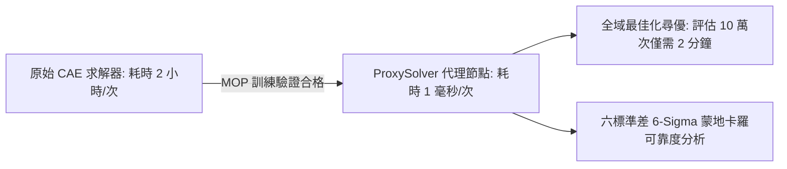

# optiSLang MOP 最佳預測元模型手冊 (`mop_metamodel.md`)

傳統 CAE 最佳化常受制於單一代理模型（如僅使用二次多項式或普通 Kriging）的侷限性。optiSLang 的核心創新在於 **MOP (Metamodel of Optimal Prognosis, 最佳預測元模型)** 架構，它透過模型空間自動競賽與最佳子空間搜索，尋找客觀預測精度最高的代理模型。

---

## 一、MOP 候選模型空間 (Model Pool)

MOP 自動評估並比較下列多元模型架構：

1. **多項式回歸 (Polynomial Regression)**：
   - 線性、純二次、帶交互項二次多項式。
   - 優勢：物理趨勢平滑，外插衰減受控，計算極速。
   - 劣勢：難以捕捉局部高度波折或階躍不連續。
2. **移動最小二乘法 (Moving Least Squares, MLS)**：
   - 採用空間距離權重進行局部回歸。
   - 優勢：對非均勻空間分佈具有高度適應力，能平滑局部噪聲。
3. **克里金高斯過程 (Kriging / Gaussian Process)**：
   - 結合全域回歸基底與局部高斯隨機過程協方差。
   - 優勢：精確通過抽樣點（若無視噪聲），能提供預測方差與不確定性估計。
4. **多層感知機神經網路 (MLP, Multi-Layer Perceptron)**：
   - 前饋人工神經網路。
   - 優勢：適合高維度、高度複雜非線性映射。

---

## 二、最佳子空間搜索 (Best Subspace Search)

MOP 不僅競賽不同模型演算法，還執行**輸入維度的子空間遍歷**：
- 自動嘗試所有可能的變數組合子集（例如從 8 個變數中找出對目標響應預測力最強的 3 個變數組合）。
- 剔除無關變數對模型的污染，防止高自由度帶來的過擬合。

---

## 三、ProxySolver 導出與超高速部署

當 MOP 訓練通過驗證後，可將其封裝為 **ProxySolver 代理求解器**：

### 部署規範：
- ProxySolver 完全脫離 ANSYS 本體求解授權，可作為獨立推論模組進行極速運算。
- 尋優完成後，必須抽取 Pareto 解集中 1~3 個最優折衷點，返回原 CAE 求解器進行真實計算覆核。
