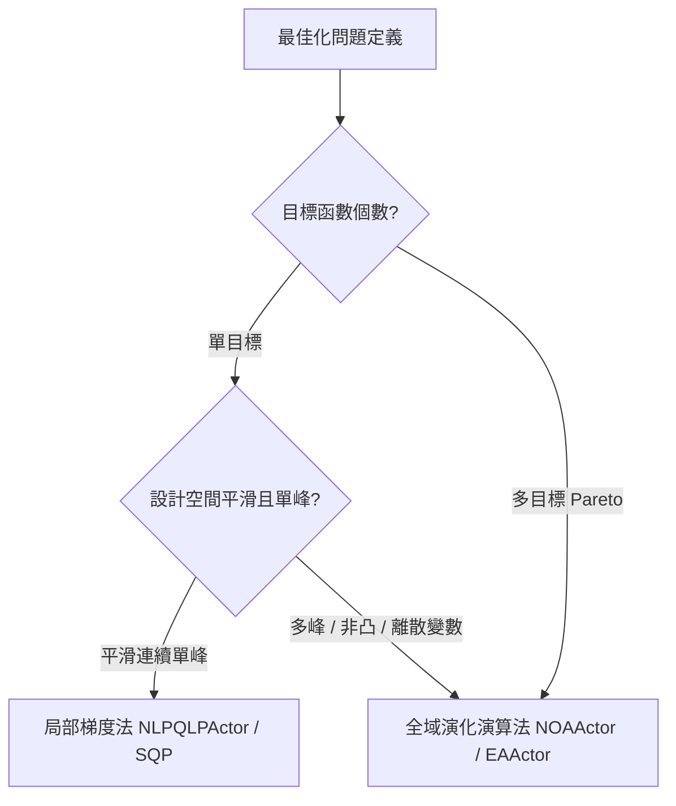

# optiSLang 最佳化演算法與 Pareto 尋優手冊 (`optimization_algorithms.md`)

在建立高品質 MOP 代理模型後，工程師需依據目標與約束特性選擇最適演算法。optiSLang 提供局部梯度法與全域啟發式演算法雙軌架構。

---

## 一、最佳化演算法選型決策矩陣

| 演算法類別 | 代表演算法 (Actor) | 適用場景與優勢 | 限制與注意事項 |
| :--- | :--- | :--- | :--- |
| **局部梯度法** | **`NLPQLPActor`** (序列二次規劃 SQP) | 變數平滑、單一目標、對局部極值收斂極快（數十步內精確收斂）。 | 易陷入局部最優；目標函數必須連續；不支援離散變數。 |
| **自適應響應面** | **`ARSMActor`** | 局部自適應縮小搜尋區域，適合直接驅動耗時模擬。 | 依賴響應面近似精度。 |
| **全域啟發式** | **`NOAActor`** / **`EAActor`** (演化演算法 NSGA-II) | **多目標 Pareto 尋優首選**；支援多峰、離散參數、高度非凸邊界。 | 評估次數大（通常需 1,000~10,000 次，強烈建議基於 MOP ProxySolver 運行）。 |
| **粒子群演算法** | **`PSOActor`** (Particle Swarm) | 快速群體全域探索，適合高維度連續空間尋優。 | 邊界約束處理需精細調諧懲罰項。 |

---

## 二、多目標 Pareto 前沿尋優 (Multi-Objective Optimization)

工程實務中，目標往往互相衝突（例如：極小化結構質量 vs 極小化最大變形量）。

### 1. 非支配排序 (Non-dominated Sorting)
- **解 A 支配 解 B**：解 A 在所有目標上均不劣於解 B，且至少在一個目標上優於解 B。
- **Pareto 前沿 (Pareto Frontier)**：整個解空間中所有非支配解所構成的集合。

### 2. 工程決策權重平衡法
在 Pareto 解集獲取後，工程師可透過折衷圖表依據製造預算或安全係數選擇最優操作點：
$$\text{Utility} = w_1 \cdot \frac{f_1 - f_{1,\min}}{f_{1,\max} - f_{1,\min}} + w_2 \cdot \frac{f_2 - f_{2,\min}}{f_{2,\max} - f_{2,\min}}$$
