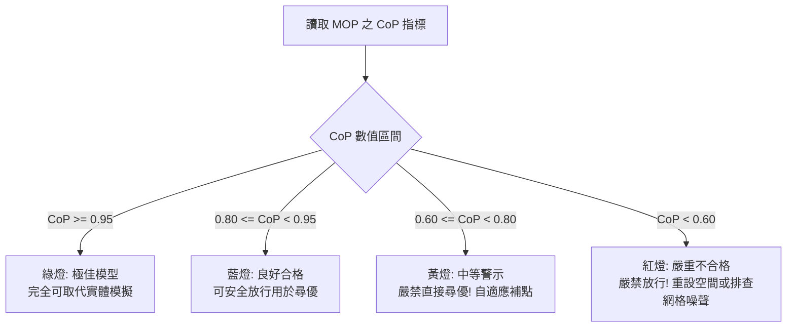

# optiSLang 判斷力庫：CoP、共線性與過擬合診斷 (`optislang_judgment.md`)

本手冊為 optiSLang 代理模型與最佳化分析之核心工程判斷力庫，定義客觀門檻、診斷病徵與修正處置流程。

---

## 一、預測係數 CoP (Coefficient of Prognosis) 核心門檻

CoP 透過多重交叉驗證（Cross-Validation）衡量模型對未知數據點的真實預測能力：
$$\text{CoP} = 1 - \frac{\sum_{i=1}^N (y_i - \hat{y}_{-i})^2}{\sum_{i=1}^N (y_i - \bar{y})^2}$$

| CoP 區間 | 品質等級 | 工程行動準則 |
| :---: | :---: | :--- |
| **$\ge 0.95$** | **極佳 (Excellent)** | 預測精度極高，可直接完全取代 CAE 實體運算進行百萬次蒙地卡羅模擬或全域最佳化。 |
| **$0.80 \sim 0.95$** | **良好 (Good)** | **工程驗證合格門檻**，適合用於趨勢判斷、敏感度過濾與代理模型尋優。 |
| **$0.60 \sim 0.80$** | **中等 (Fair)** | 存在局部非線性失真，**嚴禁直接全域尋優**；必須使用自適應採樣（Adaptive Sampling）在局部補充樣本點。 |
| **$< 0.60$** | **不合格 (Poor)** | **嚴禁交付結果！** 模型無泛化能力，需縮小參數區間或排查 CAE 求解網格噪聲。 |

---

## 二、共線性排查 (Collinearity Diagnostics)

當輸入變數間並非完全獨立時，會造成迴歸係數方差暴增、符號翻轉與模型病態。

### 1. 診斷指標
- **相關係數矩陣**：若兩輸入參數間之相關係數 $|r_{ij}| > 0.85$。
- **方差膨脹因子 (Variance Inflation Factor, VIF)**：
  $$\text{VIF}_i = \frac{1}{1 - R_i^2}$$
  - **$\text{VIF} < 5$**：共線性在合理安全範圍。
  - **$\text{VIF} \ge 5 \sim 10$**：存在顯著共線性。
  - **$\text{VIF} > 10$**：存在嚴重共線性，必須立即處理！

### 2. 處置方針
1. 結合工程先驗知識，將兩強相關變數合併為單一複合變數（如長寬比 $L/W$）。
2. 剔除其中一個變數，將其設為從屬依附變數。

---

## 三、過擬合 (Overfitting) 診斷技巧

### 1. 典型病徵：$R^2$ 虛高但 CoP 低落
- **現象**：決定係數 $R^2 = 0.99$（模型在訓練點上誤差近乎為 0），但交叉驗證 $\text{CoP} = 0.42$。
- **根因解析**：
  1. 候選模型自由度過多（如樣本僅 30 個卻擬合高階多項式）。
  2. 數值模擬中存在隨機網格雜訊，高階模型擬合了雜訊震盪。

### 2. 根除策略
- 強制降階：限制多項式最高為二次（Quadratic）。
- 採用最佳子空間搜索，剔除弱相關變數。
- 增加 LHS 樣本數量（將樣本擴充 $50\% \sim 100\%$）。
