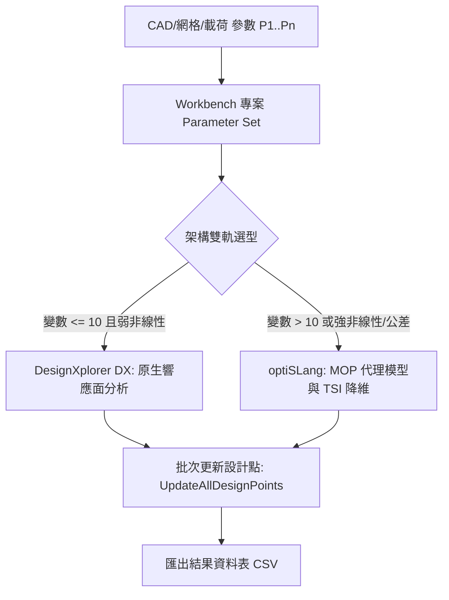

# ANSYS 參數化研究與雙軌選型優化主控手冊

本技能提供標準的 ANSYS Workbench Parameter Set 自動化驅動架構，以及 DesignXplorer (DX) 與 optiSLang 的選型判定標準。

---

## 一、參數化研究 SOP

1. **參數匯聚**：在 Workbench 專案層級取得所有標記「P」之幾何與物理參數。
2. **架構選型**：依據變數數量與非線性特性選擇 DX 或 optiSLang。
3. **批次求解**：調用 `parameters.UpdateAllDesignPoints()` 依序求解有效設計點。
4. **客觀驗證**：有效收斂點比例 $\ge 95\%$，代理模型 $\text{CoP} \ge 0.80$。

---

## 二、模組路由表 (Module Router)

| 分析主題 | 專精文件 | 核心內容 |
| :--- | :--- | :--- |
| **DX vs. optiSLang 決策矩陣** | [`reference/dx_to_optislang.md`](reference/dx_to_optislang.md) | 雙軌選型量化標準、遷移矩陣與 CoP 門檻 |
| **參數集批次自動化腳本** | [`scripts/workbench_dx_optislang_bridge.py`](scripts/workbench_dx_optislang_bridge.py) | Workbench Journal 腳本生成與選型評估器 |

---

## 三、絕對禁止事項 (Don'ts)

> [!CAUTION]
> 1. **嚴禁在超過 10 個設計變數時盲目使用 DesignXplorer 多項式響應面**：
>    高維空間會引發嚴重的「維度災難」，必須升級至 optiSLang 使用 TSI 靈敏度降維與 MOP 代理模型。
> 2. **嚴禁採信 $\text{CoP} < 0.80$ 的代理模型進行工程最佳化**：
>    預測係數未達 0.8 表示元模型泛化能力不足，盲目尋優將導致虛假最優解。
