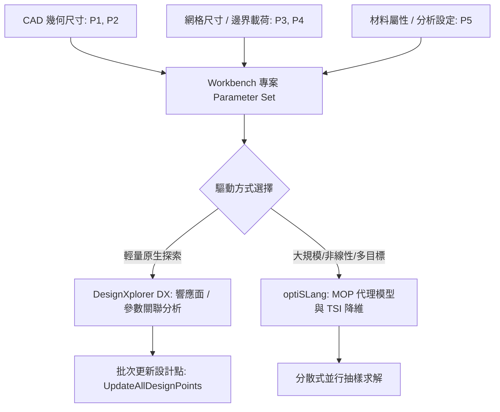

# ANSYS 參數化研究與雙軌選型優化技能 (Parametric Study & Migration Skill)

本技能提供標準的 ANSYS Workbench DesignXplorer (DX) 參數集（Parameter Set）自動化驅動架構，並定義 DesignXplorer 與 optiSLang 之雙軌選型原則及技術遷移決策矩陣。

---

## 一、Workbench DesignXplorer (DX) 參數集自動化驅動

ANSYS Workbench 的核心參數化架構依賴「參數集（Parameter Set）」組件。所有在 CAD（如 SpaceClaim、Discovery）、網格劃分（Meshing）或求解器（Mechanical、Fluent、CFX）中標記為「P」的尺寸、載荷或材料屬性，皆會自動匯聚於 Workbench 專案層級的 Parameter Set 中。



### 1. DesignXplorer (DX) 核心組件
- **Parameters**：Workbench 內建參數管理容器，支援定義 Design Point 0（基準點）至 DP N。
- **Parameters.CreateDesignPoint()**：動態建立新設計點實例。
- **Parameters.UpdateAllDesignPoints()**：依序調度相關求解器更新所有待計算之設計點，並將輸出參數寫入結果資料表。
- **Parameters.ExportDesignPointsTable()**：將設計點輸入與響應輸出匯出至 CSV 檔案進行資料持久化。

---

## 二、DX 與 optiSLang 雙軌選型原則與技術遷移矩陣

在實際工程最佳化與參數化研究中，選擇 Workbench DesignXplorer 或是獨立的 ANSYS optiSLang 是決定專案成敗與運算效率的關鍵分水嶺。

### 1. 雙軌選型決策心法
- **何時留在 DesignXplorer (DX)**：
  - 設計參數數量較少（一般建議 $\le 8 \sim 10$ 個參數）。
  - 物理場響應為連續、單調或弱非線性（例如線性靜力學應力、穩定傳熱溫度場）。
  - 專案完全在單一 Workbench 檔案內完成，無須額外跨軟體資料傳遞。
  - 需要極短時間內完成初步趨勢敏感度排查（Quick Scan）。
- **何時必須升級至 ANSYS optiSLang**：
  - 設計變數 $> 10$ 個：DX 在高維空間易面臨「維度災難（Curse of Dimensionality）」，而 optiSLang 透過總靈敏度指數（TSI）與方差分解能自動過濾非關鍵變數，達成主動降維。
  - 響應高度非線性、不連續或具有數值雜訊（例如：LS-DYNA 落摔碰撞、摩擦接觸跳脫、斷裂失效）。DX 單一多項式響應面極易失真，而 optiSLang 的 MOP 能在多項式、Kriging、MLS 與神經網路間自動競賽並以 CoP 指標檢核。
  - 需要跨軟體/跨求解器混合串聯（如 CAD + CFD + 結構 + Python 演算法腳本）。
  - 需要評估製造公差、材料分散性之產品穩健性（Robustness）與 6-Sigma 可靠度。

### 2. 技術遷移對比矩陣 (Migration Matrix)

| 評估維度 | Workbench DesignXplorer (DX) | ANSYS optiSLang (高階代理模型與最佳化) | 遷移判定條件 |
| :--- | :--- | :--- | :--- |
| **參數維度承載力** | 適合 $\le 10$ 個設計變數 | 可承載數十至上百個變數（TSI 自動篩選） | 參數數量 $> 10$ 時強制升級 |
| **代理模型架構** | 單一固定模型（多項式、Kriging、神經網路） | **MOP 自適應混合競賽**（Polynomial / Kriging / MLS / MLP） | 響應非線性強或 CoP 要求 $\ge 0.8$ |
| **品質驗證判準** | 傳統決定係數 $R^2$（易過擬合） | **預測係數 CoP (Cross-Validation)**（客觀無偏） | 需確保模型真實泛化能力 |
| **計算容錯與並行** | 依賴 Workbench 串行或本機 RSM 隊列 | 支援強大的容錯、失效樣本略過、分散式叢集並行 | 計算量大或偶發個別樣本求解發散時 |
| **不確定性分析** | 基礎蒙地卡羅 Six Sigma 模組 | 深度穩健性分析 (Robustness)、信賴度分析、自適應抽樣 | 要求量產良率與公差邊界評估 |

---

## 三、客觀驗證完成條件 (Verification Conditions)

在執行參數化研究與架構選型時，必須遵守以下客觀驗證完成條件：

1. **設計點更新完整率**：批次更新設計點後，非發散失敗（Error/Failed）之有效收斂點比例必須 $\ge 95\%$；若失敗率高於 5%，必須檢查網格品質或接觸邊界收斂性。
2. **代理模型選型品質門檻**：若採用代理模型進行最佳化，其多重交叉驗證指標必須滿足 $\text{CoP} \ge 0.80$；若 $\text{CoP} < 0.80$，判定模型不可信，必須升級至 optiSLang 或縮小設計空間。
3. **變數顯著性篩選**：升級至 optiSLang 時，必須依據 $\text{TSI} \ge 0.05$ 準則保留關鍵驅動變數，剔除非顯著變數後方可進行 Pareto 多目標尋優。

---

## 四、完整 Python 程式碼範例

以下程式碼提供 Workbench Journal 自動化批次驅動腳本生成器，以及自動判斷專案適用 DX 或 optiSLang 的雙軌選型評估演算法：

```python
# -*- coding: utf-8 -*-
"""
模組名稱：workbench_dx_optislang_bridge.py
功能說明：ANSYS Workbench DesignXplorer 參數集自動化驅動與技術遷移至 optiSLang 橋接器
依據標準：參數規模分級與代理模型自動選型決策矩陣
"""

from typing import Dict, Any, List


class WorkbenchParameterSetAutomator:
    """
    Workbench 原生 Parameter Set 與 DesignXplorer (DX) 自動化腳本生成器
    """

    def __init__(self):
        self.design_points: List[Dict[str, float]] = []

    def add_design_point(self, param_values: Dict[str, float]) -> None:
        """加入欲評估的設計點輸入變數集合"""
        self.design_points.append(param_values)

    def generate_workbench_journal_script(self) -> str:
        """
        生成 ANSYS Workbench IronPython Journal 腳本
        驅動 Parameter Set 批次更新計算
        """
        lines: List[str] = [
            "# -*- coding: utf-8 -*-",
            "# ANSYS Workbench Journal - DesignXplorer 參數批次更新腳本",
            "# Encoding: UTF-8",
            "",
            "# 1. 取得專案參數集管理物件",
            "parameters = Parameters",
            "designPoint_base = parameters.GetDesignPoint(Name='DP 0')",
            ""
        ]

        for idx, dp_dict in enumerate(self.design_points, start=1):
            lines.append(f"# 建立設計點 DP {idx}")
            lines.append(f"dp_{idx} = parameters.CreateDesignPoint()")
            for p_name, p_val in dp_dict.items():
                lines.append(
                    f"dp_{idx}.SetParameterExpression("
                    f"Parameter=parameters.GetParameter(Name='{p_name}'), "
                    f"Expression='{p_val}')"
                )
            lines.append("")

        lines.extend([
            "# 2. 觸發所有設計點批次更新求解",
            "parameters.UpdateAllDesignPoints()",
            "",
            "# 3. 匯出參數集結果資料表至 CSV",
            "parameters.ExportDesignPointsTable(FilePath='Parameter_Results.csv')",
            "Save(Overwrite=True)"
        ])

        return "\n".join(lines)


def evaluate_optimization_platform(
    num_parameters: int,
    is_strongly_nonlinear: bool,
    requires_robustness: bool,
    has_mixed_solvers: bool
) -> Dict[str, Any]:
    """
    依據工程情境推薦 Workbench DesignXplorer 或升級 optiSLang 之雙軌決策
    :param num_parameters: 設計變數個數
    :param is_strongly_nonlinear: 是否包含高度非線性 (如接觸、塑性、衝擊)
    :param requires_robustness: 是否需要公差隨機分佈與穩健性 (Robustness/6-Sigma) 分析
    :param has_mixed_solvers: 是否需要跨多個求解器/腳本聯合求解
    :return: 推薦平台與技術理由
    """
    reasons: List[str] = []
    use_optislang = False

    if num_parameters > 10:
        use_optislang = True
        reasons.append(
            f"設計變數數量為 {num_parameters} (> 10)，DX 易產生維度災難，"
            "optiSLang 的 TSI 敏感度指標能自動降維。"
        )

    if is_strongly_nonlinear:
        use_optislang = True
        reasons.append(
            "系統具有高度非線性/雜訊特性，optiSLang MOP 能在 Polynomial, "
            "Kriging, MLS, MLP 中自動競賽選出最佳元模型。"
        )

    if requires_robustness:
        use_optislang = True
        reasons.append(
            "需要隨機分佈穩健性 (Robustness) 與可靠度分析，optiSLang 提供"
            "完整的蒙地卡羅與自適應採樣支援。"
        )

    if has_mixed_solvers:
        use_optislang = True
        reasons.append(
            "需要跨軟體求解串聯，optiSLang 具備強大的節點式流程編排器 (Node Flow)。"
        )

    if not use_optislang:
        return {
            "recommended_tool": "Workbench DesignXplorer (DX)",
            "migration_required": False,
            "rationale": "參數數量適中 (<10) 且響應連續平滑，DX 原生介面操作簡捷高效。"
        }
    else:
        return {
            "recommended_tool": "ANSYS optiSLang",
            "migration_required": True,
            "rationale": " ； ".join(reasons)
        }
```
