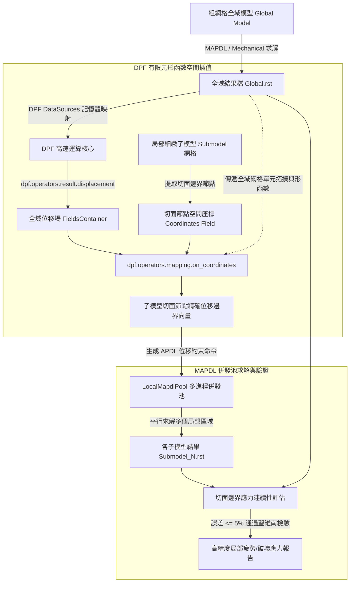

# ANSYS DPF 高速場數據提取與子模型自動化分析技能

本技能提供基於 ANSYS DPF（Data Processing Framework）與 PyMAPDL 的先進子模型（Submodeling / Cut-Boundary Interpolation）自動化技術規範。涵蓋十億級自由度結果的毫秒級場數據流式提取、嚴格遵循有限元形函數的空間座標插值器 (`on_coordinates`)、MAPDL 多進程併發求解池以及聖維南原理（Saint-Venant's Principle）切面邊界應力連續性自動驗證。

---

## 一、子模型理論與 DPF 架構概述



### 核心理論與效能優勢
1. **聖維南原理 (Saint-Venant's Principle)**：
   若外載荷系統在靜力上等效，則在遠離載荷作用區或幾何突變處，彈性體內部的應力與應變分佈基本相同。因此，子模型的「切割邊界（Cut Boundary）」必須設定在應力梯度平緩之處。
2. **DPF 零拷貝技術**：
   傳統 APDL `*GET` 或讀取整份文字檔耗時甚鉅。DPF 採用 C++ 記憶體直接映射，以十倍至百倍速率並發讀取巨量 RST 檔案。
3. **形函數插值精確性**：
   DPF 的 `on_coordinates` 算子並非簡單的歐幾里得距離加權（KNN），而是精準識別目標座標落在全域模型的哪一個高階單元（如 SOLID186 20 節點六面體），並透過有限元單元形函數（Shape Functions $N_i(\xi, \eta, \zeta)$）計算內插位移，完全保持力學連續性。

---

## 二、DPF 高速結果場提取 (Displacement & Von-Mises Stress)

```python
# ==============================================================================
# 腳本名稱: 01_dpf_fast_field_extraction.py
# 功能描述: 使用 PyAnsys DPF 毫秒級流式提取位移場與 Von-Mises 等效應力極值
# 執行環境: 本機 Python (需安裝 ansys-dpf-core)
# ==============================================================================

import os
from ansys.dpf import core as dpf

def extract_field_results(rst_file_path, time_step_index=1):
    """讀取 RST 結果檔並高速提取位移場與等效應力場。
    
    參數:
        rst_file_path (str): ANSYS MAPDL/Mechanical 結果檔 (.rst) 絕對路徑。
        time_step_index (int): 載荷步/時間步索引（以 1 為起始）。
        
    傳回:
        dict: 包含極值數據與 DPF 場物件的字典。
    """
    if not os.path.exists(rst_file_path):
        raise FileNotFoundError(f"找不到指定的 RST 檔案: {rst_file_path}")

    # 1. 建立 DPF 資料來源並載入模型
    data_sources = dpf.DataSources(rst_file_path)
    model = dpf.Model(data_sources)
    mesh = model.metadata.meshed_region

    print(f"成功加載模型: 節點總數={mesh.nodes.n_nodes}, 單元總數={mesh.elements.n_elements}")

    # 2. 建立位移算子 (Displacement Operator)
    disp_op = dpf.operators.result.displacement()
    disp_op.inputs.data_sources.connect(data_sources)
    disp_op.inputs.time_scoping.connect([time_step_index])
    disp_fields_container = disp_op.outputs.fields_container()
    disp_field = disp_fields_container[0]

    # 計算全場最大位移合量 (Norm)
    norm_op = dpf.operators.math.norm_fc()
    norm_op.inputs.fields_container.connect(disp_fields_container)
    disp_norm_field = norm_op.outputs.fields_container()[0]
    
    max_disp_val = max(disp_norm_field.data)
    min_disp_val = min(disp_norm_field.data)
    print(f"[位移場合量] 最大值: {max_disp_val:.6e} m | 最小值: {min_disp_val:.6e} m")

    # 3. 建立 Von-Mises 應力算子
    stress_op = dpf.operators.result.stress_von_mises()
    stress_op.inputs.data_sources.connect(data_sources)
    stress_op.inputs.time_scoping.connect([time_step_index])
    # 設定節點平均化處理 (Nodal Averaging)
    stress_op.inputs.requested_location.connect(dpf.locations.nodal)
    
    stress_fields_container = stress_op.outputs.fields_container()
    stress_field = stress_fields_container[0]

    # 極值快速算子
    min_max_op = dpf.operators.min_max.min_max_fc()
    min_max_op.inputs.fields_container.connect(stress_fields_container)
    field_max = min_max_op.outputs.field_max()
    field_min = min_max_op.outputs.field_min()

    max_stress_val = field_max.data[0]
    min_stress_val = field_min.data[0]
    print(f"[Von-Mises 應力] 最大值: {max_stress_val / 1e6:.2f} MPa | 最小值: {min_stress_val / 1e6:.2f} MPa")

    return {
        "model": model,
        "mesh": mesh,
        "displacement_fc": disp_fields_container,
        "stress_fc": stress_fields_container,
        "max_displacement": float(max_disp_val),
        "max_stress_pa": float(max_stress_val)
    }

# 呼叫範例:
# res = extract_field_results(r"C:\Simulations\Global_Run\file.rst")
```

---

## 三、有限元形函數空間場插值器 (`dpf.operators.mapping.on_coordinates`)

在全域-局部子模型方法中，子模型邊界切面上的節點密度遠高於粗網格全域模型。透過 DPF 的 `mapping.on_coordinates`，可直接讀取全域有限元模型的形函數幾何矩陣，將全域位移場精確內插至子模型的切面節點上。

```python
# ==============================================================================
# 腳本名稱: 02_fe_shape_function_interpolation.py
# 功能描述: 使用 DPF 有限元形函數算子將全域位移場精確內插至子模型切面節點
# 執行環境: 本機 Python (需安裝 ansys-dpf-core)
# ==============================================================================

import numpy as np
from ansys.dpf import core as dpf

def interpolate_cut_boundary_displacements(global_rst_path, cut_node_coords_dict):
    """將全域模型位移場精確插值至子模型切面節點。
    
    參數:
        global_rst_path (str): 全域粗網格模型結果檔路徑。
        cut_node_coords_dict (dict): 子模型切面邊界節點字典 {node_id: [x, y, z]}。
        
    傳回:
        dict: 各切面節點插值位移向量 {node_id: [ux, uy, uz]}。
    """
    # 1. 建立全域模型的 DPF 實例
    data_sources = dpf.DataSources(global_rst_path)
    global_model = dpf.Model(data_sources)
    global_mesh = global_model.metadata.meshed_region

    # 2. 提取全域位移場容器
    disp_op = dpf.operators.result.displacement()
    disp_op.inputs.data_sources.connect(data_sources)
    global_disp_fc = disp_op.outputs.fields_container()

    # 3. 準備目標切面節點的座標點雲 (Field of Coordinates)
    node_ids = list(cut_node_coords_dict.keys())
    coords_list = [cut_node_coords_dict[nid] for nid in node_ids]
    
    # 構建 DPF 座標場向量
    target_coords_field = dpf.fields_factory.create_3d_vector_field(
        num_entities=len(node_ids),
        location=dpf.locations.nodal
    )
    target_coords_field.scoping.ids = node_ids
    target_coords_field.data = np.array(coords_list, dtype=np.float64)

    # 4. 調用有限元空間形函數映射算子 (on_coordinates)
    print("正在執行全域有限元形函數切面空間插值...")
    mapping_op = dpf.operators.mapping.on_coordinates()
    mapping_op.inputs.fields_container.connect(global_disp_fc)
    mapping_op.inputs.coordinates.connect(target_coords_field)
    mapping_op.inputs.mesh.connect(global_mesh)

    # 取得插值後的位移場容器
    interpolated_disp_fc = mapping_op.outputs.fields_container()
    interpolated_field = interpolated_disp_fc[0]

    # 5. 解析並封裝結果
    interpolated_results = {}
    interp_data = interpolated_field.data
    for i, nid in enumerate(node_ids):
        ux, uy, uz = interp_data[i]
        interpolated_results[nid] = [float(ux), float(uy), float(uz)]

    print(f"成功完成 {len(interpolated_results)} 個切面節點的位移空間插值！")
    return interpolated_results

# 呼叫範例:
# sample_cut_nodes = {
#     101: [0.050, 0.012, 0.005],
#     102: [0.052, 0.012, 0.005],
#     103: [0.054, 0.012, 0.005]
# }
# interpolated_bcs = interpolate_cut_boundary_displacements(r"C:\Sim\global.rst", sample_cut_nodes)
```

---

## 四、MAPDL 併發求解池 (`LocalMapdlPool`)

當工程結構中存在多個局部應力集中區（例如多個焊點、開孔角落或封裝錫球）時，可利用 `LocalMapdlPool` 同時拉起多個 MAPDL 求解核心，平行施加切面邊界條件並併發執行求解。

```python
# ==============================================================================
# 腳本名稱: 03_mapdl_pool_concurrent_solving.py
# 功能描述: 使用 LocalMapdlPool 併發執行多個子模型切面約束施加與結構求解
# 執行環境: 本機 Python (需安裝 ansys-mapdl-core)
# ==============================================================================

import os
from ansys.mapdl.core import LocalMapdlPool

def solve_submodels_in_pool(submodel_tasks, n_instances=4, working_dir="C:/Temp/SubmodelPool"):
    """使用 MAPDL 併發進程池平行求解多個局部子模型。
    
    參數:
        submodel_tasks (list): 任務設定列表，每項包含 cdb_path 與 cut_bcs 字典。
        n_instances (int): 併發啟動的 MAPDL 進程實例數量。
        working_dir (str): 平行運算基礎工作目錄。
    """
    if not os.path.exists(working_dir):
        os.makedirs(working_dir)

    print(f"正在初始化 MAPDL 併發求解池 (進程數: {n_instances})...")
    # 建立多進程求解池實例
    pool = LocalMapdlPool(
        n_instances=n_instances,
        run_location=working_dir,
        cleanup_on_exit=False,
        verbose=False
    )

    def _run_single_submodel(mapdl, task):
        """單一 MAPDL 實例內執行的封裝作業。"""
        sub_name = task["submodel_name"]
        cdb_path = task["cdb_path"]
        cut_bcs = task["cut_bcs"]  # {node_id: [ux, uy, uz]}

        print(f"[{mapdl.name}] 開始處理子模型: {sub_name}")
        mapdl.clear()
        mapdl.prep7()
        
        # 載入子模型有限元網格
        mapdl.cdread("DB", cdb_path)

        # 批次施加切面位移約束條件
        for nid, (ux, uy, uz) in cut_bcs.items():
            mapdl.d(nid, "UX", ux)
            mapdl.d(nid, "UY", uy)
            mapdl.d(nid, "UZ", uz)

        # 進入求解器模組並執行求解
        mapdl.finish()
        mapdl.slashsolu()
        mapdl.antype("STATIC")
        mapdl.solve()
        mapdl.finish()

        # 檢查求解狀態
        mapdl.post1()
        mapdl.set("LAST")
        max_eqv = mapdl.get_value("NODE", 0, "S", "EQV")
        print(f"[{mapdl.name}] 子模型 {sub_name} 求解成功！最高等效應力={max_eqv / 1e6:.2f} MPa")
        
        rst_path = os.path.join(mapdl.directory, "file.rst")
        return {"submodel": sub_name, "max_stress_eqv": max_eqv, "rst_path": rst_path}

    try:
        print("開始透過併發池派發子模型運算...")
        results = pool.map(_run_single_submodel, submodel_tasks)
        print("所有子模型平行求解全數完成！")
        return results

    finally:
        # 退出並安全清理併發池資源
        pool.exit()
        print("MAPDL 併發求解池已安全關閉釋放。")

# 呼叫範例:
# tasks = [
#     {"submodel_name": "Corner_Fillet_A", "cdb_path": r"C:\Sim\subA.cdb", "cut_bcs": {1: [0,0,0]}},
#     {"submodel_name": "Hole_Edge_B", "cdb_path": r"C:\Sim\subB.cdb", "cut_bcs": {10: [1e-5,0,0]}}
# ]
# solve_submodels_in_pool(tasks, n_instances=2)
```

---

## 五、全域-局部子模型誤差評估準則 (Saint-Venant 驗證)

依據聖維南原理，子模型的有效性完全仰賴「邊界應力連續性條件」。若切面位置選擇過於接近應力集中區域，粗網格無法精準反映該處的真實應變場，導致切面邊界處全域模型應力與子模型反算應力出現巨大斷差。

### 應力連續性評估指標
對切面上的每一節點 $k$，計算其全域應力 $\sigma_{\text{global}}^k$ 與子模型應力 $\sigma_{\text{submodel}}^k$ 的相對百分比誤差：
$$\text{Error}_k = \frac{|\sigma_{\text{submodel}}^k - \sigma_{\text{global}}^k|}{\max(\sigma_{\text{global}})} \times 100\%$$

- **通過標準**：切面上所有節點的平均相對誤差 $\le 5\%$，最大單點局部誤差 $\le 10\%$。
- **超標處置**：若誤差 $> 10\%$，說明切面違反聖維南假設，必須在外擴 $2\sim 3$ 倍特徵尺寸處重新定義切面。

```python
# ==============================================================================
# 腳本名稱: 04_saint_venant_error_assessment.py
# 功能描述: 檢驗切面邊界上的應力連續性以驗證聖維南原理合規性
# 執行環境: 本機 Python (需安裝 ansys-dpf-core)
# ==============================================================================

import numpy as np
from ansys.dpf import core as dpf

def evaluate_submodel_boundary_continuity(global_rst, submodel_rst, cut_boundary_node_ids, tolerance_percent=10.0):
    """評估切面邊界節點的應力連續性誤差。
    
    參數:
        global_rst (str): 全域模型結果檔路徑。
        submodel_rst (str): 子模型結果檔路徑。
        cut_boundary_node_ids (list): 切面邊界節點的 ID 清單。
        tolerance_percent (float): 允許的應力相對誤差上限百分比（預設 10%）。
        
    傳回:
        dict: 誤差統計結果與聖維南檢驗通過判定。
    """
    # 1. 讀取全域模型 Von-Mises 應力場
    global_model = dpf.Model(global_rst)
    g_stress_op = dpf.operators.result.stress_von_mises(
        data_sources=dpf.DataSources(global_rst),
        requested_location=dpf.locations.nodal
    )
    g_stress_field = g_stress_op.outputs.fields_container()[0]

    # 2. 讀取子模型 Von-Mises 應力場
    sub_model = dpf.Model(submodel_rst)
    s_stress_op = dpf.operators.result.stress_von_mises(
        data_sources=dpf.DataSources(submodel_rst),
        requested_location=dpf.locations.nodal
    )
    s_stress_field = s_stress_op.outputs.fields_container()[0]

    # 3. 提取切面邊界上的應力值
    errors = []
    global_peak_stress = max(g_stress_field.data)

    print(f"正在驗證 {len(cut_boundary_node_ids)} 個邊界節點的應力連續性...")
    for nid in cut_boundary_node_ids:
        try:
            val_global = g_stress_field.get_entity_data_by_id(nid)[0]
            val_sub = s_stress_field.get_entity_data_by_id(nid)[0]
            
            # 以全域峰值應力作為歸一化基準以避免小應力區域數值奇異性
            rel_diff = (abs(val_sub - val_global) / global_peak_stress) * 100.0
            errors.append(rel_diff)
        except Exception:
            continue

    if not errors:
        raise ValueError("未能匹配到任何切面節點的應力數據，請檢查節點編號。")

    max_error = float(np.max(errors))
    mean_error = float(np.mean(errors))
    is_valid = max_error <= tolerance_percent

    print("=== 聖維南原理切面邊界檢驗報告 ===")
    print(f"切面平均相對誤差: {mean_error:.2f}%")
    print(f"切面最大局部誤差: {max_error:.2f}% (容許上限: {tolerance_percent}%)")
    print(f"檢驗結果: {'[通過] 切面遠離應力集中區，結果可信' if is_valid else '[不合格] 邊界應力斷差過大，需擴大子模型切割邊界'}")

    return {
        "mean_error_percent": mean_error,
        "max_error_percent": max_error,
        "is_passed": is_valid,
        "evaluated_node_count": len(errors)
    }

# 呼叫範例:
# assessment = evaluate_submodel_boundary_continuity(
#     r"C:\Sim\global.rst",
#     r"C:\Sim\submodel.rst",
#     [1001, 1002, 1003, 1004],
#     tolerance_percent=10.0
# )
```

---

## 六、完整端到端 Python 自動化範例腳本

以下為整合全域 DPF 提取、形函數內插、子模型併發求解與聖維南連續性驗證之完整整合腳本：

```python
# ==============================================================================
# 腳本名稱: complete_submodeling_dpf_pipeline.py
# 功能描述: 整合 DPF 提取、形函數座標插值、MAPDL 併發求解與聖維南誤差評估的全流程腳本
# 執行環境: 本機 Python (需安裝 ansys-dpf-core 與 ansys-mapdl-core)
# ==============================================================================

import os
import numpy as np
from ansys.dpf import core as dpf
from ansys.mapdl.core import launch_mapdl

def run_full_submodeling_workflow(config):
    """執行完整端到端子模型自動化流程。
    
    參數:
        config (dict): 包含全域模型、子模型路徑與驗證門檻的字典。
    """
    global_rst = config["global_rst"]
    submodel_cdb = config["submodel_cdb"]
    submodel_work_dir = config.get("submodel_work_dir", "C:/Temp/Submodel_Run")
    cut_node_coords = config["cut_node_coords"]  # {nid: [x, y, z]}

    if not os.path.exists(submodel_work_dir):
        os.makedirs(submodel_work_dir)

    print("=== [第 1 步] 使用 DPF 讀取全域模型並執行形函數空間插值 ===")
    global_data = dpf.DataSources(global_rst)
    global_model = dpf.Model(global_data)
    disp_op = dpf.operators.result.displacement(data_sources=global_data)
    global_disp_fc = disp_op.outputs.fields_container()

    node_ids = list(cut_node_coords.keys())
    coords_array = np.array([cut_node_coords[nid] for nid in node_ids], dtype=np.float64)

    target_field = dpf.fields_factory.create_3d_vector_field(len(node_ids), dpf.locations.nodal)
    target_field.scoping.ids = node_ids
    target_field.data = coords_array

    # 執行有限元形函數精準插值
    interp_op = dpf.operators.mapping.on_coordinates(
        fields_container=global_disp_fc,
        coordinates=target_field,
        mesh=global_model.metadata.meshed_region
    )
    cut_bcs_field = interp_op.outputs.fields_container()[0]
    print("形函數空間插值完成。")

    print("=== [第 2 步] 啟動 MAPDL 求解子模型 ===")
    mapdl = launch_mapdl(run_location=submodel_work_dir, verbose=False)
    
    try:
        mapdl.clear()
        mapdl.prep7()
        mapdl.cdread("DB", submodel_cdb)

        # 施加插值之切面位移約束
        for i, nid in enumerate(node_ids):
            ux, uy, uz = cut_bcs_field.data[i]
            mapdl.d(nid, "UX", float(ux))
            mapdl.d(nid, "UY", float(uy))
            mapdl.d(nid, "UZ", float(uz))

        mapdl.finish()
        mapdl.slashsolu()
        mapdl.antype("STATIC")
        mapdl.solve()
        mapdl.finish()
        print("子模型求解完成！")

    finally:
        mapdl.exit()

    submodel_rst = os.path.join(submodel_work_dir, "file.rst")

    print("=== [第 3 步] 聖維南原理切面邊界應力連續性檢驗 ===")
    sub_data = dpf.DataSources(submodel_rst)
    s_stress_op = dpf.operators.result.stress_von_mises(
        data_sources=sub_data,
        requested_location=dpf.locations.nodal
    )
    s_field = s_stress_op.outputs.fields_container()[0]
    
    g_stress_op = dpf.operators.result.stress_von_mises(
        data_sources=global_data,
        requested_location=dpf.locations.nodal
    )
    g_field = g_stress_op.outputs.fields_container()[0]
    peak_stress = max(g_field.data)

    diffs = []
    for nid in node_ids:
        try:
            s_val = s_field.get_entity_data_by_id(nid)[0]
            g_val = g_field.get_entity_data_by_id(nid)[0]
            diffs.append(abs(s_val - g_val) / peak_stress * 100.0)
        except Exception:
            continue

    max_err = np.max(diffs)
    print(f"切面最大邊界誤差: {max_err:.2f}%")
    if max_err <= config.get("tolerance", 10.0):
        print(">> [檢驗通過] 子模型切面滿足聖維南原理，局部高精度求解可信。")
    else:
        print(">> [警告] 邊界誤差超過門檻，建議外擴子模型切割邊界以避免奇異性。")

    print("=== 子模型自動化工作流全部執行完畢 ===")

# 設定參數結構範例:
# pipeline_config = {
#     "global_rst": r"C:\Simulations\Global_Run\file.rst",
#     "submodel_cdb": r"C:\Simulations\Submodel_Mesh.cdb",
#     "submodel_work_dir": r"C:\Simulations\Submodel_Output",
#     "cut_node_coords": {1: [0.01, 0.02, 0.003], 2: [0.012, 0.02, 0.003]},
#     "tolerance": 10.0
# }
