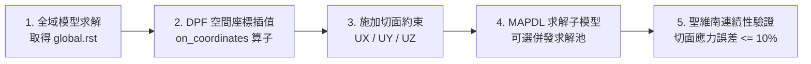

# ANSYS DPF 高速結果場提取與子模型自動化主控手冊

本技能提供基於 ANSYS DPF 與 PyMAPDL 的先進子模型（Submodeling / Cut-Boundary Interpolation）自動化技術規範。

---

## 一、子模型核心分析 SOP

1. **全域場提取**：以 DPF DataSources 記憶體直接映射串流讀取位移與應力場。
2. **形函數插值**：藉由單元形函數精準內插位移至子模型切面節點（保持力學連續性）。
3. **子模型求解**：導入切面邊界條件，於 MAPDL 或併發池 (`LocalMapdlPool`) 完成局部求解。
4. **邊界連續性檢核**：計算全域與子模型在切面邊界上的應力斷差，嚴格落實聖維南檢核。

---

## 二、模組路由表 (Module Router)

深入操作手冊與實作範例請參閱 `reference/` 與 `scripts/`：

| 分析主題 | 專精文件 | 核心內容 |
| :--- | :--- | :--- |
| **DPF 場提取與形函數插值** | [`reference/dpf_interpolation.md`](reference/dpf_interpolation.md) | 位移/應力算子、`on_coordinates` 向量場映射 |
| **MAPDL 併發求解池** | [`reference/mapdl_pool.md`](reference/mapdl_pool.md) | `LocalMapdlPool` 平行求解多個局部區域 |
| **聖維南連續性誤差驗證** | [`reference/saint_venant_validation.md`](reference/saint_venant_validation.md) | 切面相對誤差計算與自動判定放行標準 |
| **端到端完整管線腳本** | [`scripts/run_submodeling_pipeline.py`](scripts/run_submodeling_pipeline.py) | 提取 $\rightarrow$ 插值 $\rightarrow$ 求解 $\rightarrow$ 驗證全流程腳本 |

---

## 三、絕對禁止事項 (Don'ts)

> [!CAUTION]
> 1. **嚴禁在應力梯度劇烈處建立子模型切面**：
>    切面必須遠離幾何突變、載荷集中點與塑性區，確保切面應力誤差 $\le 10\%$，否則違反聖維南原理。
> 2. **嚴禁使用最近鄰（KNN）幾何距離替代有限元形函數插值**：
>    單純空間距離加權未考慮單元形函數彎曲與剪切連續性，會引發嚴重的人為虛假剛度。
