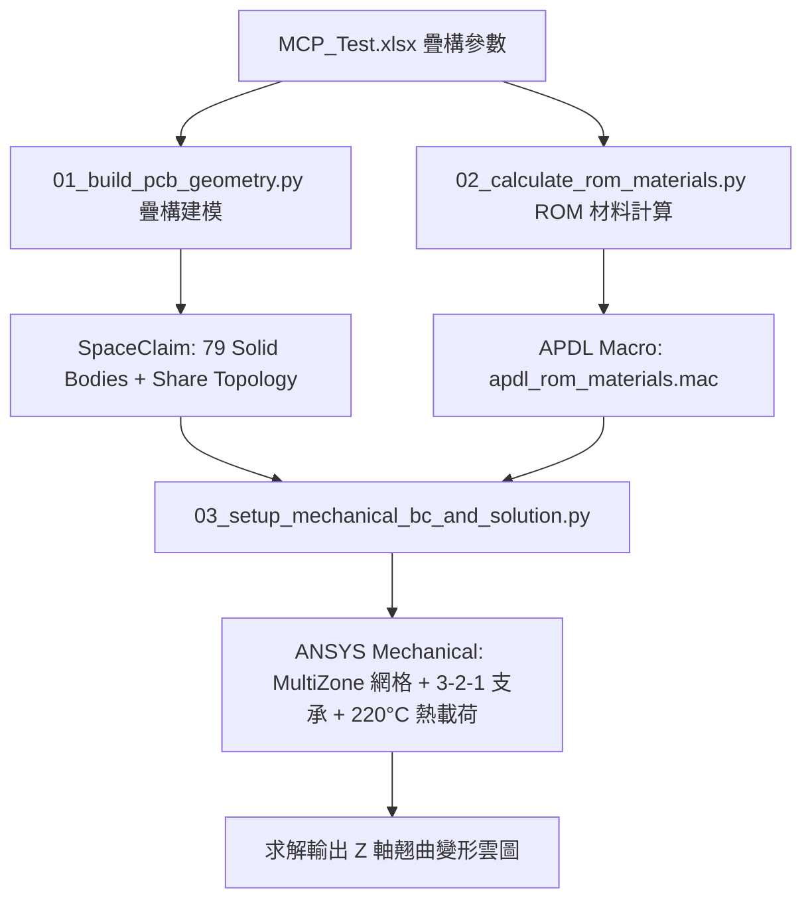

# PCB Multi-Layer Thermal Warpage Analysis Skill

本技能專門處理 PCB 多層板熱翹曲（Z 軸變形）自動化分析工作流（ANSYS SpaceClaim 疊構建模 + ROM 複合材料巨集 + Mechanical 3-2-1 靜定支承熱應力求解）。

---

## 工作流架構

## 核心腳本目錄
本技能目錄內建腳本 `./scripts/`（或專案根目錄 `scripts/pcb_warpage_analysis/`）：
1. `01_build_pcb_geometry.py`：SpaceClaim / Discovery 疊構幾何建模
2. `02_calculate_rom_materials.py`：ROM 等效材料計算與 APDL Macro 輸出
3. `03_setup_mechanical_bc_and_solution.py`：Mechanical 邊界條件設定與求解
4. `run_full_warpage_workflow.py`：全自動化閉環批次執行腳本
