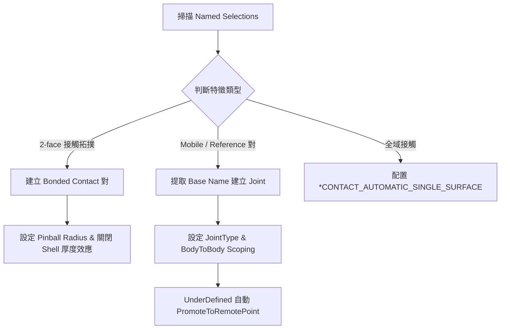

# Session 02: 接觸對與運動副自動建立 (Contact & Joint Creation)

## 1. 目標 (Objective)
在 LS-DYNA 衝擊分析模型中，建立各組件間的介面關係，包含：
1. **全域單表面自接觸 (Global Single Surface Contact)**：防止全機所有零件在劇烈衝擊形變下發生自穿透。
2. **局部綁定接觸對 (Bonded Contact Regions)**：鎖定緊固件、散熱片墊片與 PCB 黏著介面。
3. **運動副機構 (Kinematic Joints)**：針對把手開關、退出機構等旋轉鉸鏈（Revolute Joint）與固定接頭（Fixed Joint）進行自動配對。

---

## 2. ACT 自動化建立引擎 (ACT Automation Engine)

本會話整合了 ACT 工具 `Mech_bonded` 與 `MECH_RM_Joint_Creation.py` 的核心演算法：



---

## 3. 介面建立策略與參考手冊 (Progressive Disclosure)

- **自動運動副建立 (`create_joints_from_ns`)**：自動解析 _Mobile / _Reference 後綴，成對建立 BodyToBody 關節。
- **綁定接觸批次配置 (`create_bonded_contacts`)**：針對 2-face 連接拓撲自動配置 Bonded Contact，設定 Pinball 半徑為 1.22 mm。
- **全域單表面接觸 (`*CONTACT_AUTOMATIC_SINGLE_SURFACE`)**：注入 SOFT=1、動靜摩擦係數 0.2 之整機自防穿透卡片。

> 完整演算法程式碼與 LS-DYNA 卡片定義，詳見專門手冊：
> - [`reference/contact_formulations.md`](reference/contact_formulations.md)

---

## 4. 小批次驗證章節 (Dedicated Verification Section)

本會話提供小型單元測試腳本，透過動態建立 1 個接觸對與 1 個旋轉關節、驗證其屬性並立即清除，以達到 0 殘留測試驗證。

### 4.1 驗證步驟
1. 透過 PyMechanical gRPC 連線至 Port 10000。
2. 建立暫存 Connection Group `_TEST_Verification_Group`。
3. 建立 1 個 Sample Bonded Contact，設定 Pinball Radius 為 `1.22 mm`。
4. 建立 1 個 Sample Revolute Joint，設定 Scoping 為 `BodyToBody`。
5. 進行屬性斷言檢驗（ContactType == Bonded, JointType == Revolute, Scoping == BodyToBody）。
6. 安全刪除測試物件與暫存群組，恢復模型原始狀態。

### 4.2 獨立測試腳本執行方式
執行以下獨立測試腳本：
```powershell
python SKILLs/shock-analysis-workflow/scripts/test_session_02.py
```

### 4.3 驗證評估指標 (Verification Metrics)
- **接觸對建立與屬性檢核**: PASS (Bonded, Pinball=1.22mm)
- **運動副建立與 Scoping 檢核**: PASS (Revolute, BodyToBody)
- **模型無污染狀態 (Pristine State)**: 100% 乾淨（0 殘留測試物件）

---

## 5. 相關參考手冊 (Related References)

| 手冊名稱 | 內容摘要 |
| :--- | :--- |
| [`reference/contact_formulations.md`](reference/contact_formulations.md) | 運動副腳本、Pinball 綁定接觸對配置與單表面接觸卡片 |
