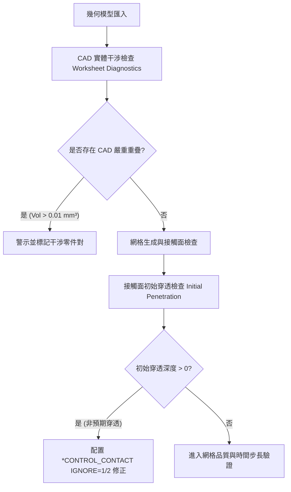

# Session 03: 網格優先級、干涉預檢與顯式時間步長調校 (Mesh Tuning & Time Step Quality)

## 1. 目標 (Objective)
在 LS-DYNA 衝擊與跌落分析中，網格品質直接決定了計算穩定性與計算效率。本會話之目標包括：
1. **網格前置干涉檢查 (Pre-Mesh Interference Checks)**：在劃分網格前檢測 CAD 實體重疊與接觸面初始穿透，杜絕 $t=0$ 瞬間接觸能量爆炸。
2. **多區域網格優先級階梯 (MultiZone Priority Setup)**：針對規則金屬實體優先採用 MultiZone 六面體網格。
3. **顯式動力學特徵時間步長控制 ($\Delta t \ge 2.0 \times 10^{-8}\text{ s}$)**：確保最小單元尺寸不造成高頻震盪或時間步長崩潰。

---

## 2. 幾何與網格干涉預檢防呆 (Interference & Initial Penetration Pre-Checks)

本會話整合了 ACT 工具 `MECH_Interference_Check.py` 的檢查機制：



## 3. 網格方法優先級階梯 (Mesh Method Priority Cascade)

1. **Priority 1: MultiZone (六面體 Hexahedral 優先)**
   - 適用於所有規則金屬機殼底座、固定治具塊與散熱底板。
   - 透過 `mesh.AddAutomaticMethod()` 並設定 `mc.Method = MethodType.MultiZone`。
2. **Priority 2: Sweep Method (掃掠網格)**
   - 適用於圓柱銷（Pin）、導軌與等截面實體。
3. **Priority 3: Tetrahedrons (Patch Independent / Patch Conforming 四面體)**
   - 適用於具備複雜拔模角與不規則外型之 DFM 把手或壓鑄件。
4. **Priority 4: Shell Quad/Tri (中面薄板殼單元)**
   - 適用於 2D 中面鈑金零件。

---

---

## 4. 顯式時間步長準則與參考手冊 (Progressive Disclosure)

- **顯式時間步長控制準則 (CFL Condition)**：要求 $\Delta t = L/c \ge 2.0 \times 10^{-8}\text{ s}$（20 ns 門檻），其中聲速  = \sqrt{E/\rho}$。
- **CAD 實體干涉檢查 (`check_cad_interference`)**：透過 Worksheet Diagnostics 偵測重疊體積。
- **網格初始穿透檢查與防護**：設定 `*CONTROL_CONTACT IGNORE=1` 於 t=0 投射穿透節點。

> 完整干涉診斷腳本、控制卡與各材料 CFL 臨界尺寸速查表，詳見專門手冊：
> - [`reference/mesh_quality_criteria.md`](reference/mesh_quality_criteria.md)

---

## 5. 小批次驗證章節 (Dedicated Verification Section)

為避免在大模型上進行耗時之全機網格劃分與求解，本會話採用 **3 個樣本 Solid Body** 進行快速小批次控制與特徵時間步長驗證。

### 5.1 驗證步驟
1. 透過 PyMechanical gRPC 連線至 Port 10000。
2. 篩選出 3 個代表性實體零件（Solid Bodies）。
3. 依據材料物性計算特徵聲速 $c = \sqrt{E/\rho}$ 與設定尺寸之顯式時間步長 $\Delta t = L/c$。
4. 驗證 $\Delta t \ge 2.0 \times 10^{-8}\text{ s}$（20 ns 門檻）。
5. 對 3 個樣本 Body 分別掛載 `MultiZone` 自動方法與 `2.0 mm` 區域 Sizing 控制。
6. 驗證控制項正確綁定後，立即安全刪除測試控制項，維持模型乾淨無殘留。

### 5.2 獨立測試腳本執行方式
執行以下獨立測試腳本：
```powershell
python SKILLs/shock-analysis-workflow/scripts/test_session_03.py
```

### 5.3 驗證評估指標 (Verification Metrics)
- **樣本實體零件數 (Sample Solid Bodies)**: 3
- **MultiZone 方法配置驗證**: PASS (3 / 3)
- **局部 Sizing 配置驗證**: PASS (3 / 3, Size = 2.0 mm)
- **特徵聲速與時間步長**: $c = 5047.5\text{ m/s}, \Delta t = 3.962 \times 10^{-7}\text{ s} \ge 2.0 \times 10^{-8}\text{ s}$ (PASS)
- **模型無污染狀態 (Pristine State)**: 100% 乾淨（0 殘留測試控制項）

---

## 6. 相關參考手冊 (Related References)

| 手冊名稱 | 內容摘要 |
| :--- | :--- |
| [`reference/mesh_quality_criteria.md`](reference/mesh_quality_criteria.md) | CAD 干涉診斷腳本、*CONTROL_CONTACT IGNORE 卡片與 CFL 聲速時間步長表 |
