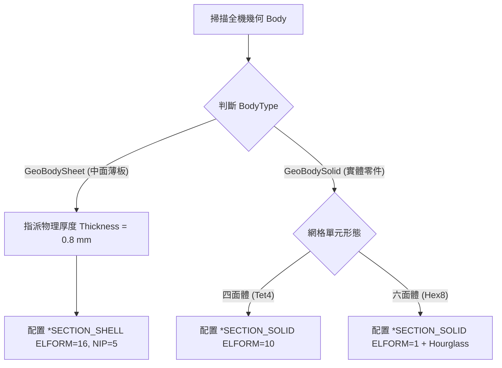

# Session 05: 截面性質與單元公式指派 (Section & Shell Thickness Assignment)

## 1. 目標 (Objective)
在 LS-DYNA 衝擊分析中，為 2D 中面幾何（Mid-surface）與 3D 實體幾何指派物理厚度與正確的單元數學公式（Element Formulations），包括：
1. **中面薄板厚度指定**：為所有 `GeoBodySheet` 物件指派準確的物理厚度（如 `0.8 mm` 或依 CAD 指定）。
2. **殼單元公式 (`*SECTION_SHELL`)**：配置完全積分殼單元（`ELFORM=16`）或 Belytschko-Tsay 殼單元（`ELFORM=2`），並設定 5 個厚度積分點（`NIP=5`）以精確捕捉彈塑性彎曲。
3. **實體單元公式 (`*SECTION_SOLID`)**：配置四面體（`ELFORM=10`）或六面體（`ELFORM=1` 搭配沙漏控制）。

---

## 2. ACT 自動截面指派引擎 (ACT Section Assignment Engine)

本會話整合了 ACT 工具 `Dyna-Section-Mass-Implicit-Setting.py` 的截面分類與單元判斷邏輯：



### 2.1 中面薄板厚度批次指派
自動遍歷幾何樹，過濾出未抑制的 `GeoBodySheet` 並指派物理厚度：
```python
def assign_shell_thickness(model, default_thickness_mm=0.8):
    cnt_assigned = 0
    for body in model.Geometry.GetChildren(DataModelObjectCategory.Body, True):
        if body.Suppressed:
            continue
        gb = body.GetGeoBody()
        if gb and str(gb.BodyType) == "GeoBodySheet":
            body.Thickness = Quantity(default_thickness_mm, "mm")
            cnt_assigned += 1
    print("Successfully assigned {} mm thickness to {} sheet bodies.".format(default_thickness_mm, cnt_assigned))
```

### 2.2 LS-DYNA 截面與單元公式關鍵字 (`*SECTION_SHELL` & `*SECTION_SOLID`)

#### A. 殼單元截面卡片 (`*SECTION_SHELL`)
- **ELFORM = 16**: Fully Integrated Shell Element（完全積分殼單元，無沙漏模式，大幅提高薄板大變形彎曲與應力計算精度）。
- **NIP = 5**: 5 個厚度方向積分點（Through-thickness integration points），精確描述金屬降伏與塑性流動。
```
*SECTION_SHELL
$#   secid    elform      shrf       nip     propt     qr/ir     icomp      setyp
         1        16     1.000         5         1         0         0         1
$#      t1        t2        t3        t4      nloc     marea      idof    edgset
     0.800     0.800     0.800     0.800     0.000     0.000     0.000         0
```

#### B. 實體單元截面卡片 (`*SECTION_SOLID`)
- **四面體 (Tet4)**: `ELFORM = 10` (1-point tetrahedron with stabilization) 或 `ELFORM = 13` (Nodal pressure tetrahedron 適用於不可壓縮或大塑性)。
- **六面體 (Hex8)**: `ELFORM = 1` (Constant stress solid) 搭配 `*HOURGLASS` Type 5 (Flanagan-Belytschko stiffness form) 或 `ELFORM = 2` (Fully integrated S/R solid)。
```
*SECTION_SOLID
$#   secid    elform       aet
         2        10         0
```

---

## 3. 小批次驗證章節 (Dedicated Verification Section)

本會話提供小型單元測試腳本，針對 **2 個薄板樣本 (GeoBodySheet)** 與 **2 個實體樣本 (GeoBodySolid)** 進行厚度指派、幾何體積確認與單元公式合規性檢核。

### 3.1 驗證步驟
1. 透過 PyMechanical gRPC 連線至 Port 10000。
2. 篩選出 2 個 `GeoBodySheet` 與 2 個 `GeoBodySolid` 樣本。
3. 對 2 個薄板零件指派 `0.8 mm` 物理厚度，並斷言指派成功。
4. 對 2 個實體零件讀取幾何體積，斷言其幾何體積為正值（`Volume.Value > 0`）。
5. 檢核對應的 LS-DYNA 截面公式配置（Shell ELFORM=16, Solid ELFORM=10/1）。
6. 輸出驗證報告。

### 3.2 獨立測試腳本執行方式
執行以下獨立測試腳本：
```powershell
python SKILLs/shock-analysis-workflow/scripts/test_session_05.py
```

### 3.3 驗證評估指標 (Verification Metrics)
- **樣本薄板零件數 (Sample Sheet Bodies)**: 2 (100% 成功指派 0.8 mm 厚度)
- **樣本實體零件數 (Sample Solid Bodies)**: 2 (100% 幾何體積健全)
- **殼單元公式合規性 (Shell ELFORM)**: PASS (ELFORM=16, NIP=5)
- **實體單元公式合規性 (Solid ELFORM)**: PASS (ELFORM=10 / ELFORM=1)
- **模型無污染狀態 (Pristine State)**: 100% 乾淨（0 殘留測試物件）
