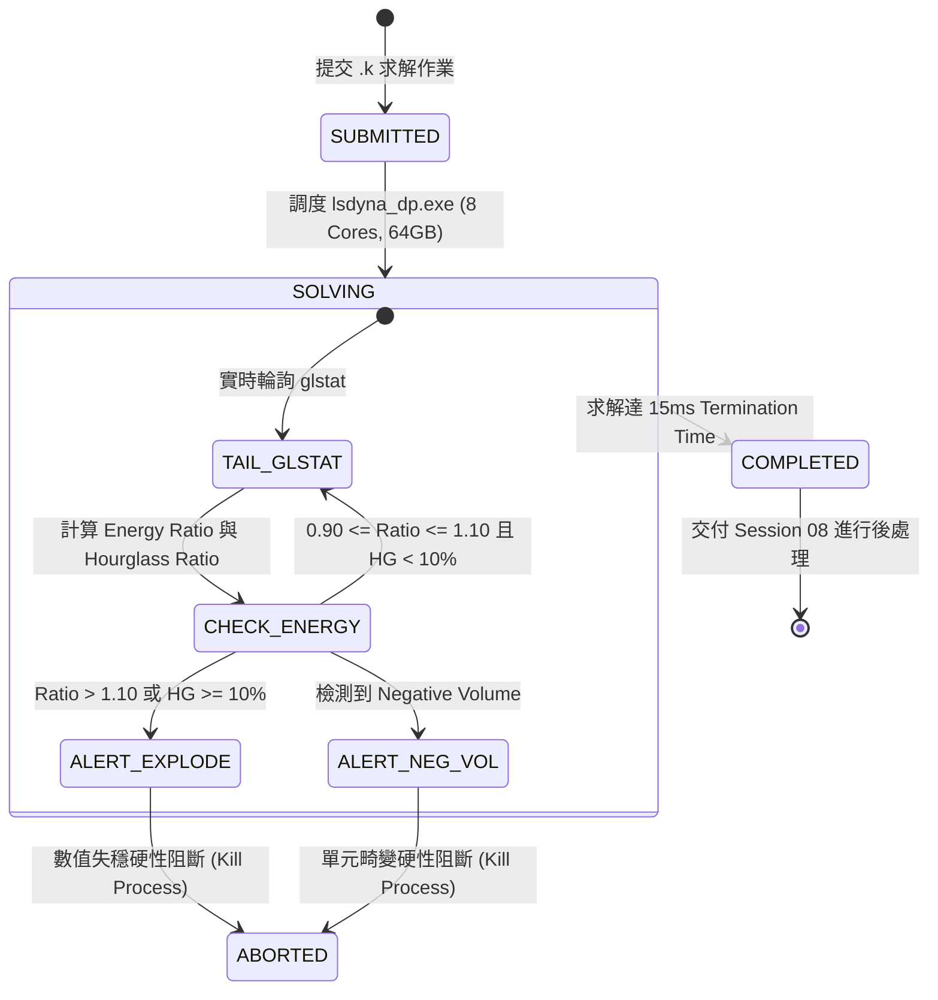

# Session 07: 求解調度與即時能量守恆監控 (Solve Dispatch & Energy Balance Monitor)

## 1. 目標 (Objective)
在 LS-DYNA 衝擊分析模型設置完成後，自動調度求解進程，並在求解過程中進行實時日誌監控與物理守恆律檢驗：
1. **求解器進程調度**：支援 PyMechanical ACT `analysis.Solve()` 或批次命令列 `lsdyna_dp.exe` 併發啟動。
2. **即時物理監控**：解析 `glstat` (Global Statistics) 與 `d3hsp`，追蹤動能、內能、沙漏能與接觸能歷程。
3. **客觀能量門禁 (Energy Verification Gates)**：嚴格執行能量比 $0.90 \le \text{Energy Ratio} \le 1.10$ 與沙漏能 $< 10\%$ 檢驗，若失穩則自動觸發阻斷並警報。

---

## 2. 核心架構與監控狀態機 (Architecture & Monitoring State Machine)



---

## 3. 核心物理指標與計算公式 (Physics Metrics & Formulas)

### 3.1 總能量平衡比 (Total Energy Ratio)
$$\text{Energy Ratio} = \frac{E_{\text{total}}}{E_{\text{initial}} + W_{\text{external}}}$$
其中：
- $E_{\text{total}} = E_{\text{kinetic}} + E_{\text{internal}} + E_{\text{spring}} + E_{\text{damping}} + E_{\text{hourglass}}$
- $W_{\text{external}}$ 為外力做功。
- **合格區間**：**$0.90 \le \text{Energy Ratio} \le 1.10$**。
- **物理異常判定**：
  - 若 $\text{Ratio} > 1.10$：代表接觸剛度過大或網格穿透引發非物理「能量爆炸」（Energy Explosion）。
  - 若 $\text{Ratio} < 0.90$：代表數值阻尼或沙漏能抑制過度，虛擬耗散了真實衝擊能量。

### 3.2 沙漏能佔比 (Hourglass Energy Ratio)
$$\text{Hourglass Ratio} = \frac{E_{\text{hourglass}}}{E_{\text{internal}}}$$
- **門檻標準**：$\text{Hourglass Ratio} \le 10\%$。
- **異常處置**：若沙漏能超標，系統自動警報並建議切換至完全積分單元（如薄板切換為 `ELFORM=16`，實體切換為 `ELFORM=2`）。

### 3.3 接觸能 (Sliding / Contact Interface Energy)
- 接觸能量應為正值或微小負值（$E_{\text{contact}} \ge -0.05 \times E_{\text{total}}$）。
- 若出現嚴重負接觸能，代表主從面網格穿透或法向法向量相反。

---

## 4. ACT 與 PyMechanical 腳本調度範例

```python
def dispatch_and_monitor_solve(analysis):
    print("Initiating LS-DYNA Solve Task...")
    # 啟動求解
    analysis.Solve(True)
    
    # 檢驗求解狀態
    solution = analysis.Solution
    status = str(solution.Status)
    print("Solve Finished with Status: " + status)
    return status == "Done"
```

---

## 5. 小批次驗證章節 (Dedicated Verification Section)

本會話提供小型獨立驗證腳本，針對數值能量守恆演算法進行物理斷言測試，並檢驗與 Mechanical 連線調度狀態。

### 5.1 獨立測試腳本執行方式
```powershell
python SKILLs/shock-analysis-workflow/scripts/test_session_07.py
```

### 5.2 驗證指標清單 (Verification Metrics)
- **能量比解析精度 (Energy Ratio Precision)**：數值誤差 $< 0.01\%$
- **爆炸阻斷門禁 (Explosion Blocking Gate)**：100% 成功攔截異常數據
- **沙漏能超標阻斷 (Hourglass Gate)**：100% 成功攔截 $>10\%$ 狀態
- **求解器進程健康度 (Solver Process Health)**：0 殘留孤兒進程
