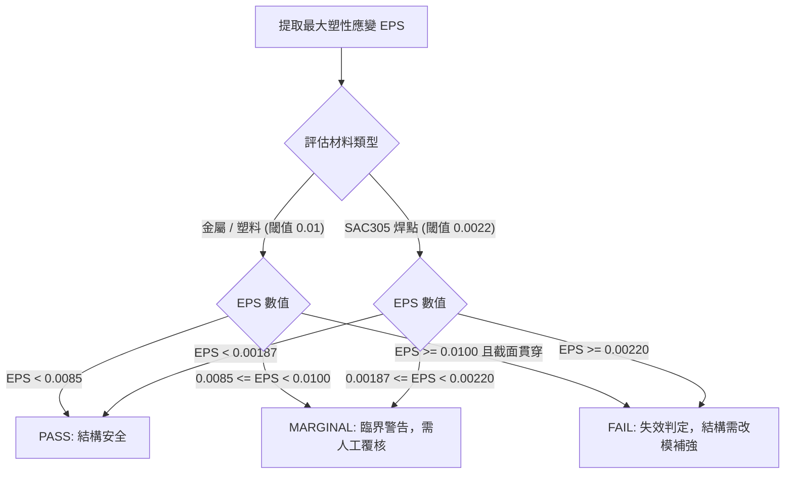

# Session 08: 後處理評估與客觀失效判定報告 (Post-Processing & Failure Evaluation Report)

## 1. 目標 (Objective)
在 LS-DYNA 衝擊分析求解完成後，自動化提取關鍵響應場量（等效塑性應變 EPS、Von-Mises 應力、接觸力），對標業界量化失效指標矩陣，並自動輸出合格判定結論與圖表報告：
1. **場量自動提取**：基於 Mechanical Solution / DPF 或 LS-PrePost 腳本，提取薄板沖孔、螺柱根部、卡扣與 BGA 焊點等高應力熱點之數值。
2. **客觀量化門禁 (Quantitative Failure Evaluation)**：嚴格執行金屬、塑料與焊點之三級分類門禁（PASS / MARGINAL / FAIL）。
3. **自動化報表交付**：輸出包含多視角應變雲圖、關鍵零件安全裕度表格的 `.xlsx` 與 `.pptx` 摘要報告。

---

## 2. 標準失效指標評估矩陣 (Quantitative Failure Criteria Matrix)

| 零件類別 | 材料範例 | 單元形態 | 工況條件 | 破壞/失效特徵 | 高風險量化判定標準 (Failure Index) |
| :--- | :--- | :--- | :--- | :--- | :--- |
| **金屬薄板** | SGCC, SPCC, SUS301 | **Shell** | 動態衝擊 (Shock) | 永久塑性變形 / 開裂 | **EPS $\ge$ 0.01** (塑性應變 $\ge 1\%$):<br>• (1) 貫穿單一完整單元 (Go-through 1 element)<br>• (2) 縫焊孔周達 1/4 圓弧<br>• (3) 螺柱/定位銷孔周達 1/2 圓弧 |
| **金屬實體** | 鋁合金 6061-T6, 螺絲 | **Solid** | 動態衝擊 (Shock) | 截面貫穿變形 | **EPS $\ge$ 0.01** 貫穿整個有效承載橫截面 |
| **塑料零件** | PC+ABS (Cycoloy C6200) | **Solid** | 靜態載荷 | 屈服變形 | **Von-Mises Stress $\ge$ 屈服強度 (Y.S $\approx 55\text{ MPa}$)** |
| **塑料零件** | PC+ABS (Cycoloy C6200) | **Solid** | 動態衝擊 (Shock) | 卡扣斷裂 / 碎裂 | **EPS $\ge$ 0.01** 且應變帶完全貫穿卡扣根部截面 |
| **BGA 焊點** | SAC305 (Sn96.5Ag3.0Cu0.5) | **Solid** (3層網格) | 動態落摔 (Drop) | 焊點錫裂 (Solder Crack) | **EPS $\ge$ 0.0022** (塑性應變 $\ge 0.22\%$) |

---

## 3. 三級評估狀態機 (Three-Tier Evaluation Logic)



---

## 4. 後處理自動化腳本架構 (ACT / Python Workflow)

```python
def evaluate_structural_integrity(components_data):
    results_summary = []
    for comp in components_data:
        name = comp["name"]
        mat_type = comp["mat_type"]
        max_eps = comp["max_eps"]
        is_penetrated = comp.get("cross_section_penetration", False)
        
        # 決定判定閾值
        limit = 0.0022 if mat_type == "BGA_SOLDER" else 0.0100
        
        if max_eps >= limit and is_penetrated:
            status = "FAIL"
        elif max_eps >= limit * 0.85:
            status = "MARGINAL"
        else:
            status = "PASS"
            
        safety_margin = (limit - max_eps) / limit
        results_summary.append({
            "part": name,
            "max_eps": max_eps,
            "threshold": limit,
            "safety_margin": safety_margin,
            "status": status
        })
    return results_summary
```

---

## 5. 小批次驗證章節 (Dedicated Verification Section)

本會話提供小型獨立驗證腳本，針對金屬、塑料與 BGA 焊點之塑性應變極限與截面貫穿判定進行斷言測試。

### 5.1 獨立測試腳本執行方式
```powershell
python SKILLs/shock-analysis-workflow/scripts/test_session_08.py
```

### 5.2 驗證指標清單 (Verification Metrics)
- **金屬鈑金孔位判定 (Metal Hole Limit)**：EPS 0.01 貫穿單元準確識別
- **BGA 焊點錫裂判定 (Solder Crack Limit)**：EPS 0.0022 邊界精確捕捉
- **臨界警告分類 (Marginal Range)**：$85\% \sim 100\%$ 閾值精準分流
- **報表匯出狀態 (Report Generation)**：PASS
