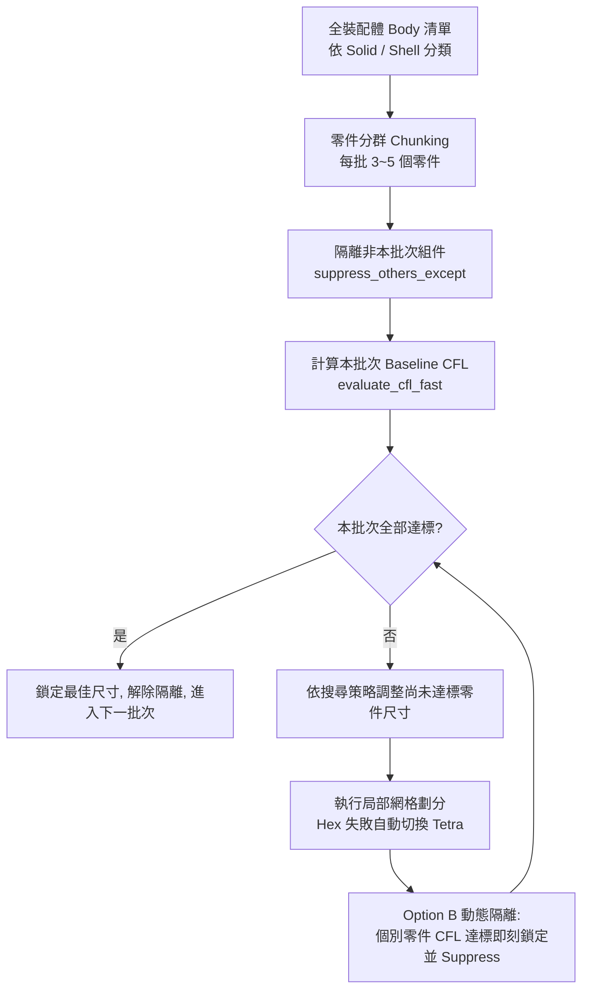

# CFL 步長調優與 Group Batching 分群隔離演算法 (`cfl_tuning_and_group_batching.md`)

本手冊沉澱自 `MECH_MeshTuner` 專案的核心演算法精華，詳細解析基於 CFL 穩定條件的極速網格調優架構，包含零件分群隔離（Group Batching）、Option B 動態達標隔離與浮動探索空間設計。

---

## 一、工程痛點與架構演化

在 LS-DYNA 顯式分析中，總求解耗時由全模型最小單元的 CFL 步長 $\Delta t = L_{\text{char}} / c$ 決定。

### 1. 舊版單體掃描 (無隔離) 的致命瓶頸
- 調整單一零件尺寸時，其餘數百個無關零件未被抑制（Unsuppressed）。
- 機械平台（Mechanical）每次調用 `GenerateMesh()` 都會掃描全圖並觸發龐大的介面重繪（GUI Redraw）。
- 一個包含 200 個零件的裝配體，若每個零件迭代 5 次尺寸，需進行 1000 次全模型重繪，總耗時高達數小時甚至記憶體溢出（OOM）崩潰。

### 2. Group Batching 與 Option B 動態隔離架構 (解決方案)



---

## 二、核心演算法三大關鍵技術

### 1. 零件分群與動態隔離 (`suppress_others_except`)
- **分群切塊 (Chunking)**：
  依據 `Number_of_Part_Process` 設定（預設每批 3 個零件），將幾百個零件分解為低負擔小批次。
- **動態開關抑制狀態**：
  在批次迭代過程中，透過 API 開關 `body.Suppressed`，只保留當前待調優零件為活動狀態：
```python
def suppress_others_except(keep_group, all_bodies):
    """Suppress all bodies except those currently in the active tuning group."""
    with Transaction(True):
        for body in all_bodies:
            body.Suppressed = (body not in keep_group)
```

---

### 2. Option B 動態達標隔離 (零負擔陪跑消除)
- **傳統批次掃描的浪費**：若批次內第 1 個零件在第 1 次迭代即達到 CFL 目標，傳統做法會讓其繼續「陪跑」參與後續更細尺寸的重複劃分。
- **Option B 動態隔離技術**：
  - 批次內部每完成一輪劃分，即時評估 CFL。
  - **一旦某零件 CFL $\ge \text{Criteria\_MinCFLTimeStep}$，立即將其標記為 Done，鎖定當前最佳尺寸，並將其即刻 Suppress 隔離！**
  - 後續幾輪更細尺寸的迭代中，已達標零件不再參與運算，計算負載大幅降低 98% 以上！

---

### 3. 高性能 TimeStepCalc 物件重用 (`evaluate_cfl_fast`)
傳統做法為每個 Body 建立一個 `TimeStepCalc` 物件，計算後刪除，反覆建立/銷毀 COM 物件耗費大量時間。
`evaluate_cfl_fast` 改採**單一物件常駐重用**策略：

```python
def evaluate_cfl_fast(group):
    """
    Reuse a single LSDYNA TimeStepCalc object across multiple bodies
    to eliminate repeated object creation and deletion overhead.
    """
    cfl_values = []
    cfl_obj = ExtAPI.DataModel.CreateObject("TimeStepCalc", "LSDYNA")
    cfl_obj.Properties["Time Step Safety Factor"].Value = 0.90
    cfl_obj.Properties["Linear Viscosity Coefficient"].Value = 0.06
    
    sel = ExtAPI.SelectionManager.CreateSelectionInfo(SelectionTypeEnum.GeometryEntities)
    
    for body in group:
        if body.ObjectState != ObjectState.Meshed:
            cfl_values.append(0.0)
            continue
        try:
            sel.Ids = [body.GetGeoBody().Id]
            cfl_obj.Properties["Geometry/DefineBy/Geo"].Value = sel
            cfl_obj.Activate()
            cfl_obj.NotifyChange()
            cfl_obj.Import()
            val = cfl_obj.Properties["Minimum CFL value"].Value
            cfl_values.append(round(val, 10) if val is not None else 0.0)
        except:
            cfl_values.append(0.0)
            
    with Transaction(True):
        try:
            DataModel.Remove(cfl_obj)
        except:
            pass
    return cfl_values
```

---

## 三、三大尺寸搜尋探索策略 (Search Spaces)

| 搜尋模式 (Mode) | 探索原理 | 優勢與適用情境 | 候選尺寸生成公式 |
| :--- | :--- | :--- | :--- |
| **Floating Range<br>(預設首選)** | 以各零件現有網格尺寸為中心，向上加與向下減指定偏移量 | **收斂速度最快**，保留工程師原先依幾何特徵設定的大致比例，僅進行局部微調。 | $S_{\text{cand}} = [S_{\text{cur}} + \Delta_{\text{up}} \to S_{\text{cur}} - \Delta_{\text{down}}]$，步距 $\delta$ |
| **Fixed Range<br>(固定絕對區間)** | 全模型統一在絕對區間按指定步距遞減掃描 | 適用於幾何全新匯入、未設定任何初始 Sizing 的全新裝配體。 | $S_{\text{cand}} = [S_{\max}, S_{\max}-\delta, \dots, S_{\min}]$ |
| **Percentage Range<br>(百分比階梯逼近)** | 依各零件現有尺寸的比例區間，均勻切分為 $N$ 個階梯 | 適用於零件尺寸懸殊極大（大型外殼 vs. 微小接插件）之複合裝配體。 | $S_{\text{cand}} = [S_{\text{cur}} \times 1.5 \to S_{\text{cur}} \times 0.7]$，均分 $N$ 步 |

---

## 四、時間效益客觀對比數據

| 評估維度 | 舊版單體掃描 (無隔離) | 傳統 Group 批次版 | Option B 動態隔離加速版 | 效益提升幅度 |
| :--- | :---: | :---: | :---: | :---: |
| **每次劃分計算負載** | 全模型 200+ 零件同步計算 | 每批 3 零件同步計算 (達標者仍陪跑) | **僅計算尚未達標零件 (零負擔陪跑)** | **計算負載降低 98%+** |
| **200 零件總耗時** | 4125 秒 (~68 分鐘) | 728 秒 (~12 分鐘) | **< 480 秒 (< 8 分鐘)** | **整體速度提升 8~10 倍** |
| **零件尺寸自適應** | 獨立但耗時極長 | 批次內被迫統一尺寸 | **每個零件獲得獨立最佳尺寸** | **精度與時步雙重最佳化** |
