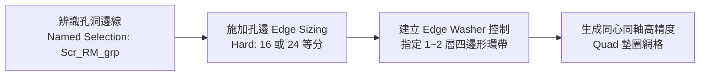

# 局部網格控制與螺栓孔 Washer 墊圈技術指南 (`local_controls_and_washers.md`)

本手冊整合 NotebookLM 局部控制功能（Sizing、Influence 範圍）與本機 ACT 成熟之 **螺栓孔 Edge Washer 墊圈環狀網格生成技術**，提供高精度應力捕捉與 CFL 步長防護之具體實踐。

---

## 一、局部尺寸控制技術 (Local Sizing)

局部 Sizing 優先權高於全域設定，支援 Vertex、Edge、Face 與 Body。

### 1. Hard vs. Soft 行為控制
- **`Soft` 行為 (預設)**：允許網格生成器依據周圍過渡梯度或曲率特徵對尺寸進行彈性放大或縮小。
- **`Hard` 行為 (強制)**：**嚴格鎖定**該邊或面的網格尺寸/等分數，嚴禁周圍過渡演算法覆蓋。在關鍵孔邊或接觸對必須設定為 `Hard`。

### 2. 漸變控制 (Bias Type & Bias Factor)
- **應用場景**：在應力集中區（如缺口、倒角）朝遠場過渡時，藉由單向或雙向漸變減少不必要的遠場節點。
- **配置參數**：
  - `Bias Type`：朝一側細化、朝兩側細化或朝中心細化。
  - `Bias Factor`：最大單元長度與最小單元長度之比值（建議控制在 $2.0 \sim 4.0$，避免尺寸跳躍過大）。

---

## 二、空間影響範圍控制 (Sphere & Body of Influence)

### 1. 球體影響範圍 (Sphere of Influence)
- **原理**：定義一個三維球體空間，落在球體內部之幾何將強制採用指定的高密度尺寸，球體外部則平滑過渡。
- **ACT 程式碼範例**：
```python
sphere_sizing = Model.Mesh.AddSizing()
sphere_sizing.Location = target_body_selection
sphere_sizing.Type = Ansys.Mechanical.DataModel.Enums.SizingType.SphereOfInfluence
sphere_sizing.SphereCenter = coordinate_system_object  # 球心自訂座標系
sphere_sizing.SphereRadius = Quantity(10.0, "mm")      # 影響半徑
sphere_sizing.ElementSize = Quantity(0.5, "mm")        # 球內加密尺寸
```

### 2. 主體影響範圍 (Body of Influence)
- **原理**：在 CAD 前處理中建立一個輔助無質量幾何塊（Tool Body），將其指定為 Body of Influence。主幾何體（Target Body）進入該實體區域的部分將自動局部細化，無需進行幾何切割。

---

## 三、螺栓孔 Edge Washer 墊圈網格技術 (核心實踐)

在電子產品落摔（Drop Test）與結構強度分析中，螺栓孔（Bolt Holes / Remote Points）承受極強的剪切與拉拔應力。手動劃分往往在圓周邊界產生不規則三角形單元，引發兩大嚴重後果：
1. **數值應力集中失真**：多邊形角點產生人工應力奇異。
2. **CFL 步長崩潰**：三角形單元的高（Height）極小，迫使 LS-DYNA 步長嚴重縮短。



### 1. 自動辨識與 Edge Sizing 加密
- 掃描以 `Scr_RM_grp` 前綴命名的 Named Selection（螺栓遠程點配對組）。
- 指派邊線劃分，設定等分數（Divisions $= 16 \sim 24$）或單元尺寸（如 $1.0 \sim 1.5\text{ mm}$），設定為 `Hard`。

### 2. Edge Washer 生成技術
- **原理**：在圓孔邊緣向外偏移切分出均勻的四邊形環帶單元（Washer Layers），使孔邊的第一層單元均為排列整齊的正規四邊形（Quad）。
- **ACT 核心 API 實現範例**：
```python
def create_edge_washer(edge_ids, layer_num=1):
    """
    Create high-quality Quad Washer mesh around circular bolt hole edges.
    Args:
        edge_ids: list of CAD edge IDs
        layer_num: number of concentric quad layers (default: 1 or 2)
    """
    sel = ExtAPI.SelectionManager.CreateSelectionInfo(SelectionTypeEnum.GeometryEntities)
    sel.Ids = edge_ids
    
    washer = Model.Mesh.AddWasher()
    washer.Location = sel
    washer.NumberOfLayers = layer_num
    print("[Edge Washer] Created {} layer(s) Quad Washer for {} edges.".format(layer_num, len(edge_ids)))
```

---

## 四、面網格劃分 (Face Meshing) 與 $N+4$ 法則

針對 2D 殼體或實體表面，透過 `Model.Mesh.AddFaceMeshing()` 強制生成結構化映射網格：
1. **拓撲角點原則**：四邊形面網格需要 4 個角點（Corners）。若曲面為不規則多邊形，需透過 `Specified Corners` 指定頂點。
2. **內部節點平衡 ($N+4$ 法則)**：
   - 邊線節點數（$N$）與角點數（$C$）需滿足映射拓撲平衡。
   - `Specified Ends`：發散 2 條網格線。
   - `Specified Sides`：發散 3 條網格線。
   - `Specified Corners`：發散 4 條網格線。
