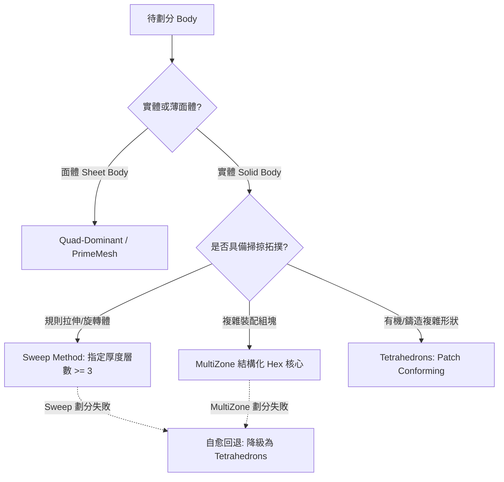

# 網格劃分方法與幾何缺陷修復指南 (`mesh_methods_and_geometry_healing.md`)

本手冊整合 NotebookLM 實體/面體劃分方法（Methods）與幾何缺陷防護技術（Defeaturing、Pinch Control、Virtual Topology），提供標準化 ACT / Python 控制範例與 Hex 失敗自愈機制。

---

## 一、實體與面體劃分方法 (Mesh Methods)

在 ANSYS Mechanical 中，劃分方法透過 `Model.Mesh.AddAutomaticMethod()` 控制，並綁定幾何實體。



### 1. 掃掠法 (Sweep Method)
- **適用場景**：具有清楚頂面（Source）與底面（Target）的規則拉伸體、旋轉體或薄壁零件。
- **薄壁件多層控制規範**：厚度方向**強制指定劃分層數 $\ge 3$**，防止剪切自鎖。
- **ACT 程式碼範例**：
```python
sweep_method = Model.Mesh.AddAutomaticMethod()
sweep_method.Location = body_selection
sweep_method.Method = Ansys.Mechanical.DataModel.Enums.MethodType.Sweep
sweep_method.SweepNumberDivisions = 3  # 厚度方向劃分 3 層單元
sweep_method.SweepBiasType = Ansys.Mechanical.DataModel.Enums.BiasType.NoBias
```

---

### 2. 多區域法 (MultiZone Method)
- **適用場景**：複雜塊狀幾何，自動將幾何分解為結構化（Hex/Prism）與非結構化（Tetra）子區域。
- **NotebookLM 核心配置**：
  - `Mapped Mesh Type`：Hexa、Hexa/Prism。
  - `Free Mesh Type`：Tetrahedrons、Hex Dominant。
  - `Surface Mesh Method`：Uniform、Paved。
- **ACT 程式碼範例**：
```python
mz_method = Model.Mesh.AddAutomaticMethod()
mz_method.Location = body_selection
mz_method.Method = Ansys.Mechanical.DataModel.Enums.MethodType.MultiZone
mz_method.MultiZonePreserveBoundary = True
```

---

### 3. 四面體法 (Tetrahedrons: Patch Conforming)
- **適用場景**：有機外型、複雜倒角裝配體或作為結構化網格失敗時的可靠兜底。
- **算法對比**：
  - **Patch Conforming (首選)**：基於 Delaunay 與前沿推進演算法，完全貼合所有幾何邊界，支援 Inflation 膨脹層與局部特徵細化。
  - **Patch Independent**：均勻八叉樹網格，忽視細微幾何特徵，邊界貼合度較差，新版工程中逐漸淘汰。
- **ACT 程式碼範例**：
```python
tet_method = Model.Mesh.AddAutomaticMethod()
tet_method.Location = body_selection
tet_method.Method = Ansys.Mechanical.DataModel.Enums.MethodType.AllTriAllTet
tet_method.Algorithm = Ansys.Mechanical.DataModel.Enums.MeshMethodAlgorithm.PatchConforming
```

---

### 4. 智慧容錯回退機制 (Hex-to-Tet Fallback)
在批次劃分大量實體時，複雜零件極易因幾何非掃掠性或微小特徵導致 Sweep / MultiZone 報錯。腳本必須具備**例外捕捉與自動回退**功能：

```python
def safe_generate_mesh_with_fallback(body, method_ctrl):
    """Attempt mesh generation; if Hex-like method fails, safely fallback to Tetra."""
    Model.Mesh.GenerateMesh()
    if body.ObjectState != ObjectState.Meshed:
        # Check if current method is Hex-like
        m_str = str(method_ctrl.Method).lower()
        if any(k in m_str for k in ["sweep", "multizone", "hex"]):
            # Switch to robust Tetrahedrons
            method_ctrl.Method = Ansys.Mechanical.DataModel.Enums.MethodType.AllTriAllTet
            Model.Mesh.ClearGeneratedData()
            Model.Mesh.GenerateMesh()
            print("[Self-Healing] Hex meshing failed for Body: {}. Fallback to Tetra succeeded.".format(body.Name))
```

---

## 二、幾何缺陷修復與防護 (Geometry Healing)

微小的幾何短邊、狹窄尖角或碎面會迫使網格生成器生成特徵長度極小（如 $< 0.01\text{ mm}$）的退化單元，直接壓垮 LS-DYNA CFL 步長或引發 Mechanical 歪斜度超標。

### 1. 網格層級去細節 (Mesh Defeaturing)
- **原理**：在網格劃分過程中，設定 `Defeature Size`，凡小於該尺寸的倒角、微小孔或短邊將自動被網格演算法跨越縫合，**無需修改原始 CAD 模型**。
- **配置原則**：
  $$\text{Defeature Size} = (0.2 \sim 0.5) \times \text{Element Size}$$
- **ACT 程式碼範例**：
```python
# 全域網格去細節設定
Model.Mesh.AutomaticMeshDefeaturing = True
Model.Mesh.DefeaturingTolerance = Quantity(0.5, "mm")

# 局部 Body Sizing 去細節控制
body_sizing = Model.Mesh.AddSizing()
body_sizing.Location = body_selection
body_sizing.ElementSize = Quantity(2.0, "mm")
body_sizing.DefeaturingTolerance = Quantity(0.4, "mm")
```

---

### 2. 捏合控制 (Pinch Control)
- **原理**：當 CAD 模型中存在相鄰的微小縫隙（狹縫）或邊界未對齊時，Pinch 會定義 Master（保留邊界）與 Slave（被吸附邊界），在網格層級將兩者直接貼合，杜絕極狹長單元。
- **核心參數**：
  - `Pinch Tolerance`：吸附忍受公差（**必須小於相鄰局部網格尺寸**，通常設為局部單元尺寸的 20%~30%）。
  - `Auto vs Manual`：可手動選取特定邊線/面，或啟用全域自動 Pinch 搜尋。
- **ACT 程式碼範例**：
```python
pinch = Model.Mesh.AddPinch()
pinch.MasterGeometry = master_face_sel
pinch.SlaveGeometry = slave_face_sel
pinch.Tolerance = Quantity(0.2, "mm")
```

---

### 3. 虛擬拓撲 (Virtual Topology)
- **原理**：在 Mechanical 樹狀目錄中，於網格劃分之前將 CAD 拓撲結構進行簡化：
  - **Merge Faces**：將同一個倒角面上的多個細碎面片段合併為單一曲面。
  - **Merge Edges**：將斷裂的連續微小邊線縫合為單一導動邊。
  - **Split Faces**：在大型不規則板件上手動切分輔助線，以建構出可掃掠（Sweepable）之四邊形區域。
- **工程最佳實踐**：
  針對成百上千個零件的裝配體，優先在 SpaceClaim 中執行特徵簡化（參考 `SC_Defeature_func`），次選在 Mechanical 中透過 `Mesh Defeaturing` 搭配 `Pinch Control` 自動防護。
