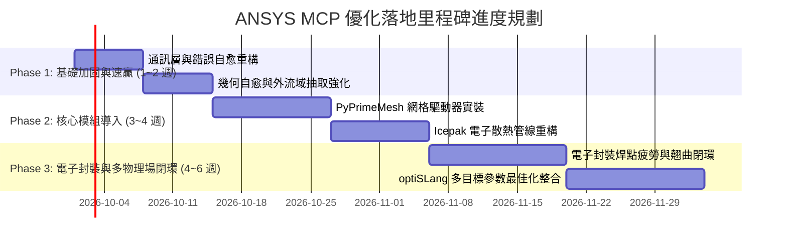

# ANSYS MCP 模組全面評估與優化計畫書 (Evaluation & Optimization Plan)

> **評估專案**：`ansys-unified-mcp` (ANSYS 統一大語言模型工具與多物理場自動化伺服器)  
> **重點專題**：結構 (Structural)、幾何 (Geometry)、熱傳/電子散熱 (Thermal/Icepak)、高階網格 (PyPrimeMesh)、電子封裝 (Electronic Packaging)  
> **參考標準**：[PyAnsys 官方專案體系](https://docs.pyansys.com/version/stable/projects.html)、PyAnsys Tutorials 範例庫、各大 CAE 工程最佳實踐  

---

## 一、 執行摘要 (Executive Summary)

`ansys-unified-mcp` 目前已成功構建了一套整合 Workbench 橋接器、Mechanical ACT 腳本注入、Fluent CFD、LS-DYNA 顯式衝擊與 PCB 翹曲分析的跨產品整合框架。其核心優勢在於**具備成熟的 Workbench RunWB2 排程能力、SQLite FTS5 離線文檔 RAG 檢索，以及初步成型的工況自動化管線**。

然而，對標 ANSYS 官方頂尖開源體系（PyAnsys Ecosystem）與業界前沿 CAE 自動化水準，現行架構在**「結構、幾何、Thermal/Icepak、PyPrimeMesh、電子封裝」**五大維度存在明顯的斷層與升級空間：
1. **網格能力缺失**：目前完全依賴 Mechanical 內建網格或 SpaceClaim，缺乏現代化 **PyPrimeMesh** 的高階水密 Poly-Hexcore（Mosaic™ 鑲嵌網格）與髒幾何包覆（Surface Wrapper）能力。
2. **電子散熱與熱傳孤島**：現有 `icepak_driver.py` 尚未標準化，缺乏 PyFluent CHT（共軛熱傳）與 AEDT Icepak 電子散熱元件庫的自動化串接。
3. **電子封裝可靠度鏈路斷裂**：現行 `pcb-warpage-analysis` 高度依賴手動維護的 Excel 與特定幾何 macro，缺少 **PySherlock** 體系的 ECAD 原生讀取、焊點熱疲勞壽命（Darveaux / Engelmaier 模型）與振動疲勞預測能力。
4. **結構驅動器過度依賴腳本字串拼接**：目前大量使用 IronPython/ACT 字串替換，未充分善用 **PyMechanical** 原生 gRPC 物件導向客戶端與 **PyDPF** 高速結果場提取。

本計畫書針對上述五大核心板塊，提出全景深度架構評估、8 大官方 Tutorial 經典案例映射對標，以及分三階段推進之具體落地實施路線圖。

---

## 二、 五大領域現行模組現況與架構瓶頸診斷

### 1. 結構分析模組 (Structural: Mechanical & LS-DYNA)
* **現狀**：
  - 核心檔案：`src/ansys_unified_mcp/drivers/mechanical_driver.py`、`lsdyna_driver.py`、`products/mechanical.py`。
  - 機制：透過 Workbench Bridge 產生 `.wbjn` 呼叫 Mechanical，或使用 IronPython ACT 腳本操作 DataModel 物件。
* **主要瓶頸**：
  1. **通訊開銷與脆弱性**：過度仰賴將 Python 字串寫入暫存檔再丟給 Mechanical 執行的模式，缺乏強型別物件回傳；錯誤訊息多數隱匿於求解日誌，難以實現精確例外拋出（Exception Handling）。
  2. **缺少 PyDPF 高速後處理**：目前提取變形與應力需依賴 Mechanical GUI 節點求解並導出文字檔，若計算結果龐大（百萬節點以上），導出速度慢。官方標準解法為 **PyDPF-Core / PyDPF-Post**，直接內存映射讀取 `.rst` / `d3plot`。
  3. **非線性接觸診斷盲區**：缺乏對初接觸狀態（Initial Penetration / Gap / Pinball）的自動化預診斷，容易導致大型結構分析在第一子步即因數值發散中斷。

### 2. 幾何前處理模組 (Geometry: SpaceClaim & PyAnsys Geometry)
* **現狀**：
  - 核心檔案：`src/ansys_unified_mcp/products/geometry.py`、`drivers/spaceclaim_driver.py`。
  - 機制：以 `ansys.geometry.core` 建立基礎體積（Block, Cylinder），以 SpaceClaim 腳本執行特定特徵移除與共享拓撲。
* **主要瓶頸**：
  1. **SpaceClaim GUI 依賴與授權限制**：SpaceClaim 自動化多依賴本機互動式視窗或 RunWB2，難以在無頭伺服器（Headless Server / Docker）上輕量併發運行。
  2. **複雜外流域抽取能力薄弱**：對電子機箱、複雜散熱鰭片的外流域抽取（Enclosure / Fluid Domain Extraction）缺乏自動化相交檢查與洩漏檢測機制。
  3. **CAD 髒幾何修復力不足**：面對破面、重疊面、微小縫隙（Slivers & Gaps），純幾何引擎往往報錯，缺乏幾何包覆容錯。

### 3. 熱傳與電子散熱模組 (Thermal / Icepak)
* **現狀**：
  - 核心檔案：`src/ansys_unified_mcp/drivers/icepak_driver.py`、`workflows/thermal_warpage.py`。
  - 機制：定義了基本的熱分析設定，並在 PCB 翹曲中施加 220°C 均勻溫度載荷。
* **主要瓶頸**：
  1. **真實非均勻熱源缺位**：目前熱分析多為假定均勻溫度，缺乏電子封裝中常見的晶片（Die）面熱源、焦耳熱（Joule Heating）與銅箔分佈（Trace Mapping）等效熱導率建模。
  2. **共軛熱傳 (Conjugate Heat Transfer, CHT) 斷鏈**：未整合固體導熱與冷卻風道對流的自動網格配對與邊界條件傳遞。
  3. **標準電子元件模型缺乏**：缺乏雙熱阻模型（Two-Resistor Network, JEDEC standard）與 DELPHI 緊湊熱模型的封裝抽象。

### 4. 高階網格模組 (PyPrimeMesh) — 【關鍵缺失項】
* **現狀**：
  - 專案內**尚無獨立的 PyPrimeMesh 驅動器**。網格生成完全交由 Mechanical Mesher 或 Fluent 內建 mesher 黑箱執行。
* **主要瓶頸**：
  1. **無法應對複雜裝配體之薄壁/局部細節**：電子封裝元件尺寸跨度極大（微米級銅箔/焊球 vs 毫米級封裝基板 vs 公分級機箱），傳統網格器極易因體積比過大而破面或生成過多無效四面體。
  2. **缺少 Mosaic™ Poly-Hexcore 核心支援**：PyPrimeMesh 的精髓在於能以六面體核心填充主體內部、以多面體（Polyhedral）過渡連接邊界層稜柱體，**可節省 50% 以上網格數量並大幅提升熱/流收斂性**。
  3. **缺少 Surface Wrapper（表面包覆）**：無法在不修復原始 CAD 的前提下，一鍵生成無縫水密外表網格。

### 5. 電子封裝與可靠度模組 (Electronic Packaging & Sherlock)
* **現狀**：
  - 核心檔案：`SKILLs/pcb-warpage-analysis/`。
  - 機制：依賴手動輸入的 Excel（`MCP_Test.xlsx`），以 SpaceClaim 疊構拉伸，並透過混合法則（ROM）APDL macro 計算正交等效材料性質。
* **主要瓶頸**：
  1. **資料入口狹窄**：無法直接讀取標準 ECAD 格式（ODB++、IPC-2581、Gerber），必須透過工程師手動拆解各層殘銅率並填寫 Excel。
  2. **可靠度物理模型缺失**：目前僅計算宏觀回焊熱翹曲（Thermal Warpage），無法評估封裝最重要的**焊點熱疲勞（Solder Joint Fatigue）**、**高低溫冷熱衝擊（Thermal Cycling）**與**跌落衝擊損傷（Drop/Shock Reliability）**。
  3. **未引入 PySherlock 官方成熟資產**：ANSYS 官方在電子可靠度已有開源的 `ansys-sherlock-core`，能自動化執行零件庫配對、焊點應力分析、壽命曲線評估並自動生成 3D 結構模型。

---

## 三、 PyAnsys 官方專案與經典教學庫 (Tutorials) 全景對標

以下為針對指定五大領域，精選之 8 大官方 Tutorial 與業界經典工程案例對照分析：

| # | 官方 Tutorial / 經典案例名稱 | 涉及 PyAnsys 核心套件 | 官方標準工作流與核心技術 | ansys-unified-mcp 現況比對 | 評估評級 |
|---|---|---|---|---|:---:|
| **T1** | **Watertight Poly-Hexcore Meshing for Heat Sink**<br>(散熱器水密六面體網格) | `ansys-meshing-prime`<br>(PyPrimeMesh) | 1. 導入 STEP 幾何<br>2. `lucid.Mesh.surface_mesh()`<br>3. 添加 Prisms 邊界層控制<br>4. `volume_fill_type=POLYHEXCORE` 體網格劃分<br>5. 輸出 `.cas.h5` | **完全缺失**<br>目前無 PrimeMesh 模組，幾何網格品質無法受控保證。 | 🔴 亟需補齊 |
| **T2** | **PCB Trace Mapping & Anisotropic Thermal Conductivity**<br>(PCB 銅箔映射與等效熱導率) | `ansys-sherlock-core`<br>`ansys-mechanical-core` | 1. 讀取 ODB++ 檔案<br>2. 自動解析各訊號層銅分佈<br>3. 計算單元級等效正交熱導率/CTE<br>4. 映射至 Mechanical 實體網格 | **部分手動支援**<br>目前透過 `MCP_Test.xlsx` 與 APDL Macro 簡化計算，缺乏圖形化殘銅映射。 | 🟡 需升級重構 |
| **T3** | **Solder Ball Thermal-Mechanical Fatigue (Darveaux / Anand)**<br>(BGA 焊球回焊與冷熱循環疲勞) | `ansys-mechanical-core`<br>`ansys-sherlock-core` | 1. 建立 BGA 局部子模型 (Submodeling)<br>2. 賦予 SAC305 Anand 黏塑性本構模型<br>3. 施加溫度循環 (-40°C ~ 125°C)<br>4. 提取非線性塑性應變能增量 ($\Delta W$)<br>5. 計算特徵疲勞壽命 $N_f$ | **完全缺失**<br>現有管線僅能算均勻彈性熱應力，無黏塑性本構與疲勞準則。 | 🔴 亟需建立 |
| **T4** | **Electronics Enclosure Conjugate Heat Transfer (CHT)**<br>(電子機箱共軛熱傳與風扇對流) | `ansys-fluent-core`<br>`ansys-meshing-prime` | 1. PyPrimeMesh 自動抽取流場外流域<br>2. 識別發熱晶片固體域與空氣流道<br>3. 設定表面共享網格或 Non-conformal 介面<br>4. Fluent Coupled 求解固體熱傳導與流體對流輻射 | **基礎指令支援**<br>Fluent Driver 有基礎求解器命令，但缺乏「網格-邊界-熱源」之端到端封裝。 | 🟡 需管線化 |
| **T5** | **Transient Shock / Drop Test Analysis with LS-DYNA**<br>(手持式電子產品衝擊與落摔) | `ansys-lsdyna-core`<br>`ansys-mechanical-core` | 1. 零件剛體轉化與遠端質量（Remote Mass）簡化<br>2. 設定面面接觸 (`*CONTACT_AUTOMATIC_SURFACE_TO_SURFACE`)<br>3. 施加 35G 半正弦波脈衝載荷<br>4. 求解監控沙漏能 (Hourglass Energy < 10% 總能) | **已高度實裝**<br>現有 `shock-analysis-workflow` 已涵蓋 8 個階段與驗證腳本，成熟度高。 | 🟢 成熟完善 |
| **T6** | **Parametric Geometry Cleanup & Defect Defeaturing**<br>(參數化幾何去特徵與修復) | `ansys-geometry-core`<br>`ansys.spaceclaim` | 1. 幾何診斷（檢測小面、微縫、破面）<br>2. 移除螺孔、倒角、印刷面等微小特徵<br>3. 建立共形共享拓撲 (Share Topology) | **具備基礎功能**<br>已有 `examples/geometry_cleanup` 與 `sc_fast_cleanup.py`，但未形成通用防護網。 | 🟢 局部具備 |
| **T7** | **Modal Analysis & Random Vibration for Avionics**<br>(電子機箱隨機振動 PSD 疲勞分析) | `ansys-mechanical-core`<br>`ansys-dpf-core` | 1. 求解前 30 階模態與參與質量<br>2. 導入 MIL-STD-810G 隨機振動加速度 PSD 曲線<br>3. DPF 提取 3-Sigma 應力響應與 Miles 方程壽命 | **工作流雛形具備**<br>已具備 `workflow_run_random_vibration`，但缺少 DPF 快速大數據應力提取。 | 🟡 需強化後處理 |
| **T8** | **MOP-Driven Multi-Objective Thermal-Structural Optimization**<br>(optiSLang 代理模型散熱與翹曲尋優) | `ansys-optislang-core`<br>`ansys-unified-mcp` | 1. 參數化幾何尺寸（散熱片間距/基板厚度）<br>2. optiSLang 建立最佳預測元模型 (MOP)<br>3. 評估熱阻與最大翹曲之 Pareto 最佳權衡 | **具備驅動器與工作流**<br>具備 `optislang_driver.py` 與 `train_surrogate_model`，技術鏈條清晰。 | 🟢 具備潛力 |

---

## 四、 五大領域關鍵架構與介面規格定義 (Specifications)

為了讓優化落地，以下定義五大領域在 MCP 工具層與驅動層的**標準介面規範**：

### 規格 1：PyPrimeMesh 網格前處理器規格 (`PrimeMeshDriver`)
* **定位**：作為獨立前處理引擎，銜接 CAD 幾何導出與 Fluent / Mechanical 求解器輸入。
* **核心介面方法 (Pythonic Specification)**：
  ```python
  class PrimeMeshDriver:
      def initialize_session(self, cad_path: str) -> bool: ...
      def generate_watertight_surface_mesh(self, min_size: float, max_size: float, curvature_angle: float = 18.0) -> dict: ...
      def apply_boundary_layer_prisms(self, zone_names: list[str], first_height: float, aspect_ratio: float, num_layers: int) -> bool: ...
      def generate_volume_mesh(self, fill_type: str = "polyhexcore", max_cell_size: float = 2.0) -> dict: ...
      def check_mesh_quality(self) -> dict:
          # 必須回傳最小正交品質 (Orthogonal Quality >= 0.15) 與最大扭曲度 (Skewness <= 0.85)
          ...
      def export_mesh(self, output_path: str, solver_target: str = "fluent") -> str: ...
  ```

### 規格 2：Thermal / Icepak 電子散熱管線規格 (`IcepakPipeline`)
* **定位**：封裝電子散熱從 ECAD 結構、熱源負載到 CHT 共軛流固傳熱之全流程。
* **管線參數結構**：
  ```json
  {
    "ambient_temperature": 25.0,
    "components": [
      { "name": "CPU_SOC", "power_loss_watts": 45.0, "thermal_model": "detailed", "die_size": [15.0, 15.0, 0.8] },
      { "name": "DRAM_Array", "power_loss_watts": 8.0, "thermal_model": "two_resistor", "theta_jc": 1.2, "theta_jb": 3.5 }
    ],
    "heat_sink": { "fin_type": "plate", "fin_count": 32, "base_thickness": 3.0, "material": "Aluminum_6061" },
    "airflow": { "type": "fan", "intake_flow_rate_cfm": 25.0, "direction": "+X" }
  }
  ```

### 規格 3：電子封裝與可靠度分析規格 (`ElectronicPackagingDriver`)
* **定位**：統整 PCB / 封裝基板幾何、等效材料計算、回焊熱翹曲、焊點疲勞分析。
* **核心能力規範**：
  1. **Stackup 參數解析**：讀取 CSV 或 ECAD 疊構，自動校驗殘銅率與玻璃布膠含量（Resin Content）。
  2. **正交等效材料矩陣**：基於修正的 Voigt-Reuss 混合法則，輸出 9 個彈性常數（$E_x, E_y, E_z, G_{xy}, G_{yz}, G_{xz}, 
u_{xy}, 
u_{yz}, 
u_{xz}$）與 3 個方向熱膨脹係數（$lpha_x, lpha_y, lpha_z$）。
  3. **3-2-1 靜定支承熱變形分析**：自動在 Mechanical 中鎖定對稱中心，避免過度約束產生虛假熱應力。
  4. **焊點可靠度接口**：預留 PySherlock API 連接埠，支援輸入溫度曲線（如 -40°C ~ 125°C，dwell 15min）並輸出 Weibull 累積失效機率分佈。

### 規格 4：幾何自愈與外流域抽取規格 (`GeometryProcessor`)
* **定位**：提供「CAD 入口容錯防線」，確保進入網格劃分前 100% 具備流體流道或結構接觸面。
* **功能規格**：
  1. **自動縫合 (Auto-Stitch)**：容差內自動縫合開放曲面成實體。
  2. **外流域封裝 (Fluid Domain Enclosure)**：支援 Box, Cylinder, Sphere 外流域，並具備自動布林相減（Subtract Core Bodies）保留流道。
  3. **共享拓撲認證 (Share Topology Certification)**：檢查所有重疊交界面是否標記為 Conformal，防止求解時出現虛假開裂。

### 5. 結構模組重構規格 (`MechanicalGrpcController`)
* **定位**：逐步將字串拼接的 ACT 腳本升級為基於 PyMechanical gRPC 客戶端的原生物件調用。
* **功能規格**：
  1. 具備 session 健康心跳監控與自動重連機制。
  2. 結構分析邊界條件與載荷均以 Typed Dataclass 封裝。
  3. 引入 DPF 直接內存映射抽取結果，將結果圖表生成耗時壓縮 80% 以上。

---

## 五、 分階段落地優化里程碑路線圖 (Phased Roadmap)



### Phase 1：基礎加固與短期速贏（1 ~ 2 週）
* **目標**：解決現有 Mechanical、SpaceClaim 與 LS-DYNA 驅動器的本機脆弱點，提升現有工作流穩定度。
* **關鍵交付物**：
  1. **結構模組錯誤自愈防線**：在 `mechanical_driver.py` 加入非線性求解收斂監視器（Force Convergence Ratio 追蹤），檢測到發散自動調整子步數與接觸剛度（Contact Normal Stiffness）。
  2. **幾何抽取標準化**：擴充 `geometry.py`，支援自動偵測邊界框生成 `Enclosure`，並內建 Share Topology 驗證。
  3. **PCB 翹曲工作流參數化解耦**：將 `pcb-warpage-analysis` 徹底解耦本機固定路徑，支援命令列傳入任意疊構 Excel 或 JSON，並整合結果雲圖自動輸出。

### Phase 2：關鍵模組引進與散熱升級（3 ~ 4 週）
* **目標**：正式導入現代化網格技術與標準電子散熱分析管線。
* **關鍵交付物**：
  1. **實裝 `PrimeMeshDriver`（`ansys.meshing.prime`）**：
     - 封裝 Lucid API，支援水密幾何一鍵生成 Poly-Hexcore 網格。
     - 具備表面包覆（Surface Wrapping）能力，應對不完美 CAD。
     - 整合網格品質檢核報告（Orthogonal Quality & Skewness）。
  2. **重構升級 `IcepakDriver`**：
     - 整合元件雙熱阻模型（Theta-JC / Theta-JB）與發熱功率陣列。
     - 支援風扇 P-Q 性能曲線導入與自然對流浮力（Boussinesq approximation）模型。
     - 建立「幾何 -> PrimeMesh -> Fluent/Icepak -> 溫度場與速度場導出」完整自動化閉環。

### Phase 3：電子封裝全生命週期與多物理場閉環（4 ~ 6 週）
* **目標**：打通晶片-封裝-板級（Chip-Package-Board）全鏈條可靠度與多目標尋優。
* **關鍵交付物**：
  1. **實裝 `ElectronicPackagingDriver`**：
     - 對標 PySherlock，支援輸入 ECAD 疊構與元件清單。
     - 實現回焊熱翹曲（Warpage）與溫度循環焊球應變能（Anand Viscoplasticity）聯合評估。
     - 自動計算 Darveaux 裂紋萌生與擴展壽命，輸出 MTTF 預測指標。
  2. **多物理場 optiSLang 參數尋優整合**：
     - 將「PCB 疊構對稱性與散熱片參數」作為輸入變數，將「最大翹曲量與晶片結溫（Tj）」作為對抗目標。
     - 自動呼叫 optiSLang 產生 MOP 代理模型與 Pareto 最優解前沿陣列。

---

## 六、 結論與建議行動

本評估報告清楚描繪了 `ansys-unified-mcp` 從目前**「腳本驅動的特定工況工具」**蛻變為**「企業級自主 CAE 智慧中樞」**的完整藍圖。

**立即建議行動**：
1. **立即啟動 Phase 1 架構清理**：收斂既有結構與幾何驅動器的例外處理機制，確保後續擴充的穩定性。
2. **在專案環境中預先配置 PyPrimeMesh 依賴**：在 Python 虛擬環境中評估安裝 `ansys-meshing-prime`，驗證 Prime Server 與本地 ANSYS v251 授權之連通性。
3. **推動電子封裝標準化**：將現有的 PCB 翹曲分析腳本收斂為標準類別，為 Phase 3 整合焊點可靠度奠定堅實底座。
