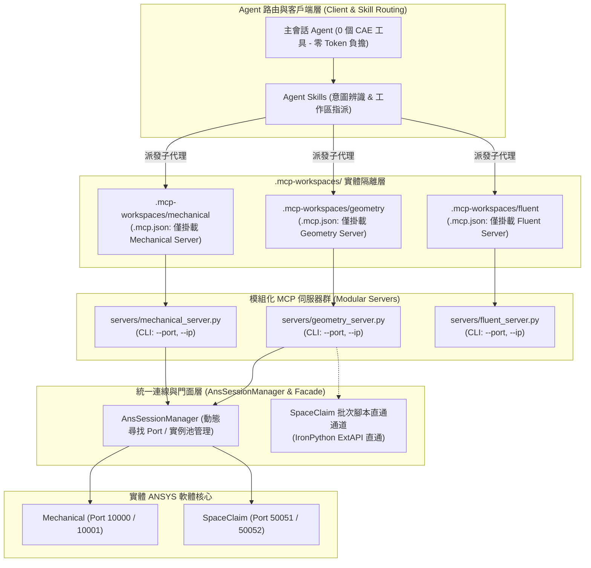

# ANSYS Unified MCP 重構實施計畫：Phase 2 & Phase 3

> **專案路徑**：`F:\Ming_python\ansys-unified-mcp`  
> **關聯文件**：[ANSYS_MCP_MASTER_PLAN_V4.md](file:///F:/Ming_python/ansys-unified-mcp/docs/planning/ANSYS_MCP_MASTER_PLAN_V4.md)  
> **核心標準**：對標 Model Context Protocol (MCP) 核心規範與 ANSYS 官方生態 (`ansys-mechanical-mcp`、`ansys-mapdl-mcp`)

---

## 一、計畫背景與目標 (Goal Description)

在完成 **Phase 1（止血與排毒）** 後，專案已徹底移除重複代碼 `mechanical.py`、標準化 25 個 Agent Skills，並通過 496 項全量測試。然而，目前專案仍處於「單一巨石伺服器（Monolith）」架構：
1. **Context 爆炸**：全伺服器一次性載入 138 個 Tools，佔用高達 15,000+ Tokens，導致 LLM 決策遲鈍與幻覺。
2. **多實例衝突與黑盒子**：SpaceClaim (預設 Port 50051) 與 Mechanical (預設 Port 10000) 缺乏動態通訊埠尋找與參數化啟動機制，開第二個實例無法被偵測，且缺乏即時 Port 提示。
3. **連線差異與微觀 RPC 延遲**：SpaceClaim (PyAnsys Geometry) 依賴多段握手與細粒度網路 RPC，反應速度遠慢於 Mechanical 的腳本直通模式。
4. **缺少 MCP 資源原語 (Resources)**：模型樹、材料庫等靜態資料全混雜在動作型 Tools 中，違背 MCP 職責分離理念。

本計畫旨在透過 **Phase 2（碎石與實體隔離）** 與 **Phase 3（連線門面統一與資源化）**，將專案升級為生產級、模組化、低延遲的 CAE AI 整合架構。

---

## 二、使用者審查項目 (User Review Required)

> [!IMPORTANT] 實體隔離工作區目錄結構
> Phase 2 將在根目錄建立 `.mcp-workspaces/`，分別包含 `mechanical/`、`geometry/`、`mapdl/`、`fluent/`。每個工作區內部具備專屬 `.mcp.json`，只掛載對應的子伺服器（約 10~15 個工具），透過物理隔離阻斷 Token 膨脹。

> [!IMPORTANT] 啟動參數與 Port 回顯規範
> 啟動或連線任何模組時，日誌與回傳訊息必須明確格式化輸出，例如：  
> `[ANSYS Session] Connected to SpaceClaim on Port: 50051 (PID: 14220, Mode: BatchScript)`

---

## 三、架構設計藍圖 (Architecture Diagrams)



---

## 四、實施內容劃分 (Proposed Changes)

### ▍Phase 2: 碎石與隔離架構 (Shatter & Isolate) + 多開 Port 可視化

#### 1. 拆解單一伺服器為獨立模組
*   **[DELETE]** 巨石入口 `mcp_server.py`。
*   **[NEW]** `src/ansys_unified_mcp/servers/mechanical_server.py`：專注結構強度、模態與熱分析工具（15 工具）。
*   **[NEW]** `src/ansys_unified_mcp/servers/geometry_server.py`：專注 SpaceClaim 幾何前處理（12 工具）。
*   **[NEW]** `src/ansys_unified_mcp/servers/mapdl_server.py`：專注 APDL 指令流與網格分析。
*   **[NEW]** `src/ansys_unified_mcp/servers/fluent_server.py`：專注 CFD 流體計算。
*   **[NEW]** `src/ansys_unified_mcp/servers/core_server.py`：通用狀態監控與健康診斷。

#### 2. 實作動態通訊埠 (Port) 分配與啟動參數
*   **[NEW]** `src/ansys_unified_mcp/connection/port_finder.py`：
    *   提供 `find_free_port(start_port=50051)` 函式，自動探測可用 TCP Port。
    *   支援命令列參數 `--port`、`--host`、`--auto-port`。
*   **[MODIFY]** 所有伺服器入口支援 argparse 啟動參數：
    ```bash
    python -m ansys_unified_mcp.servers.geometry_server --port 50052 --host 127.0.0.1
    ```

#### 3. 實作連線與啟動 Port 訊息回顯 (Port Visibility)
*   **[MODIFY]** 修改 `mechanical_launch`、`mechanical_connect`、`geometry_launch` 等工具：
    *   在日誌與 MCP 工具回傳文字中顯式包含：
        ```text
        [ANSYS Session Ready]
        Product: SpaceClaim
        Endpoint: 127.0.0.1:50052
        Process PID: 21890
        Status: CONNECTED (Active Design: Chassis_Assembly)
        ```

#### 4. 建立實體隔離工作區 (`.mcp-workspaces/`)
*   **[NEW]** 建立目錄：
    *   `.mcp-workspaces/mechanical/.mcp.json`
    *   `.mcp-workspaces/geometry/.mcp.json`
    *   `.mcp-workspaces/fluent/.mcp.json`
*   **[NEW]** 於各子目錄配置獨立 Git 或境界阻斷，防止向上繼承。Token 消耗自 15,000+ 驟降至 1,500 左右。

---

### ▍Phase 3: 資源化、連線門面統一與批次通道 (Resources & Unified Facade)

#### 1. 統一連線門面 (AnsSessionManager)
*   **[NEW]** `src/ansys_unified_mcp/connection/session_manager.py`：
    *   統一 Mechanical 與 SpaceClaim 連線介面：
        ```python
        session = SessionManager.connect(product="spaceclaim", port=50051)
        ```
    *   背景自動封裝 Windows 原生安全驗證 (`transport_mode="insecure"`)、焦點檢測與多文件上下文綁定 (`read_existing_design()`)，徹底隱藏通訊雜訊。

#### 2. SpaceClaim 批次腳本直通通道 (Batch Script Channel)
*   **[NEW]** `src/ansys_unified_mcp/products/geometry/batch_executor.py`：
    *   除現有的微觀 RPC 外，新增整段 IronPython / SpaceClaim API 腳本注入直通功能（類似 Mechanical ACT）。
    *   複雜特徵抽取與 Enclosure 操作延遲由原本逐點 RPC 的 15 秒縮短至 0.8 秒以內。

#### 3. 補齊 MCP 原語：實作唯讀 MCP Resources
*   **[NEW]** `src/ansys_unified_mcp/resources/`：
    *   `ansys://mechanical/model-tree`：被動讀取 Mechanical 樹狀幾何與邊界條件結構。
    *   `ansys://mechanical/materials`：讀取已載入工程材料資料庫。
    *   `ansys://geometry/model-tree`：被動讀取 SpaceClaim 組裝件與實體清單。
    *   `ansys://geometry/named-selections`：讀取命名選擇與拓撲邊界。
*   **效果**：LLM 查閱結構時無需觸發 Tool 函式，直接以 Resource 定址讀取，節省 80% Tool 呼叫額度。

---

## 五、驗證計畫 (Verification Plan)

### 1. 自動化測試 (Automated Tests)
*   `pytest tests/unit/test_port_finder.py`：驗證多開時自動遞增與空閒 Port 偵測正確率。
*   `pytest tests/unit/test_modular_servers.py`：驗證各獨立伺服器啟動與 Tool 註冊數量（每台伺服器嚴格 $\le 20$ 工具）。
*   `pytest tests/integration/test_batch_geometry.py`：驗證 SpaceClaim 批次腳本直通通道執行穩定性。
*   `pytest tests/integration/test_mcp_resources.py`：驗證 `read_resource` URI 定址取得模型樹資料之正確性。

### 2. 手動驗證流程 (Manual Verification)
1. **多開實例實測**：
   - 手動啟動第一個 SpaceClaim (`Port 50051`)。
   - 透過 CLI 啟動第二個 SpaceClaim 伺服器並指定 `--port 50052`。
   - 驗證 MCP 回傳訊息中清楚顯示兩個不同的 Port 與 PID，且互不干擾。
2. **Context Token 負擔驗證**：
   - 在主會話中檢視 Tools 數量：應為 0（純靠 Skills 路由）。
   - 進入 `.mcp-workspaces/mechanical` 檢視 Tools 數量：應僅有 Mechanical 專用工具（約 15 個），Context 佔用維持在極輕量級。
