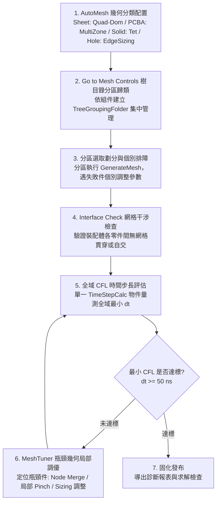

# ANSYS Mesh 網格工程與效能調優主控手冊

本手冊規範從無網格到劃分完成、再到 CFL 步長優化達標的完整工程 SOP。核心流程嚴格遵照標準工程手法與避坑原則：自適應分流 $\rightarrow$ 控制分區整理 $\rightarrow$ 分區劃分排障 $\rightarrow$ 網格干涉前檢 $\rightarrow$ 全域 CFL 評估 $\rightarrow$ 瓶頸幾何局部調優（Node Merge / MeshTuner）。

---

## 一、核心物件進入點 (Entry Handles)

在 Mechanical ACT 腳本與 PyMechanical 環境中，預設全域物件 handle 如下：

```python
Model       = ExtAPI.DataModel.Project.Model  # 幾何與模型核心節點
Mesh        = Model.Mesh                      # 網格控制核心節點
Geometry    = Model.Geometry                  # 幾何拓撲核心
Selection   = ExtAPI.SelectionManager         # 選取管理器
DataModel   = ExtAPI.DataModel                # 樹狀資料模型
```

---

## 二、從無到有至達標之 7 步標準手法 (Standard SOP)



### Step 1: 幾何分類與控制指派 (AutoMesh)
依零件拓撲特徵自動指派合適的 Method 與 Sizing，避免全域一刀切：
- **中面薄板 (Sheet Bodies)**：指派 `Prime` / `Quad-Dominant` Method，基礎尺寸預設 $3.0\text{ mm}$。
- **規則板件 / PCBA (Sweepable Solids)**：名稱含 `PCBA`, `PCB`, `BACKPLANE`, `MIDPLANE` 等掃掠板件，指派 `MultiZone` Method，尺寸 $1.5\text{ mm}$。
- **複雜實體塊 (Complex Solids)**：螺絲柱、扣件、散熱座等複雜塊體，指派 `AllTriAllTet` (或 Tetrahedrons)，尺寸 $2.0\text{ mm}$。
- **螺栓孔邊界 (Bolt Holes)**：遍歷 `Scr_RM_grp_*` 等孔邊 Named Selections，配置聚合式 Edge Sizing（尺寸 $1.5\text{ mm}$, `Behavior=Hard`）。

### Step 2: 分區整理網格控制項 (Go to Mesh Controls)
建立模型樹資料夾（`TreeGroupingFolder`），依組件或分區將 Sizing、Method 等控制項歸類收納：
- 依照子裝配體（如 `BASEPAN`, `Rear_wall`, `1F_FRONT_END`, `CX7`, `PDB` 等）建立專屬資料夾。
- 將對應幾何的 Sizing 與 Method 移動或建立至該目錄下，避免模型樹雜亂無章。

### Step 3: 分區選取劃分與個別排障 (Partitioned Generate Mesh)
- **選取分區劃分**：使用選取管理器將各組件之幾何 IDs 封裝為 `SelectionInfo`，分批次呼叫劃分，隔離幾何拓撲風險。
- **個別故障排除**：若特定幾何出現劃分失敗（如 `The mesh generation failed on body...`）：
  1. 單獨選取該幾何，分析幾何缺陷（微小邊、短倒角、厚度過小面）。
  2. 個別微調該幾何之 Sizing 或改換 Method（如 MultiZone 失敗回退為 Tet）。
  3. 單獨劃分成功後，再接續下一分區，確保 100% 幾何成功劃分。

### Step 4: 網格干涉檢查 (Interface Check)
在進行求解前，呼叫 ACT `Interface Check`（或接觸前檢工具）：
- 檢查裝配體零件接觸界面有無未預期的幾何貫穿、單元重疊或自交。
- 確認薄殼法向一致性，防止動力學求解時接觸剛度劇烈震盪或邊界穿透。

### Step 5: 全域 CFL 時間步長評估 (Global CFL Assessment)
- 確保所有幾何皆已完成劃分（未劃分零件數 $= 0$）。
- 於模型中維護**單一** `TimeStepCalc` 物件（`ExtAPI.DataModel.CreateObject("TimeStepCalc", "LSDYNA")`）。
- 綁定全模型所有 Bodies，設定安全係數 $0.90$、線性黏性係數 $0.06$。
- 執行 `tsc.Import()` 計算全域最小 CFL 時間步長，並擷取各零件之最小步長排序。

### Step 6: 瓶頸幾何局部微調 (MeshTuner & Local Refinement)
針對壓低全域 CFL 步長的前 1~3 個瓶頸幾何進行個別處理：
- **微小狹縫與極短邊界**：
  - 優先使用 **`Node Merge`**：將距離小於閾值（如 $0.3\text{ mm}$）的節點縫合，直接消除超細微三角單元。
  - 或配置**局部 Scoped `Pinch`**：僅作用於瓶頸面/邊界，縫合微小特徵。
- **形狀突變與尖角過渡**：
  - 針對瓶頸零件個別增減局部 Sizing、調整局部單元增長率（Growth Rate $= 1.10$）。
- **嚴禁全域重置**：所有調整僅限於局部控制項，絕不重置全域設定。

### Step 7: 迭代閉環直至達標 (Loop until Target)
- 對微調後的瓶頸幾何執行單獨劃分或局部更新。
- 重新刷新單一 `TimeStepCalc`，比對全域最小步長變化。
- 重複步驟 5 $\rightarrow$ 6，直至全域最小時間步長滿足目標門檻（如 $dt_{\min} \ge 50\text{ ns}$）。

---

## 三、幾何抑制與還原鐵律 (Suppression Lifecycle Protocol)

若因排障或特定操作需對幾何實施 Suppress（抑制）：

1. **既有抑制保護 (Pre-existing Suppressed Protection)**：
   - 執行任何操作前，先快照所有幾何原始抑制狀態：`orig_state = {b.Id: b.Suppressed for b in bodies}`。
   - **若幾何原先已是 Suppressed（`orig_state[b.Id] == True`），一律嚴格保持 Suppressed，絕不更動、絕不主動 Unsuppress**。
2. **臨時抑制必須成對還原 (Guaranteed Restoration)**：
   - 僅允許對原始為未抑制（`Suppressed == False`）的幾何進行臨時抑制操作。
   - 臨時抑制必須包裹在 `try...finally` 結構中，操作完成或遭遇異常中斷時，**必須 100% Unsuppress 還原回原始狀態**。
   - 範例保護模式：
     ```python
     # Snapshot baseline
     initially_active = [b for b in bodies if not b.Suppressed]
     try:
         for b in temp_suppress_list:
             if b in initially_active:
                 b.Suppressed = True
         # Execute operation...
     finally:
         # Guaranteed restore
         for b in initially_active:
             if b.Suppressed:
                 b.Suppressed = False
     ```
3. **參數化屬性防護**：若幾何 `Suppressed` 被標記為 Parameterized 唯讀，禁止強制賦值，自動改採幾何選取（Selection Scoping）隔離。

---

## 四、工程紅線禁忌清單 (Crucial Don'ts & Lessons Learned)

> [!CAUTION]
> 1. **嚴禁破壞既有抑制與遺漏還原**：
>    既有 Suppressed 幾何一律保持抑制；因臨時隔離而 Suppressed 的幾何，在流程結束或異常退出時必須完整 Unsuppress 還原。
> 2. **嚴禁在調優階段修改頂層 `Mesh` 全域特徵公差**：
>    修改 `Mesh.DefeatureTolerance` 或 `Mesh.PinchTolerance` 會改變全域拓撲公差基準，導致所有已完成劃分的零件狀態轉為 `Obsolete Mesh`，觸發全模型 `(15%) Converting Topology...` 逆向重算與進程假死。調優時必須使用**局部 Node Merge** 或**針對特定幾何的局部 Pinch 控制項**。
> 3. **嚴禁重複建立與刪除 `TimeStepCalc` 物件**：
>    ACT 的 `TimeStepCalc` 物件無法透過 `DataModel.Remove()` 刪除（會拋出 `Cannot delete Object.`）。模型樹中**只能維護單一物件**，重算時直接重複呼叫其計算方法即可，切勿在迴圈中反覆新增。
> 4. **嚴禁終端強制殺死 `AnsMeshingServer.exe`**：
>    終端強制中斷網格進程會破壞 Mechanical COM 通訊管線，導致主程序拋出 `MeshProgress.htm` 釋放例外並崩潰。網格處理必須透過非同步超時機制自然排查。
> 5. **嚴禁全裝配體盲目重劃分**：
>    已達標零件無需重新劃分。調優階段只選取目標瓶頸幾何進行微調與局部更新，維持其餘已達標零件的網格拓撲不變。

---

## 五、專精參考手冊導引 (References Router)

| 工程領域 / 任務情境 | 專精手冊 | 核心重點與關鍵規範 |
|---|---|---|
| **CFL 步長調優與分群隔離** | [`references/cfl_tuning_and_group_batching.md`](references/cfl_tuning_and_group_batching.md) | Group Batching 演算法、CFL 瓶頸定位、Node Merge 縫合微小特徵。 |
| **局部控制與墊圈結構** | [`references/local_controls_and_washers.md`](references/local_controls_and_washers.md) | 孔邊 Edge Sizing、圓孔 Washer 墊圈幾何拓撲、局部 Pinch 控制項。 |
| **網格劃分方法與幾何修復** | [`references/mesh_methods_and_geometry_healing.md`](references/mesh_methods_and_geometry_healing.md) | MultiZone、Sweep、Tet 方法選擇依據，CAD 拓撲微小特徵修復。 |
| **網格品質指標體系** | [`references/metrics_and_quality_standards.md`](references/metrics_and_quality_standards.md) | 雅可比比率 (Jacobian Ratio)、翹曲度、長寬比門檻標準與 Interface Check。 |
