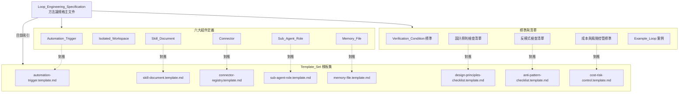
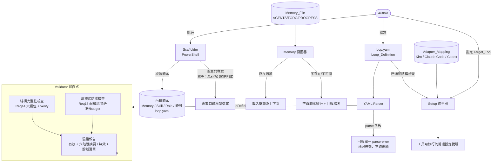
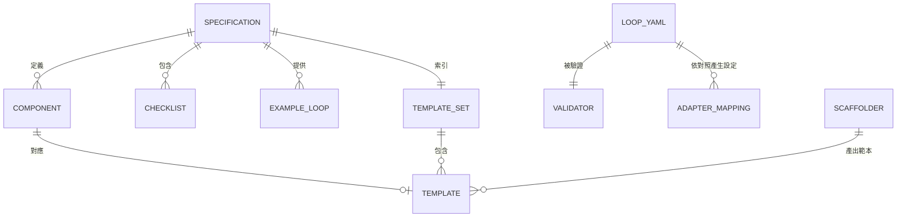

# Design Document

## Overview

本設計文件描述「Loop Engineering 框架」的交付架構。此交付物為**雙層**結構：一層是與工具無關的**文件型交付物**（方法論規格 + 樣板集），另一層是把規格落地成可跑元件的**可執行實作層**（TypeScript/Node.js kit + Windows PowerShell Scaffolder）。

### 兩層交付物

1. **規格層（文件型，Req 1–13）**
   - **Loop_Engineering_Specification（方法論規格文件）**：一份 Markdown 主文件，以抽象語言定義 Loop 的六大組件、設計原則、反模式、成本風控標準與範例 Loop。
   - **Template_Set（可套用樣板集）**：一組獨立的 Markdown 樣板檔案，使用者可直接複製到任何 AI coding agent 專案中填寫。
   - 此層**不是可執行軟體**，以文件結構驗收，不適用 PBT。

2. **實作層（可執行，Req 14–17 及強化的 Req 4/6/7）**
   - **loop.yaml（Loop_Definition）**：宣告式描述閉環六階段（trigger、discover、classify、assign、verify、record）+ 成本上限 budget，工具無關。
   - **Validator**：純函式，輸入解析後的 Loop_Definition，輸出「有效／無效 + 結構化診斷清單」。邏輯密集且行為隨輸入大量變化，是 PBT 主要對象。
   - **Adapter_Mapping**：Kiro / Claude Code / OpenAI Codex 各一份資料檔，把六階段對應到各工具原生原語並記錄落差。
   - **Setup 產生器**：查 Adapter_Mapping，把已通過結構檢查的 loop.yaml 產生為特定工具可執行的循環設定說明。
   - **Memory 讀回器**：會話開始時讀回 Memory_File 章節為上下文，不存在則以空白範本續行。
   - **Scaffolder**：PowerShell 指令，一鍵在專案內產生範例 loop.yaml 與 Memory / Skill / Sub_Agent_Role 範本，具冪等性。

### 設計核心決策

| 決策 | 選擇 | 理由 |
| --- | --- | --- |
| 規格層交付形式 | 純 Markdown 文件 + 樣板 | Req 13 要求無工具綁定、可直接複製；Markdown 為所有 AI coding agent 通用格式 |
| 工具特定語法處理 | 僅作「參考範例」區塊標註 | Req 1.3、2.3、5.2 要求規格本身工具無關，工具語法與規格要求分離 |
| Loop_Definition 格式 | YAML | 宣告式、人可讀、各語言皆有成熟 parser；工具無關性靠「禁用原生原語」內容規則保證，而非格式 |
| Validator 與 parser 分離 | 先 parse 產生結構（或回 parse-error），Validator 只處理合法 YAML | 讓 Validator 成為可測純函式（Req 15.3 明確要求 parse 失敗時不執行後續檢查） |
| 實作語言 | TypeScript / Node.js | 跨平台、YAML 生態成熟、`fast-check` 提供 PBT；Validator 為純模組可獨立測試 |
| YAML 解析 | `yaml` 套件 | 標準、支援錯誤定位 |
| Property-based testing | `fast-check` | TypeScript 生態標準 PBT 函式庫，不自造框架 |
| Scaffolding | PowerShell 指令稿 | Req 17.1 明確要求 Windows 環境執行 |
| 是否採 PBT | 分層：規格層否、實作層是 | 規格層為文件無 I/O 邏輯（文件結構驗收）；實作層 Validator/產生器/Memory 讀回器/Scaffolder 冪等性為隨輸入變化的純／可控邏輯，適用 PBT |

### PBT 適用性分層說明

- **規格層（Req 1–13）**：交付物是文件與樣板，非具備輸入/輸出行為的程式碼，無法撰寫「for all inputs X, P(X) holds」的通用性質。驗收方式為**文件結構檢查清單**（見 Testing Strategy）。
- **實作層（Req 14–17、4.6/4.7、6.2、7.4–7.7）**：Validator、Setup 產生器、Memory 讀回器與 Scaffolder 冪等性行為隨輸入大量變化，屬純／可控邏輯，以 **property-based testing（fast-check，每條 property ≥ 100 iterations）** 驗證，見 Correctness Properties 章節。靜態範本檔與 Adapter_Mapping 內容以 example / smoke / integration 測試涵蓋。

## Architecture

框架採雙層架構：規格層為「一份主規格 + 多份獨立樣板」的中心輻射結構；實作層為「loop.yaml → 驗證 → 產生 / scaffold / 記憶讀回」的資料流。

### 規格層：中心輻射結構

主規格為中心，定義所有概念並索引樣板；每份樣板為輻射端點，可獨立複製使用。



### 實作層：資料流



### 元件互動流程

1. **驗證流程（Req 15）**：`loop.yaml` → YAML Parser →（parse 失敗即回單一 `parse-error`，不跑後續）→ LoopDefinition → Validator（結構完整性 + 反模式防護，**兩類皆完整執行**，不因其一失敗而略過另一）→ 報告（有效附六階段摘要 / 無效附完整診斷清單）。
2. **產生流程（Req 16）**：先跑 Validator 結構檢查通過 → 選定受支援 Target_Tool → 查對應 Adapter_Mapping → 產生設定說明。工具不受支援或結構未通過則拒絕且不產生部分輸出。
3. **Scaffold 流程（Req 17）**：在專案目錄執行 → 逐檔比對是否已存在 → 建立缺少檔 / 略過既存檔（SKIPPED）→ 回報建立與略過清單。
4. **記憶讀回流程（Req 7.5–7.7）**：會話開始讀 Memory_File → 存在且可讀則載入章節為上下文；不存在／不可讀則以空白範本續行並回報受影響檔名；既存可讀檔即使格式/內容有問題也不因此回報錯誤。

### 檔案佈局

```
# 規格層交付物
loop-engineering-specification.md      # 方法論規格主文件
templates/
  automation-trigger.template.md
  skill-document.template.md
  connector-registry.template.md
  sub-agent-role.template.md
  memory-file.template.md
  design-principles-checklist.template.md
  anti-pattern-checklist.template.md
  cost-risk-control.template.md

# 實作層交付物
src/
  validator.ts        # Validator 純函式 + validateCron 子函式
  generator.ts        # Setup 產生器
  memory.ts           # Memory 讀回器
  types.ts            # Loop_Definition / Diagnostic 介面
adapters/
  kiro.yaml
  claude-code.yaml
  codex.yaml
scaffold/
  Invoke-LoopScaffold.ps1
  templates/          # Scaffolder 內建範本（loop.yaml / Memory / Skill / Role）
```

### 工具無關性保證機制

為滿足 Req 1.2、1.3、2.3、5.2、13.3、14.3 的工具無關要求：

- **規格要求段落**：以抽象語言描述，不含任何工具專屬指令。
- **參考範例區塊**：以明確標題（例如 `> 參考範例（非規格要求）`）包裹，並標註對應工具名稱，與規格要求段落視覺分離。
- **樣板檔案**：僅含 Markdown 標題、表格與填空欄位，不含任何工具專屬語法。
- **loop.yaml 內容規則**：Validator 以禁用清單偵測工具原生原語（工具專屬函式、SDK/API 名、專屬路徑、專屬指令旗標），確保 Loop_Definition 工具無關（Req 14.3）。

## Components and Interfaces

### 規格層章節（Req 1–13）

主規格文件依需求對應的章節組成。以下列出每個章節（組件）的職責與其「介面」（該章節必須向讀者提供的資訊欄位）。

#### 1. 文件總覽與結構（Req 1）
- **職責**：說明框架全貌、六大組件清單、文件導覽與樣板目錄。
- **必含元素**：六大組件名稱清單；Template_Set 目錄表（每個樣板用途與建議存放位置）；設計原則與反模式檢查清單入口。

#### 2. Automation_Trigger 章節（Req 2）
- **職責**：定義觸發抽象標準。
- **必含元素**：兩種類型（定時 / 事件）；要求記錄三欄位（觸發類型、觸發條件、執行頻率）。
- **對應樣板**：`automation-trigger.template.md`。

#### 3. Isolated_Workspace 章節（Req 3）
- **職責**：定義工具無關的隔離工作空間標準。
- **必含元素**：概念定義與必備特性（至少含檔案系統隔離、可合併回主線）；至少三種實現機制類型及等價說明；多角色並行時每角色須獨立 workspace 規則；合併回主線前的驗證步驟。

#### 4. Skill_Document 章節（Req 4）
- **職責**：定義漸進式披露的技能文件標準。
- **必含元素**：四欄位標準結構（名稱、描述、適用條件、詳細內容）；漸進式披露載入規則；多文件索引清單要求。
- **對應樣板**：`skill-document.template.md`（含 metadata、適用場景、專案慣例、常見陷阱四章節，且含 `name`/`description` YAML front matter）。
- **實作層連動**：Skill front matter 缺欄的驗證由 Validator 處理（見 C2、Req 4.6/4.7）。

#### 5. Connector 章節（Req 5）
- **職責**：定義何時需要 Connector 及如何記錄。
- **必含元素**：使用決策標準；MCP 為建議（非強制）參考標準；非 MCP 機制須同時記錄能力清單與存取範圍。
- **對應樣板**：`connector-registry.template.md`。

#### 6. Sub_Agent_Role 章節（Req 6）
- **職責**：定義製造者 / 檢查者分工標準。
- **必含元素**：角色分類（製造者、檢查者）；產出與審查任務須分派給不同角色實例（Req 6.2）；每角色須記錄職責、輸入/輸出、存取權限（唯讀/可寫）；Explorer 與 Reviewer 標為唯讀（Req 6.5）。
- **對應樣板**：`sub-agent-role.template.md`（至少 Explorer、Implementer、Tester、Reviewer 四預設角色）。

#### 7. Memory_File 章節（Req 7）
- **職責**：定義持久記憶格式標準。
- **必含元素**：三區塊 Markdown 結構（進行中、已完成、待分類）；每輪執行後更新狀態；進行中事項須記錄負責角色、所屬 workspace、Verification_Condition 達成狀態。
- **對應樣板**：`memory-file.template.md`（AGENTS.md / TODO.md / PROGRESS.md）。
- **實作層連動**：讀回行為由 Memory 讀回器處理（見 C7、Req 7.5–7.7）。

#### 8–13. 其餘規格章節
- **8. Verification_Condition（Req 8）**、**9. 設計原則清單（Req 9）**、**10. 反模式清單（Req 10）**、**11. 成本風控（Req 11）**、**12. Example_Loop（Req 12）**、**13. 樣板集交付（Req 13）**：職責與必含元素維持文件型定義，對應各自樣板，以文件結構驗收（見 Testing Strategy）。

### 實作層元件（Req 14–17、4.6/4.7、6.2、7.4–7.7）

#### C1. Loop_Definition Schema（`loop.yaml`）
定義頂層恰好六個階段欄位加上 `budget`。介面即 YAML 檔案結構（見 Data Models）。

#### C2. Validator（純函式模組）

```typescript
// 診斷項目：每筆對應一條規則失敗
interface Diagnostic {
  rule: string;            // 規則識別，如 "R15.4-missing-field"
  field: string | null;    // 失敗的欄位名稱（無特定欄位時為 null）
  category: DiagnosticCategory;
  message: string;         // 錯誤指示（繁中）
  severity: "error" | "warning"; // verify 缺 Verification_Condition 為 warning（Req 15.7）
}

type DiagnosticCategory =
  | "missing-field"          // 缺少必要欄位 (Req 15.4)
  | "empty-field"            // 欄位為空值 (Req 15.5)
  | "missing-verify-condition" // verify 無 Verification_Condition，僅警示 (Req 15.7)
  | "invalid-cron"           // cron 格式錯誤 (Req 14.4/15.6)
  | "native-primitive"       // 含工具原生原語 (Req 14.3)
  | "weak-verify-condition"  // 過弱驗證條件，無效 (Req 15.8)
  | "too-many-roles"         // 角色數 > 4 (Req 15.9)
  | "producer-checker-overlap" // 製造與檢查同一實例 (Req 6.2)
  | "missing-budget"         // 缺 budget (Req 14.2/15.10)
  | "invalid-budget"         // budget 無效值 (Req 14.2/15.10)
  | "skill-missing-frontmatter" // Skill 缺 name/description (Req 4.6)
  | "parse-error";           // YAML 無法解析 (Req 15.3)

interface FieldSummary {
  trigger: string; discover: string; classify: string;
  assign: string; verify: string; record: string;
}

interface ValidationResult {
  valid: boolean;
  diagnostics: Diagnostic[]; // 有效時為空陣列（或僅含 warning）
  summary?: FieldSummary;    // 僅在 valid === true 時提供 (Req 15.11)
}

// 主入口：輸入原始檔案內容 → 先 parse 再驗證
function validate(rawYaml: string): ValidationResult;

// 純驗證：輸入已解析結構（供 PBT 直接生成物件）
function validateDefinition(def: unknown): ValidationResult;
```

Validator 保證（Req 15.1）：結構完整性檢查與反模式防護檢查**皆完整執行**，不因其一失敗而略過另一；回傳所有失敗項目（Req 15.12）。唯一例外為 parse 失敗（Req 15.3），此時只回 `parse-error` 且不跑後續檢查。Validator 為純函式，不修改輸入、不觸發循環（Req 15.2）。verify 缺 Verification_Condition 僅回 `warning` 不判無效（Req 15.7）；Verification_Condition 全體皆過弱才判無效（Req 15.8）。

#### C3. Cron 驗證器（Validator 子函式）

```typescript
// 驗證五欄位標準 cron。回傳 null 表合法，否則回傳錯誤原因
function validateCron(expr: string): string | null;
```

規則（Req 14.4/15.6）：以空白分隔恰為五欄位（分 0-59、時 0-23、日 1-31、月 1-12、星期 0-6），支援 `*`、數值、`,` 列表、`-` 範圍、`*/n` 步進。任何 cron 欄位存在（不論 trigger 類型）都檢查。

#### C4. Setup 產生器

```typescript
type TargetTool = "kiro" | "claude-code" | "codex";

interface GenerateResult {
  ok: boolean;
  setup?: string;          // 成功：工具可執行的設定說明
  error?: Diagnostic;      // 失敗：不受支援 / 結構檢查失敗
}

function generateSetup(def: LoopDefinition, tool: string): GenerateResult;
```

行為（Req 16.5/16.6/16.7/16.8）：tool 非三者之一 → 拒絕、回不受支援錯誤、無部分輸出（Req 16.7）；未指定 tool → 套用預設或提示選擇（Req 16.6）；def 未通過結構檢查 → 拒絕、回結構失敗錯誤、保留原內容不變（Req 16.8）；受支援 tool + 已通過結構檢查 → 產出非空設定說明（Req 16.5）。

#### C5. Adapter_Mapping（資料檔）
每個 Target_Tool 一份對照檔（`adapters/{tool}.yaml`），內容為六階段欄位 → 原生原語名稱的對照，含落差記錄與已驗證版本號（見 Data Models，Req 16.1–16.4）。

#### C6. Scaffolder（PowerShell）

```
Invoke-LoopScaffold [-Path <目標專案目錄>]
```

行為（Req 17.2/17.3/17.4）：產生範例 `loop.yaml` + 三個 Memory_File + 一個 Skill_Document + 四個 Sub_Agent_Role 範本；同名檔已存在則保留並記為 SKIPPED；結束回報建立清單與略過清單。

#### C7. Memory 讀回器

```typescript
interface MemoryLoadResult {
  content: MemorySections;   // 成功載入或空白範本
  error?: string;            // 檔案不存在/不可讀時，指出受影響檔名
}
function loadMemory(path: string, kind: MemoryKind): MemoryLoadResult;
```

行為（Req 7.5/7.6/7.7）：存在且可讀 → 載入章節；不存在/不可讀 → 空白範本續行 + 回報檔名；既存可讀檔即使格式/內容有問題也不因此回報錯誤。

## Data Models

### 規格層：樣板結構化資料骨架

規格層無執行期資料模型，但樣板檔案定義了使用者填寫時的結構化骨架。

#### Automation_Trigger 樣板結構

| 欄位 | 說明 | 允許值 |
| --- | --- | --- |
| 觸發類型 | 觸發機制分類 | `定時觸發` / `事件觸發` |
| 觸發條件 | 觸發的具體條件描述 | 自由文字 |
| 執行頻率 | 預期執行頻率 | 自由文字（建議含頻率單位） |

#### Skill_Document 樣板結構
- **metadata 區塊**：名稱、描述、適用條件。
- **適用場景**、**專案慣例**、**常見陷阱** 三章節（詳細內容欄位，漸進式披露時才載入）。

#### Connector 清單樣板結構

| 欄位 | 說明 |
| --- | --- |
| 名稱 | Connector 識別名 |
| 用途 | 存取目的 |
| 存取範圍 | 可讀/可寫的資源範圍 |
| 所屬 Loop | 使用此 Connector 的 Loop |

#### Sub_Agent_Role 樣板結構

| 欄位 | 說明 | 允許值 |
| --- | --- | --- |
| 角色名稱 | 角色識別名 | 自由文字 |
| 職責範圍 | 負責的任務 | 自由文字 |
| 輸入 / 輸出 | 接收與產出的資料 | 自由文字 |
| 存取權限 | 檔案存取層級 | `唯讀` / `可寫` |
| 分類 | 製造者或檢查者 | `製造者` / `檢查者` |

#### Cost & Risk Control 樣板結構

| 欄位 | 說明 |
| --- | --- |
| 模型分層設定 | 各角色對應的模型量級（輕量 / 主力 / 強推理） |
| 執行頻率 | 對應 Automation_Trigger 頻率 |
| 成本上限 | 成本或 Token 上限數值 |
| 超限處理方式 | 超出上限時的行為 |
| 觸發方式 | 定時 / 事件 |

### 實作層：可執行資料模型

#### Loop_Definition（`loop.yaml`）

```yaml
# 頂層恰好六個階段欄位 + budget（Req 14.1, 14.2）
trigger:
  type: schedule        # schedule | event | manual
  cron: "0 9 * * 1"     # WHERE type=schedule 時為五欄位 cron (Req 14.4)
discover: "掃描開啟的 PR 與失敗的 CI 工作"        # 工具無關描述 (Req 14.3)
classify: "依標籤分為 bug / feature / chore"
assign:
  - role: implementer   # 分配給 Sub_Agent_Role
    work: make
  - role: reviewer
    work: check          # 製造與檢查分離 (Req 6.2)
verify:
  conditions:            # Verification_Condition 清單（缺則僅警示，Req 15.7）
    - "指定測試全數通過"        # 需含 測試通過/lint通過/量測門檻 (Req 15.8)
    - "lint 無錯誤"
record: "將結果寫入 PROGRESS.md 與 TODO.md"    # 至少一個 Memory_File (Req 14.5)
budget:
  max_runs_per_day: 20   # > 0 的數值上限 (Req 14.2, 15.10)
```

**約束對照**：
- 六欄位不多不少（Req 14.1）；缺欄回報全部缺欄名（Req 15.4）；欄位值為 null/空字串/空集合視為空值並回報（Req 15.5）。
- `verify.conditions` 缺任何 Verification_Condition 僅回警示不判無效（Req 15.7）；若全體皆不含（測試通過 | lint 通過 | 可量測數值門檻）任一類則判過弱無效（Req 15.8）。
- 任何 `cron` 欄位存在皆須五欄位合法（Req 14.4/15.6）。
- `budget` 必存在且為 > 0 數值（Req 14.2/15.10）。
- `assign` 中製造 vs 檢查須指派給不同 Sub_Agent_Role 實例（Req 6.2）；角色數 > 4 回報過於複雜（Req 15.9）。
- record 須指定至少一個 Memory_File（Req 14.5）。

#### Adapter_Mapping（`adapters/{tool}.yaml`）

```yaml
target_tool: kiro
verified_version: "1.2.0"      # 已驗證對應版本 (Req 16.4)
mappings:                       # 六欄位逐一對應 (Req 16.2)
  trigger:  { primitive: "Kiro Hook (eventType)" }
  discover: { primitive: "Agent 探索工作 prompt" }
  classify: { primitive: "Agent 分類步驟" }
  assign:   { primitive: "Sub-agent 呼叫" }
  verify:   { primitive: "Hook runCommand（測試/lint）" }
  record:   { primitive: null,                       # 缺乏原生原語
              gap: { field: "record",
                     fallback: "寫入 PROGRESS.md（Memory_File）" } }  # Req 16.3
```

#### Memory_File 範本結構

| 檔案 | 章節（`##`） | 特殊格式 |
|------|-------------|---------|
| `AGENTS.md` | 進行中事項 / 已完成事項 / 待分類事項 | 純 Markdown（Req 7.1） |
| `TODO.md` | 待辦 / 進行中 / 已完成 | 任務清單 `- [ ]` / `- [x]`（Req 7.4） |
| `PROGRESS.md` | 進度紀錄 | ISO 8601 時間戳開頭，新→舊逆序（Req 7.4） |

進行中事項每筆須記錄負責 Sub_Agent_Role、所屬 Isolated_Workspace（若有）、Verification_Condition 達成狀態（Req 7.3）：

```markdown
## 進行中事項
- [ ] <事項> | 負責角色: <Sub_Agent_Role> | Workspace: <Isolated_Workspace 或 N/A> | Verification: <達成狀態>

## 已完成事項
- [x] <事項>

## 待分類事項
- <尚未歸類的想法或工作>
```

#### Skill_Document 範本（含 front matter）

```markdown
---
name: <技能名稱>            # 必填 (Req 4.3/4.6)
description: <一句話描述>    # 必填 (Req 4.3/4.6)
---
## 適用場景
## 專案慣例
## 常見陷阱
```

#### Sub_Agent_Role 範本

| 角色 | 存取權限 | 職責 |
|------|---------|------|
| Explorer | 唯讀（Req 6.5） | 探索程式碼、回報發現，不改碼 |
| Implementer | 可寫 | 撰寫/修改程式碼 |
| Tester | 可寫 | 撰寫/執行測試 |
| Reviewer | 唯讀（Req 6.5） | 檢查、回報，不改碼 |

### 交付物關係圖



## Correctness Properties

*A property is a characteristic or behavior that should hold true across all valid executions of a system—essentially, a formal statement about what the system should do. Properties serve as the bridge between human-readable specifications and machine-verifiable correctness guarantees.*

本節屬性僅適用於**實作層**（Req 14–17、4.6/4.7、6.2、7.4–7.7），集中於 **Validator**、**Setup 產生器**、**Memory 讀回器** 與 **Scaffolder 冪等性** 等隨輸入大量變化的純／可控邏輯。**規格層（Req 1–13）為文件型交付，不適用 PBT**，以文件結構驗收（見 Testing Strategy）。靜態範本檔與 Adapter_Mapping 內容以 example / smoke 測試涵蓋。

經 property reflection 合併去冗餘後（cron 14.4+15.6 併一、budget 14.2+15.10 併一、不可變性 15.2+16.8保留內容 併一；verify 存在性 15.7「警示不判無效」與過弱 15.8「判無效」語意不同故分列），得下列屬性。

### Property 1: 頂層恰好六個階段欄位

*For any* 物件，Validator 僅在其頂層階段欄位恰為 `{trigger, discover, classify, assign, verify, record}` 六者（不多不少）時，才不回報 missing-field 或多餘欄位相關診斷。

**Validates: Requirements 14.1**

### Property 2: 缺欄回報所有缺少欄名

*For any* 從六必要欄位中移除的任意非空子集，Validator SHALL 標記無效，且回報的缺欄名稱集合恰等於被移除的欄位集合。

**Validates: Requirements 15.4**

### Property 3: 空值欄位偵測

*For any* 定義，若將任意必要欄位子集設為空值（null、空字串或空集合），Validator SHALL 對每個空值欄位回報 empty-field 診斷（含欄名）並標記無效。

**Validates: Requirements 15.5**

### Property 4: verify 缺 Verification_Condition 僅警示不判無效

*For any* Loop_Definition，若 `verify` 不含任何 Verification_Condition，Validator SHALL 回報 missing-verify-condition 警示並標記 field 為 `verify`，但**不因此**將該定義標記為無效；若含至少一個則不回報此警示。

**Validates: Requirements 15.7**

### Property 5: cron 五欄位正確性

*For any* 字串作為 cron 欄位值（不論 trigger 類型），Validator SHALL 僅在其以空白分隔恰為五欄位且每欄值落在合法範圍（分 0-59、時 0-23、日 1-31、月 1-12、星期 0-6）時視為合法；否則回報 invalid-cron 並標記無效。

**Validates: Requirements 14.4, 15.6**

### Property 6: 原生原語偵測

*For any* Loop_Definition，若任一階段欄位值含禁用清單中的工具原生原語 token（工具專屬函式、SDK/API 名、專屬路徑、專屬指令旗標），Validator SHALL 回報 native-primitive；不含則不回報。

**Validates: Requirements 14.3**

### Property 7: 過弱驗證條件偵測

*For any* Loop_Definition，若其 Verification_Condition 全體皆不含（測試通過、lint 通過、可量測數值門檻）三類判準中任一類，Validator SHALL 回報 weak-verify-condition、指出缺少的判準類型並標記無效；含至少一類則不回報。

**Validates: Requirements 15.8**

### Property 8: 子代理角色數上限

*For any* Loop_Definition，當其 Sub_Agent_Role 數量超過 4 時，Validator SHALL 回報 too-many-roles 並列出第 5 個起超出上限的所有角色名稱；數量 ≤ 4 時不回報。

**Validates: Requirements 15.9**

### Property 9: budget 正確性

*For any* Loop_Definition，Validator SHALL 僅在 `budget` 欄位存在且為大於 0 的數值時通過 budget 檢查；缺少時回報 missing-budget，非數值或 ≤ 0 時回報 invalid-budget，兩者皆標記無效並保留原始內容不變。

**Validates: Requirements 14.2, 15.10**

### Property 10: 製造與檢查分離

*For any* Loop_Definition，若其 `assign` 同時包含製造工作與檢查工作，Validator SHALL 要求兩者指派給不同的 Sub_Agent_Role 實例（允許同一角色型別的不同實例）；同一實例兼任兩者則回報 producer-checker-overlap 並標記無效。

**Validates: Requirements 6.2**

### Property 11: 結構與反模式兩類檢查皆執行

*For any* 同時違反結構完整性（如缺欄）與反模式防護（如缺 budget）的 Loop_Definition，Validator 的診斷清單 SHALL 同時包含兩類的對應診斷，不因任一類失敗而略過另一類。

**Validates: Requirements 15.1**

### Property 12: 通過時提供六階段摘要

*For any* 通過全部結構與反模式檢查的 Loop_Definition，Validator SHALL 回報 valid=true 且提供含 trigger、discover、classify、assign、verify、record 六階段各自解析值的摘要。

**Validates: Requirements 15.11**

### Property 13: 診斷項目結構完整

*For any* 未通過檢查的 Loop_Definition，其診斷清單中每一筆 SHALL 含非空的規則識別（rule）與失敗原因分類（category），並在適用時含失敗欄位名稱（field）。

**Validates: Requirements 15.12**

### Property 14: 解析失敗僅回 parse-error

*For any* 無法解析為有效 YAML 的輸入字串，Validator SHALL 僅回報單一 parse-error 診斷（含失敗原因）並標記無效，診斷清單不含任何其他 category（即不執行後續結構與反模式檢查）。

**Validates: Requirements 15.3**

### Property 15: Validator 與產生器不修改輸入

*For any* 輸入（Loop_Definition 物件或原始內容），呼叫 Validator 或 Setup 產生器後，輸入內容 SHALL 保持深層不變（不修改、不觸發循環）。

**Validates: Requirements 15.2, 16.8**

### Property 16: 不受支援工具拒絕產生

*For any* 不屬於 {kiro, claude-code, codex} 的 Target_Tool 名稱，Setup 產生器 SHALL 回傳失敗、錯誤指出該工具不受支援，且不產生任何部分 setup 輸出。

**Validates: Requirements 16.7**

### Property 17: 受支援工具 + 有效定義必產生設定

*For any* 已通過結構檢查的 Loop_Definition 與任一受支援 Target_Tool，Setup 產生器 SHALL 回傳成功且產出非空的循環設定說明。

**Validates: Requirements 16.5**

### Property 18: 結構未通過則拒絕產生

*For any* 未通過結構檢查的 Loop_Definition，Setup 產生器 SHALL 拒絕、回傳指出結構檢查失敗的錯誤，且不產生 setup 輸出。

**Validates: Requirements 16.8**

### Property 19: Skill_Document 缺 front matter 為無效

*For any* Skill_Document，若缺少 `name` 或 `description` front matter 欄位（或兩者），Validator SHALL 將其標記為無效（無論缺少欄位名稱是否成功回報皆維持無效標記）。

**Validates: Requirements 4.6**

### Property 20: PROGRESS 時間戳逆序

*For any* 一組帶 ISO 8601 時間戳的進度紀錄，寫入 PROGRESS.md 後解析所得的時間戳序列 SHALL 由新到舊單調遞減排列。

**Validates: Requirements 7.4**

### Property 21: Memory 章節讀回 round-trip

*For any* 一組隨機章節內容，將其寫入某個 Memory_File 後再由 Memory 讀回器載入，載入的章節內容 SHALL 等同寫入的內容。

**Validates: Requirements 7.5**

### Property 22: 既存可讀檔不因格式回報錯誤

*For any* 已存在且可讀的 Memory_File（不論其內容格式是否正確），Memory 讀回器 SHALL 不回報錯誤（error 為未定義）。

**Validates: Requirements 7.7**

### Property 23: Scaffolder 冪等保留既存檔

*For any* 目標目錄中預先存在的框架檔案子集，執行 Scaffolder 後這些既存檔案內容 SHALL 保持不變，且其檔名出現在略過清單（SKIPPED）中。

**Validates: Requirements 17.3**

### Property 24: Scaffolder 報告完整且互斥

*For any* Scaffolder 執行，回報的「已建立清單」與「已略過清單」之聯集 SHALL 等於全部目標檔案集合，且兩清單互斥（無交集）。

**Validates: Requirements 17.4**

## Error Handling

### 規格層：規格缺陷與使用者填寫錯誤

| 缺陷類型 | 防範方式 |
| --- | --- |
| 遺漏組件定義 | 交付前以文件結構檢查清單逐項核對六大組件與清單 |
| 混入工具專屬語法於規格要求段落 | 全篇掃描；工具語法一律移入「參考範例」區塊 |
| 樣板含工具綁定語法 | 樣板僅保留 Markdown 骨架，交付前逐檔檢查 |
| 主觀 Verification_Condition 範例 | 規格內明列合規與不合規對照範例 |

規格文件透過內建規則協助使用者自我糾錯：主觀完成條件改寫（Req 8.2）、自我審查偏差分離（Req 6.2、8.4）、成本失控（Req 10、11.3）、並行覆寫（Req 3.3）。

### 實作層：執行期錯誤處理

| 情境 | 對應需求 | 處理策略 |
|------|---------|---------|
| YAML 無法解析 | 15.3 | 回單一 parse-error（含位置/原因），不跑後續檢查，標記無效 |
| 缺必要欄位 | 15.4 | 收集所有缺欄，一次回報全部缺欄名 |
| 欄位空值 | 15.5 | 逐一標記空值欄名 + 「欄位不得為空」指示 |
| verify 缺 Verification_Condition | 15.7 | 回 warning（missing-verify-condition），標記 verify 欄位，**不判無效** |
| Verification_Condition 全體過弱 | 15.8 | weak-verify-condition，列缺少判準類型，判無效 |
| cron 格式錯 | 14.4/15.6 | invalid-cron，指出欄位數或範圍問題 |
| 含原生原語 | 14.3 | native-primitive，指出違規欄位與 token |
| 角色過多 | 15.9 | too-many-roles，列超限角色名 + 精簡建議 |
| 製造/檢查同一實例 | 6.2 | producer-checker-overlap，判無效 |
| budget 缺/無效 | 14.2/15.10 | missing-budget / invalid-budget，保留原內容 |
| Skill 缺 front matter | 4.6/4.7 | skill-missing-frontmatter，判無效並阻止載入 |
| 不受支援工具 | 16.7 | 拒絕產生，無部分輸出 |
| 未指定 Target_Tool | 16.6 | 允許繼續，套用預設或提示選擇 |
| 結構未通過請求產生 | 16.8 | 拒絕產生，保留原內容不變 |
| Memory_File 不存在/不可讀 | 7.6 | 以空白範本續行 + 回報受影響檔名 |
| Scaffold 目標檔已存在 | 17.3 | 保留既有，記入略過清單（SKIPPED） |

**錯誤彙總原則**：Validator 採「收集全部失敗後一次回報」（Req 15.12），而非首錯即停。唯一提前中止情境為 YAML parse 失敗（Req 15.3）。所有錯誤處理路徑皆不修改輸入、不觸發循環（Req 15.2）。

## Testing Strategy

框架雙層採不同測試策略：規格層以文件結構驗收；實作層以 property-based testing 為主力，輔以 unit / smoke / integration 分層。

### 規格層：文件結構驗收檢查

交付物為文件與樣板（非可執行程式碼），採文件結構驗收清單逐項核對。

主規格文件驗收：

- [ ] 六大組件皆有專屬章節與抽象定義（Req 1.1、1.2）
- [ ] 所有工具專屬內容皆置於標註的「參考範例」區塊（Req 1.3、2.3、5.2）
- [ ] 含 Template_Set 目錄，列出每個樣板用途與建議存放位置（Req 1.4、13.2）
- [ ] 設計原則與反模式檢查清單已納入文件結構（Req 1.5）
- [ ] Automation_Trigger 定義兩類型並要求記錄三欄位（Req 2.1、2.2）
- [ ] Isolated_Workspace 列出必備特性與至少三種實現機制、並行規則、合併前驗證步驟（Req 3.1–3.4）
- [ ] Skill_Document 定義四欄位結構、漸進式披露規則、多文件索引要求（Req 4.1、4.2、4.4、4.5）
- [ ] Connector 定義使用決策標準、MCP 建議標註、非 MCP 記錄要求（Req 5.1–5.3）
- [ ] Sub_Agent_Role 定義分類、分工規則、每角色記錄欄位、Explorer/Reviewer 唯讀（Req 6.1、6.3、6.4、6.5）
- [ ] Memory_File 定義三區塊結構、更新要求、進行中事項記錄欄位（Req 7.1–7.3）
- [ ] Verification_Condition 定義數量要求、主觀不合規判定、四種範例類型、角色分離要求（Req 8.1–8.4）
- [ ] 設計原則檢查清單含至少三原則、每項附自我檢查問題（Req 9.1、9.2）
- [ ] 反模式檢查清單含至少三 Anti_Pattern、每項附症狀與改善建議（Req 10.1、10.2）
- [ ] 成本風控含模型分層、頻率建議、上限記錄要求、事件觸發建議（Req 11.1–11.4）
- [ ] 提供 2–3 個 Example_Loop，每個涵蓋至少四組件並記錄四要素、標註可修改（Req 12.1–12.3）

Template_Set 驗收：

- [ ] 八個樣板檔案皆為獨立 Markdown（Req 13.1）
- [ ] 每個樣板對應一組件或一清單（Req 2.4、4.3、5.4、6.4、7.4、9.3、10.3、11.5、13.1）
- [ ] 所有樣板無任何工具專屬指令或語法（Req 13.3）
- [ ] Skill_Document 樣板含四章節與 name/description front matter（Req 4.3）

### 實作層：測試分層

- **Property tests（fast-check，主力）**：涵蓋上述 24 條 Correctness Properties，集中於 Validator、Setup 產生器、Memory 讀回器、Scaffolder 冪等性。
- **Unit / Example tests**：靜態範本內容結構（AGENTS/TODO/PROGRESS/Skill/Role 章節與 front matter，Req 7.1/7.4/4.3/6.4/6.5）、Adapter_Mapping 六階段對應與落差記錄（Req 16.2/16.3）、record 指定 Memory_File（Req 14.5）、未指定 Target_Tool 套預設（Req 16.6）、無效 Skill 阻止載入（Req 4.7）。
- **Smoke tests（單次執行）**：三份 adapter 檔存在（Req 16.1）、已驗證版本號存在（Req 16.4）、三 Memory 範本存在（Req 7 樣板）、四角色範本存在（Req 6.4）、PowerShell 指令可載入（Req 17.1）。
- **Integration tests**：Scaffolder 在暫存空目錄執行產出所有產物（Req 17.2）；Memory_File 不存在時的空白範本續行（Req 7.6，edge case）。

### Property-Based Testing 配置

- 使用 `fast-check`（不自造 PBT 框架）。
- 每條 property test 最少 **100 次迭代**（`fc.assert(..., { numRuns: 100 })`）。
- 每條 Correctness Property 以**單一** property-based test 實作。
- 每條測試以註解標記對應設計屬性，格式：
  `// Feature: loop-engineering-framework, Property {number}: {property_text}`

### 產生器策略

- **有效 Loop_Definition 產生器**：組合合法六欄位 + 合法 cron + 有效 budget + 合法 Verification_Condition，供 Property 12/15/17 使用。
- **變異產生器**：在有效基礎上注入單一或多重缺陷（缺欄、空值、壞 cron、原生原語 token、弱驗證條件、過多角色、製造/檢查重疊、壞 budget），供 Property 1–11 使用；透過標記可斷言預期診斷集合。
- **cron 產生器**：隨機欄位數（含 ≠5）與隨機欄位值（含超範圍），供 Property 5。
- **Skill front matter 產生器**：隨機缺 name/description/兩者，供 Property 19。
- **檔案內容產生器**：隨機章節文字（含 Unicode、空白、格式錯亂），供 Property 20/21/22。
- **既存檔子集產生器**：隨機挑選要預置的目標檔並帶標記內容，供 Property 23/24。

### 邊界與特殊輸入

產生器須涵蓋：空集合、Unicode 與特殊字元、極長字串、cron 邊界值（0、59、60、-1）、budget 邊界（0、負數、非數值、極大值）、Memory_File 內容含非法 YAML/Markdown。
